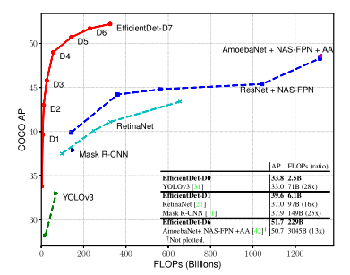

今天要分享的是谷歌发表在 CVPR 2020 上的一篇论文，研究的问题是目标检测，**在保证准确率的情况下提高模型效率**，这里的效率指模型大小和训练/推理时间，都是越小越好；论文的实验效果很惊艳。

论文标题： [EfficientDet: Scalable and Efficient Object Detection](https://arxiv.org/abs/1911.09070)

论文作者： Mingxing Tan, Ruoming Pang, Quoc V. Le (both from Google Brain)

### 论文贡献
1. 保证准确率的情况下，大幅提高检测效率  
2. 提出一个检测器系列 EfficientDet D0-D7，适配不同资源场景  
3. 提出BiFPN，提升特征融合效果（可能是为了凑工作量）

### 测试原因
1. 论文中的效果太惊艳了，加之谷歌背书，可信度比较高  
2. 创新性比较大，提出了一个**检测器系列** EfficientDet D0-D7，其中最次的D0和 [YOLOv3](https://arxiv.org/abs/1804.02767)效果持平  
3. 应用在实际中效果到底如何

### 开发环境准备
1. Ubuntu 16.04  
2. miniconda创建虚拟环境，python 3.7、TensorFlow 1.15  
3. 在自己笔记本电脑上进行的测试，没有GPU也能跑起来，这是这个项目好的地方之一

### 使用的模型
1. [EfficientDet-D0](https://storage.googleapis.com/cloud-tpu-checkpoints/efficientdet/coco/efficientdet-d0.tar.gz)  
1. [EfficientDet-D2](https://storage.googleapis.com/cloud-tpu-checkpoints/efficientdet/coco/efficientdet-d2.tar.gz)

### 测试用例
1. [Youku 的一个视频，关于候鸟迁徙的，时长50多秒](https://v.youku.com/v_show/id_XNDM2NTg0MDg3Ng==.html)  
2. 一个工厂外部的监控视频，监控来回的行人和车辆，视频画面动的是人，在一条丁字路来回走动；没有公开的链接

### 测试结果
1. 对于第一个测试用例
    - 用EfficientDet-D0就达到了比较好的效果，视频中的飞鸟应检尽检，也得益于飞鸟很大，背景是天空，没有复杂的场景和物体
    - 因为这个视频不是下载下来的，而是我用录屏软件生成，所以开始和结尾会有录屏软件和其他杂乱的东西，对于这部分产生了误检，把录屏软件当成了“book”、“cell-phone”
1. 对于第二个测试用例
    - EfficientDet D0 和 D2 都测试了，当人离镜头远的时候 D0 和 D2 都跟丢了；调整镜头焦距离人近的时候，同时能跟踪到；说明对于小物体的检测做的不好，因为训练数据 Imagenet、COCO 没有针对小物体，网络结构也没有针对小物体设计
    - D2的检测效果好于D0，体现在D2比D0更早追踪到人，也就是说离镜头远的时候，D2检测到人的时候，D0还未能做到
    - D2的推理速度慢于D0，D2用时近一小时，D0十多分钟；CPU确实慢
1. EfficientDet 这种检测器本质上是一副图片，没有考虑图片间的时序关系，虽然能实现物体跟踪的效果，但是和物体跟踪范式还有所区别
