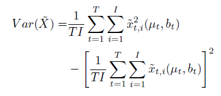

今天分享的是发表在 ICCV 2019 的一篇论文，研究的问题是：通过单目相机，给出**行人在三维空间的位置**，并估计这个 **位置的不确定性——位置的误差** 有多大。

论文标题：[MonoLoco: Monocular 3D Pedestrian Localization and Uncertainty Estimation](https://openaccess.thecvf.com/content_ICCV_2019/html/Bertoni_MonoLoco_Monocular_3D_Pedestrian_Localization_and_Uncertainty_Estimation_ICCV_2019_paper.html)

论文作者：Lorenzo Bertoni, Sven Kreiss, Alexandre Alahi (both from EPFL VITA lab)

EPFL的全称是 Ecole Polytechnique Federale de Lausanne，又称Swiss Federal Institute of Technology，**瑞士联邦理工学院**，QS排名14；VITA的全称是 Vision Intelligence for Transportation，做**自动驾驶**、送货机器人、社交机器人等。

### 概览
1. 本文从单目RGB图片，进行行人3D定位
2. 众所周知，单目相机无法估计图像中物体深度，用它进行三维空间行人定位，任务具有歧义性
3. 设计了一个基于 Laplace distribution 的损失函数，**通过预测置信区间**，解决歧义性
4. 整个框架分为两步：
    1. 从RGB图片得到行人姿态——由一组人体关键点表示，使用现成的 pose detection Neural Network，Mask RCNN、PifPaf
    2. 把行人姿态输入另一个NN，输出行人距离相机的距离 $\mu$ 和误差 $b$ $\Longrightarrow$ 置信区间[$\mu - b, \mu + b$]

### 相关工作
1. Monocular 3D Object Detection
    1. 有的工作研究了从单目RGB图片，检测交通车辆（把交通车辆当做刚体处理）的问题；作者认为目前还没有用单目RGB图像，3D定位行人的工作
    2. [Kundegorski and Breckon]()，结合单目红外图像infrared imagery和实时摄影测量real-time photogrammetry，对行人进行定位和跟踪
    3. Alahi et al. 组合了单目图像和wireless signal、单目图像和visual priors
    4. Mono3D 用深度学习方法，检测 car、pedestrian、cyclist，但是**没有估计pedestrian的空间位置**
    5. 针对车辆的检测、跟踪：从2D检测拟合3D姿态参数，典型方法Deep3DBox、MonoGRnet、Hu et al[23]
    6. 综合多种信息，进行深度估计：Multi-fusion、ROI-10D
    7. **最近**，Roddick et al. 利用积分图integral images，把基于图像的特征映射到鸟瞰图，跳出图像域 escape image domain；好像不太相关
    8. 拟合汽车3D模板到图像 [54, 55, 7, 30]
2. Uncertainty in Computer Vision（感觉比较新颖）
    1. 在一些重要的应用场景下，比如自动驾驶，DNN不仅需要提供一个输出，**并且还要给出不确定性估计——该输出的误差**
    2. 传统的方法Bayesian Neural Networks [47, 40]，通过概率分布建模模型参数的认知不确定性 epistemic uncertainty，但是通常概率分布很难解，提出另外的方法解 Variational Inference [20, 4, 50]，Deep Ensembles [31].
    3. Deep Learning方法（非概率模型）——Monte Carlo dropout：Gal et al. [16, 17] 证明，在推理时候使用dropout，会产生另外的一种变分推理，网络的参数被建模成**a mixture of multivariate Gaussian distributions**，此时方差较小
    4. 计算机视觉中，**MC dropout估计不确定性**应用在了 depth regression tasks [25], scene segmentation [39, 25], LiDAR 3D object detection for cars [14].
3. Human pose estimation
    1. 效果最好的方法基于CNN，分成两类：
        - top-down methods：Rmpe、Mask RCNN
        - bottom-up methods：PifPaf、Multiposenet、Associative embedding、Personlab
    2. 有的方法从2D pose预测3D joints的相对位置，比如[37, 58, 49]，但是不能给出行人在真实空间的3D位置

### 挑战（歧义性问题）
1. 单目相机，无法获得深度信息，估计空间位置产生歧义性
2. 人的高度是不同的，定位时很难处理
3. 本文：
    1. 估计行人距相机的距离时，假设人的高度相同 $h_{mean}$，
    2. 估计**此假设产生的误差**
        1. 定位误差——$task$ $error$: 把定位误差看成行人距离相机 ground truth distance 的函数
        2. 人的高度、到相机距离，有一个三角相似性：
            - 
            - $d_{gt}$ 人到相机的真实距离；$h_{gt}$人的真实高度
            - $d_{h-mean}$ 人到相机的估算距离；$h_{mean}$人的平均高度
        3. $task$ $error$
            - $$ e \equiv \bigg\vert d_{gt}} - d_{h-mean} \bigg\vert = d_{gt}} \bigg\vert 1 - \frac{h_{mean}}{h_{gt}} \bigg\vert $$
        4. 欧洲成年人，男性平均178cm，女性平均165cm，参考文献[52]；但姿态检测器并不区分人的性别
        5. 假设人类身高服从 Gaussian distribution，作为 ground truth height distribution，因此$task error$变为：
            - 
            - 代表**定位距离误差的下限**，即 ≥ $\hat{e}$

### 解决方法
1. 模型结构
    - 
    - 2D Human Poses
        - 使用 off-the-shelf 方法，Mask RCNN、PifPaf
        - 本文使用的数据集 KITTI、nuScene，没有在上面 finetune，因为没有标注的姿态
    - 输入：人体关键点，$[u_i, v_i]^T$，利用相机内参矩阵K，得到归一化的图像坐标作为输入
        - 
    - 归一化的目的，**阻止模型对于特定相机过拟合**
    - 输出：人到相机的距离$d$
        - $$ d = \vert\vert \textbf{D} \vert\vert_2 = \sqrt{x_c^2 + y_c^2 + z_c^2} $$
        - $\textbf{D}$ 是3D位置向量表示
        - 行人 bounding box 的中心对应 **像平面物体的中心**
    - Uncertainty
        - Aleatoric Uncertainty
            - 
            - $\mu$ 是网络预测的距离，$x$ 是真实的距离，$b$ 是网络预测的误差——预测的定位误差
        - Epistemic Uncertainty
            - 
            - $\theta$ 是高斯分布的均值，其方差为0
        - Combined Uncertainty
            - 
            - $T$ 次 NN forward pass，计算比较费时；$I$ 是Laplace distribution采样的样本数，计算比较轻量

### 实验
1. 数据集 KITTI、nuScene
2. 评价指标
    - Average Location Precision（ALP）, defined by Xiang et al. [54] for the car category
    - Average Location Error（ALE）
3. 对比的方法
    - Mono3D，3D检测 car、pedestrian、cyclist
    - MonoDepth，预测图像像素的深度值
    - 3DOP，双目相机，3D检测 car、pedestrian、cyclist

7. 其他对比
    - 运行时间  
    
    - 消融实验  
    
    - 离群值敏感性
    