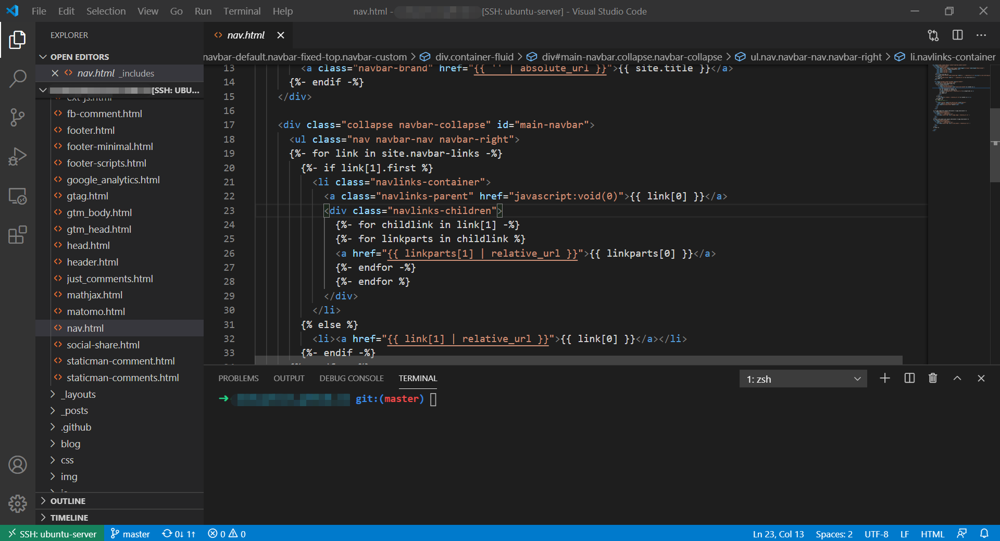

做计算机视觉方面的开发、研究，不同于其他领域，对机器硬件配置有较高的要求，最主要体现在必须配置GPU，否则寸步难行。
对于高校研究人员，不像科技公司专门设置了基础架构部统一运维整个公司的研发环境，需要自己运维机器，徒手搬机器、插电源、拉网线、装系统、配GPU...，这是基础琐碎但必须做好的工作，拥有一个简单易用的开发环境是无比幸福的事！

### 服务器端

{: .box-note}
**Note:** 配置好后，长期稳定的使用，避免作大变动（重装系统、重装基础软件），**避免把时间花在环境配置上**

1.	装一个 Linux 类型的操作系统，Ubuntu 16.04/18.04 LTS，这两个版本是官方长期维护的稳定版，用户基数非常大，遇到问题基本能在Google找到答案；现在主流的视觉框架，都有对应Ubuntu平台的实现
2.	多用户使用，管理好用户权限
    - user一般只对自己所在 /home/user目录有读、写、执行权限——防止破坏整个系统配置
    - 每个user设置自己的密码，需要 sudo 权限时，输入自己的密码
3.	使用GPU，需要安装
    - NVIDA驱动，就是**GPU向操作系统提供的接口**，操作系统操作硬件设备必备
    - CUDA，is a parallel computing platform and programming model that makes using a GPU
    - cuDNN，CUDA® Deep Neural Network library，(cuDNN) is a GPU-accelerated library of primitives for deep neural networks. cuDNN provides highly tuned implementations for standard routines such as forward and backward convolution, pooling, normalization, and activation layers
4.	现在的视觉项目，大都用python实现
    1. 每个用户都要安装自己的miniconda3/Anaconda3，然后针对每个项目，再创建对应的虚拟环境
        > e.g.：conda create –n efficientdet python=3.6.6
    2. 需要用到OpenCV时，首先考虑在虚拟环境安装 opencv-python，这样既简单又能满足需求；而不是下载OpenCV源码、手动编译、安装，费时费力常常报错
	    > e.g.：conda install opencv-python==3.4.2.18
		>	    conda install tensorflow-gpu==1.12.1
    3. 不要使用系统自带的python（除非是系统的唯一用户），也不要在系统python环境里面安装软件包
5.	避免安装最新版本的软件，比如Python3.9、TensorFlow2.2，因为最新版本的软件用户毕竟少，出了问题已知的参考答案较少，也可能是发布前未测出来的bug
6.	跑C/C++程序，自带 C/C++ 编译和调试功能，现在主流的是 C++11、C++14，语言功能、易用性较好
7.	推荐 tmux 软件，服务器程序跑着，不用担心和客户端断开
8.	一个原则是要在当前用户下配置本用户特定项目的环境，不要变动系统及其他人的环境

### 客户端

{: .box-note}
**Note:** 就是自己的笔记本/台式机，发挥轻量便携的优势

1.	一般不需要装开发环境，开发环境都放在服务器
    - 为了整个项目开发环境统一，避免笔记本写的代码，放在服务器运行不了的情况
    - 用其他的笔记本/台式机，也能连到服务器，不受限于当前的客户端
2.	只需安装连接服务器的软件，推荐 Visual Studio Code、Pycharm，它们都有连接服务器的插件并很容易安装，实现在客户端编辑、在服务器端运行的功能。Visual Studio Code 的例子

3.	如果想测试一些轻量级的代码、简单的程序，装个双系统/虚拟机/Vagrant

{: .box-warning}
**Warning:** 有待补充ing ...
