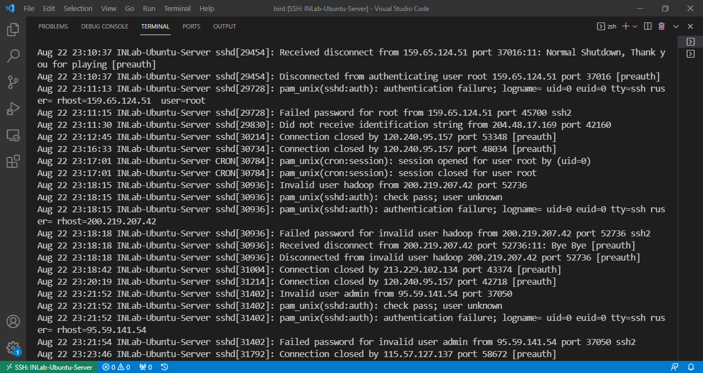

上一篇[post](https://auniquesun.github.io/2020-06-26-basic-developing-environments-for-vision-project-and-research/)从全局角度讲解了做视觉开发、研究的服务器基础环境配置问题，本文是对上篇文章的深入，讲解实施细节。具体来说，当 Ubuntu 系统装好以后，
* 如何为新用户创建友好的、易用的Shell —— 用户在Ubuntu服务器上操作，Shell是用户和系统最主要的交互工具
    * 有人可能好奇，Shell都是命令行操作，还有友好、易用之分？根据[新用户指南](#新用户指南)配置完成，你就切身体会到了：**原生的Shell只是让你能够使用系统，并不能让你高效方便的使用系统**
* 在多用户使用的情况下，如何共享数据资源 —— 节省时间、提高效率，比如常用的miniconda3安装包，下载一份多人使用即可
    * 服务器数据共享的方式有很多种，我们采用**文件夹权限共享**的方式

### 写在前面

{: .box-error}
**实验室公共设施，请大家按照要求操作，便利自己便利他人** 

* 实验室服务器是一台**硬件配置较高**的机器，常用软件已经下载或配置好，并由专门的人员运维，满足不同项目需求和环境配置，为同学们科研和开发提供便利。
    * 查看[已安装软件列表](#已安装软件列表)
    * 使用范围：做课程、项目、论文

* 运维服务器的人员可能牺牲了他的休息时间、写论文时间、思考问题时间无偿为同学们提供服务，请大家遵循 “**便利自己也便利他人**” 原则，严格按照要求操作：
    * 若使用 `Python` 开发，详见 [新用户指南](#新用户指南) 第`8`条 安装 `miniconda`，**杜绝使用系统自带** `Python`  
    * 请阅读[数据和软件共享](#数据和软件共享)部分 —— 用户主目录下不要存放大文件，**主目录占用磁盘空间超过15G会被定期清除**

* 新用户默认是普通用户，没有管理员权限，如果有机器使用问题：
    * 请在“服务器”群**说明问题和需求**，由管理员处理；`不要单独私信管理员`，“服务器”群就是让大家都了解服务器相关信息，提高沟通覆盖面，避免相同的问题重复回答
    * 管理员会尽可能在短期内查看并解决问题，但大不可能立马停下手头的事情帮你解决问题，因为他要做的事情也很多 (:
    * 为保证机器长期稳定有序运行，谢绝向管理员索要管理员权限（受老师委托）

* 欢迎你~ 祝你机器用得顺、实验做得好，论文发得早！

### 新用户指南
> 管理员创建好一个用户，系统会给用户配置默认的Shell —— `bash`，它对用户并不很友好；用户需要切换到对 **ta** 更好的 `zsh`

0. 【忽略这一步，已由管理员完成】首先需要安装 `zsh`，因为它没有内置在 Ubuntu 系统；确保有管理员权限，然后执行如下命令
    ```shell
    sudo apt install zsh
    ```

1. 把Shell切换成 `zsh`，执行如下命令
    ```shell
    chsh -s $(which zsh)
    ```

2. 进入目录 `/mnt/sdb/public/software`，执行如下命令
    ```shell
    cd /mnt/sdb/public/software
    ```

3. 用 `zsh` 安装 `ohmyzsh`，执行如下命令
    ```shell
    sh ohmyzsh-install.sh
    ```
    * `NOTE:` 安装过程中，需要确认的地方输入 `y`；默认安装在了用户主目录下的这个位置 `~/.oh-my-zsh`

5. `Shell`里几乎都是用命令操作，命令补全/高亮功能为用户提供了便利。`zsh-autosuggestions`是一个命令补全plugin，安装方法如下
    * step 1：下载 `zsh-autosuggestions` 到指定目录
    ```shell
    git clone https://github.com/zsh-users/zsh-autosuggestions ${ZSH_CUSTOM:-~/.oh-my-zsh/custom}/plugins/zsh-autosuggestions
    git clone https://github.com/zsh-users/zsh-syntax-highlighting ${ZSH_CUSTOM:-~/.oh-my-zsh/custom}/plugins/zsh-syntax-highlighting
    ```
    * step 2：打开文件 `~/.zshrc`，把 `zsh-autosuggestions` 添加到 plugins 列表
    ```shell
    plugins=(zsh-autosuggestions zsh-syntax-highlighting)
    ```
    - **NOTE**：这里 `zsh-syntax-highlighting` 要放在 plugins 列表的最后一项，引用自它的官方文档
    - [这篇文章](https://safjan.com/top-popular-zsh-plugins-on-github-2023/)总结了一些实用的 `zsh` 插件，建议根据需要安装

5. **为了使用GPU**，需要设置`cuda`环境变量，在`~/.zshrc`文件末尾添加如下两行代码
    ```shell
    export CUDA_HOME=/usr/local/cuda
    export PATH=$CUDA_HOME/bin:$PATH
    ```
    
6. 至此，默认的 `bash` 已切换成 `zsh`；以后配置环境变量，在 `~/.zshrc` 配置即可；修改后让变更生效，执行如下命令
    ```shell
    source ~/.zshrc
    ```

7. 【$\color{red}{必要操作}$】配置密钥登录。配置好后，用户每次登录服务器无需手动输入密码，解除多次输入密码被封IP的风险，可谓既方便又安全。配置方式如下，用户需要首先在**自己电脑**安装 [Git](https://git-scm.com/downloads)（如已安装请忽略），然后打开**自己电脑**安装好的 Git Bash，输入如下命令
    ```shell
    ssh-keygen  # 生成`公钥-私钥`对
    cd /c/Users/Zhangsan/.ssh  # 这一步的操作是切换到存放 ssh 公钥文件的目录（该公钥文件以 .pub 后缀结尾），我使用的是 Windows 系统，用户名是 Zhangsan；你需要根据你的系统，切换到对应目录
    ssh-copy-id -i id_rsa.pub <username>@<hostname>   # <username> 替换成本人用户名，<hostname> 替换成服务器ip地址，这条命令是将公钥写入服务器~/.ssh/authorized_keys文件
    ```

8. 若使用 `Python` 开发，请安装 `miniconda` 环境（不推荐安装`Anaconda`：`miniconda`即轻量又能实现同样的功能）
    * step 1：切换到共享软件目录
    ```shell
    cd /mnt/sdc/public/software
    ```
    * step 2：安装 `miniconda` 环境 —— 配置均为默认
    ```shell
    sh Miniconda3-latest-Linux-x86_64.sh
    ```
9. **修改自身账户初始密码**。管理员为用户设置了初始密码，用户登录后需自行修改
    - 修改方法见 [账户安全](#账户安全) 第`1`条

<!-- 4. 【这一步可做可不做】改变 ohmyzsh 主题元素，执行如下命令
    ```shell
    vim ~/.zshrc
    ```
    * 找到 `ZSH_THEME=` 所在行，替换 `robbyrussell` 为 `pygmalion`
     -->

### 数据和软件共享
0. 服务器单独配备多块数据硬盘，每块容量为4T，专用于存放用户数据(代码/文档/数据集等)，挂载到 `/mnt` 目录，如
    - `/mnt/sdb`
    - `/mnt/sdc` 
    - `/mnt/sdd` 
    - `/mnt/sde` 
    - $\cdots$

* 其子目录 `public/` 用于服务器多用户**_共享数据、存放大文件_**
* **注意：** **用户主目录 `/home/<username>` 下不要存放文件**，`/home/<username>` **占用空间超过15G会被定期清除**，数据文件存放于数据盘下，如 `/mnt/sdc/public/data/<username>`
* 如果不清楚如何挂载机械硬盘到 `Ubuntu` 系统，参考这篇 [blog](https://medium.com/@sh.tsang/partitioning-formatting-and-mounting-a-hard-drive-in-linux-ubuntu-18-04-324b7634d1e0)；**用户不需要做这一步**，已由管理员完成

1. 共享文件夹目录结构：
    > `public/`
    > -            |--- `data/`       : 共享常用数据集、大的数据文件
    > -            |--- `software/`   : 共享常用软件、安装包
    > -            |--- `操作指南.txt`

2. 事先确认要存放的文件是常用的、**_有必要共享_**的，再放入对应的文件夹

2. 常用数据集已经下载好，例如
    - COCO
    - ImageNet
    - KITTI
    - MondelNet / SUN RGBD / S3DIS
    - $\cdots$
    - $\color{red}{NOTE}$ 用户应下载数据集前应查看各块硬盘下的 `common-datasets` 目录，若目标已存在**不要重复下载**

3. 对于**用户自己的大数据文件**
* 每个用户主目录下不要存放 _大数据文件_，因为“根目录/”只剩400G+空间，这部分要留给一些重要的程序和软件用
* 大的数据文件存放于 `/mnt/sdc/public/data/<username>/` 目录下，将 `<username>` 替换成自己的用户名，建立目录
    ```shell
    mkdir /mnt/sdc/public/data/hs
    ```
* 修改刚才建立的文件夹的权限，共享给其他用户
   ```shell
    chmod o+rx /mnt/sdc/public/data/hs
    ```

4. 用户将文件拷贝到 `/mnt/sdc/public/data/`、`/mnt/sdc/public/software/` 或者 `/mnt/sdc/public/data/<username>/`，**务必修改文件权限**，**_这样其他用户才能使用_**，修改命令如下
    ```shell
    chmod o+rx <filename>
    ```
    > e.g. chmod o+rx Miniconda3-latest-Linux-x86_64.sh

3. 用户对共享目录有读、写、执行权限，【**请勿删除、修改**】 `public/` 目录下的任何文件

### 账户安全
> 互联网上时时刻刻都存在着安全风险和恶意程序，各位同学$\color{red}{务必重视自身账户安全}$，防止个人账户被攻破，导致服务器中毒，丢失资料，影响科研进展

下面这张图是本服务器真实记录的**非法用户尝试登录信息**，每天都有大量这样的日志，不可不防！  
  

1. 用户层面
    - $\color{red}{修改密码，提升强度}$：至少**12**位，包含**数字、大写、小写、特殊符号**四类字符。命令行输入
        ```shell
        passwd
        ```
        - 之后根据提示完成修改密码操作
    - 在自己笔记本电脑上生成`公钥-私钥`对，配置ssh密钥登录，优点在于每次登录时无需手动输密码，操作参见[第5条](https://auniquesun.github.io/2021-08-16-some-measures-to-secure-a-linux-server/)，这样每次登录既方便又安全

2. 系统层面
    - 【已由管理员完成】，详细操作参见 [some measures to secure a linux server](https://auniquesun.github.io/2021-08-16-some-measures-to-secure-a-linux-server/)

### 公共帐户
> 为了满足用户临时（短期）使用服务器的需求，管理员建立了 `test` 公共用户，该用户与其他用户的唯一区别是：可由多个不同人员同时登陆并使用。

1. `test` 用户登陆密码请向管理员咨询，但需遵循以下原则：
    * 用户登录后，**务必`在主目录下`创建以自己姓名全拼命名**的文件夹，**杜绝直接在主目录下操作**，例如一个人员名叫**张三**，他需要创建
        ```shell
        mkdir zhangsan
        ```

    * 使用服务器时，**张三** 用户需要切换到 `第2步` 创建的文件夹——相当于自己的工作区，以后都在自己的工作区操作，其他用户道理类似
        ```shell
        cd zhangsan
        ```
2. `test` 用户同样能够查看和使用公共数据区 `/mnt/sdc/public/data/`、`/mnt/sdc/public/software/`，更多说明见上文[数据和软件共享](#数据和软件共享)
3. `test` 用户短期内使用完服务器，备份好数据资料后，务必清除创建的文件夹
    * 例如，**张三**清除自己的工作区，执行
        ```shell
        cd ~/home/test
        rm -rf ~/home/test/zhangsan
        ```
    * 如果`/mnt/sdc/public/data/`、`/mnt/sdc/public/software/`存放有自己的数据，进行类似的清除操作
    * 使用完毕服务器，如果用户不自行清除数据资料，**系统会定期清除，丢失不负责**

### 已安装软件列表
1. CUDA Toolkit
    * 包含使用GPU的一套工具
    * 现有版本：10.0、10.2、11.6
    * GPU配置的CUDA 11.6
2. shell
    * zsh
2. 终端分屏/后台运行
    * tmux、screen
2. ROS、SLAM学习
    * ros、eigen、sophus、g2o、ceres
2. 容器/独立环境
    * docker, nvidia-docker
2. 编程工具
    * MATLAB、C++ suites (CMake/GCC/g++)


### 相关文档
* 上一篇：[视觉项目研发环境配置](https://auniquesun.github.io/2020-06-26-basic-developing-environments-for-vision-project-and-research/)
* 下一篇：[服务器GPU配置](https://auniquesun.github.io/2020-07-13-GPU-utility-settings/)
