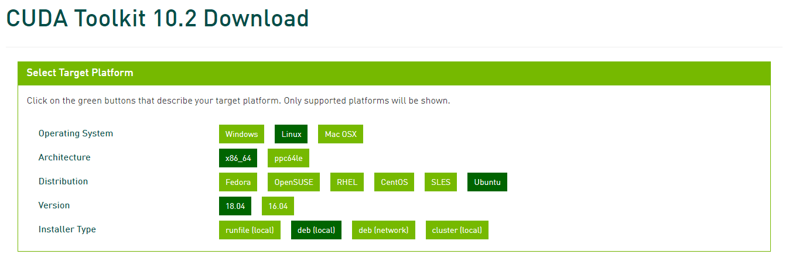

对于计算机视觉开发和研究，包括其他深度学习研发，几乎避免不了使用GPU设备。在你已经具备GPU硬件设备并
把它正确插到主机的前提下：本篇博客讲解在一台 Linux 系统上（具体是 `Ubuntu 18.04 LTS`），
如何让软件把GPU设备使用起来，包括`CUDA Toolkit`安装、环境变量配置等。

虽然这些内容在 NVIDIA 的官方文档都有介绍，但是对于**初次接触或者很少接触**GPU软硬件环境配置的同学来说，冗长的[官方文档](https://docs.nvidia.com/cuda/archive/10.2/cuda-installation-guide-linux/index.html)让人摸不着头脑，甚至望而却步，这就好比老师告诉你考试范围都在教科书上但是你不一定能厘清脉络进而抓住重点。本文对官方文档提纲挈领，讲解配置GPU软硬件环境的必要步骤，这些步骤经过了验证。

进入正文，首先要明确`CUDA`是什么？**`CUDA`是NVIDA公司开发的、支持并行计算的平台和编程模型**。为了使用`CUDA`，你需要具备以下硬件、软件条件：
* CUDA-capable GPU —— 支持 CUDA 的GPU，是硬件设备
* A supported version of Linux with a gcc compiler and toolchain —— `Ubuntu` 系统自带
* [NVIDIA CUDA Toolkit](http://developer.nvidia.com/cuda-downloads) —— 本文**重点关注**的

可以把 `CUDA Toolkit` 理解为一个软件工具箱，里面包含支持 `CUDA` 运行的各种库。`CUDA Toolkit`有两种安装方法：
* distribution-specific packages（RPM and Deb packages）
* distribution-independent package (runfile packages)

就不把它们翻译成中文了，你在实际操作过程中会明白它们的含义，这两种方法安装起来都很方便，但是**官方推荐第一种方法**（distribution-specific packages），因为这种方法与本机操作系统的包管理系统（e.g. `apt`、`apt-get` for `Ubuntu`）有很好的对接，方便后续管理使用，本文也是按照第一种方法进行安装。


{: .box-note}
**Prerequisite :** 安装者要有管理员权限，因为涉及到 `sudo` 操作

### CUDA Toolkit 安装步骤
0. **致实验室用户**：直接跳过 `CUDA Toolkit ` 安装步骤，因为管理员已由管理员完成，只需进行[用户环境变量设置](#用户环境变量设置)

1. 下载 `CUDA Toolkit`，这是[下载地址](https://developer.nvidia.com/cuda-10.2-download-archive?target_os=Linux&target_arch=x86_64&target_distro=Ubuntu&target_version=1804&target_type=deblocal)；文件大小超过1G，如果网速慢会花些时间（我下载的版本是10.2，你很容易从Google找到想要的版本，定制你的安装）


2. 安装CUDA仓库元数据
    * 下载文件，执行如下命令
    ```shell
    wget https://developer.download.nvidia.com/compute/cuda/repos/ubuntu1804/x86_64/cuda-ubuntu1804.pin
    ```

    * 把上述文件转移到合适的目录，执行如下命令
    ```shell
    sudo mv cuda-ubuntu1804.pin /etc/apt/preferences.d/cuda-repository-pin-600
    ```

    * 下载CUDA仓库 `deb` 安装包，执行如下命令
    ```shell
    wget http://developer.download.nvidia.com/compute/cuda/10.2/Prod/local_installers/cuda-repo-ubuntu1804-10-2-local-10.2.89-440.33.01_1.0-1_amd64.deb
    ```

    * 安装CUDA仓库 `deb` 安装包，执行如下命令
    ```shell
    sudo dpkg -i cuda-repo-ubuntu1804-10-2-local-10.2.89-440.33.01_1.0-1_amd64.deb
    ```

2. 为CUDA仓库添加公钥，执行如下命令
```shell
    sudo apt-key add /var/cuda-repo-10-2-local-10.2.89-440.33.01/7fa2af80.pub
```

4. 更新 APT 仓库缓存，执行如下命令
```shell
    sudo apt update
```

5. 安装 `CUDA Toolkit`
```shell
    sudo apt install cuda
```

### 用户环境变量设置
> 进行完上述安装步骤，是在 `Ubuntu` **系统层面**配置好了GPU环境，并不代表特定的用户能够使用了；用户还需要在自己的主目录下，告诉自己所在的`Shell`：系统GPU环境安装在了哪个位置，只需按照下面操作

1. 打开文件 `~/.zshrc`，在末尾添加如下两行代码
```shell
    export CUDA_HOME=/usr/local/cuda
    export PATH=$CUDA_HOME/bin:$PATH
```

2. 让文件 `~/.zshrc`的变更生效，，执行如下命令
```shell
    source ~/.zshrc
```

### 参考资料
> 本文只是总结了必要步骤，让你快速搭建起使用环境，更详细的内容、原因参考以下文档

1. [CUDA Toolkit v10.2.89 Installation Guide Linux](https://docs.nvidia.com/cuda/archive/10.2/cuda-installation-guide-linux/index.html)
2. [CUDA Toolkit 10.2 Download](https://developer.nvidia.com/cuda-10.2-download-archive?target_os=Linux&target_arch=x86_64&target_distro=Ubuntu&target_version=1804&target_type=deblocal)
