这篇博客分享的是 ICML 2020 的一篇文章，这篇文章研究的内容是**自动驾驶——ADAS中，汽车的3D检测和定位**，主要的贡献是**在神经网络中引入了邻近汽车的空间几何关系**，相当于增加了限定条件，在KITTI数据集上的实验表明这种方法提高了3D检测和定位的准确率；文章称处理速度可以达到 27.85 FPS。

论文标题：[MoNet3D: Towards Accurate Monocular 3D Object Localization in Real Time](https://arxiv.org/abs/2006.16007)

论文作者：Xichuan Zhou, Yicong Peng, Chunqiao Long, Fengbo Ren, Cong Shi （来自重庆大学、亚利桑那州立大学）

### 简介
利用**单目图像**对**三维空间**中物体检测和定位是一项有挑战性的任务，解决这个任务对于 Advanced Driving Assistance System(ADAS) 很关键。近年来，研究人员和工程师开发了一些基于深度学习（特别是CNN）的视觉系统，以求对自动驾驶场景中物体进行准确的检测和定位。

单目图像2D物体检测在效率和准确率方面取得了比较好的进展，但是单目3D物体检测还有很多困难。与雷达、双目系统相比，单目视觉系统的准确率较差（比雷达系统低63.02%），还远不能应用到ADAS，但是它的优势是硬件成本低。

单目视觉系统面临的挑战：
* 不能得到场景的深度信息，导致3D目标检测缺乏一个维度
* 物体遮挡、非弹性形变，镜头成像失真（都会有这样的问题，不仅是单目）

研究者试图引入一些先验知识、增加已知量和限制条件，来优化基于深度学习的视觉系统。例如：
* 3D-Deepbox 使用先验知识，即预测的3D边界框应紧密拟合2D边界框
* Mono3D_PLiDAR 假设3D物体的2D投影与2D物体的边界框全局一致 —— _global geometric consistency_

这些研究表明，2D和3D物体的边界框的**几何关系**是有用的信息，本文认为 _global geometric consistency_ 这个假设太强了，提出了 **_local geometric consistency_**：
* 如果两个物体在坐标系中具有相似的深度，并且2D图像离得较近，那么3D空间中离得也应该较近
* 作为一个正则化项，加入神经网络的损失函数（据说提高准确率和训练速度？）
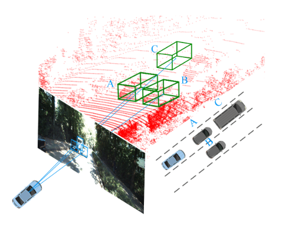

### 相关工作
**3D Object Detection from LiDAR**
* 基于雷达的3D物体检测（雷达设备比摄像头贵很多）
    - Li, B., Zhang, T., and Xia, T. Vehicle detection from 3d lidar using fully convolutional network. arXiv preprint arXiv:1608.07916, 2016
* 基于点云的3D物体检测
    - Qi, C. R., Su, H., Mo, K., and Guibas, L. J. Pointnet: Deep learning on point sets for 3d classification and seg- mentation. In Proceedings of the IEEE Conference on Computer Vision and Pattern Recognition, pp. 652–660, 2017a
    - Qi, C. R., Yi, L., Su, H., and Guibas, L. J. Pointnet++: Deep hierarchical feature learning on point sets in a metric space. In Advances in neural information processing systems, pp. 5099–5108, 2017b
    - Qi, C. R., Liu, W., Wu, C., Su, H., and Guibas, L. J. Frustum pointnets for 3d object detection from rgb-d data. In Proceedings ofthe IEEE Conference on Computer Vision and Pattern Recognition, pp. 918–927, 2018
    - Zhou, Y. and Tuzel, O. Voxelnet: End-to-end learning for point cloud based 3d object detection. In Proceedings ofthe IEEE Conference on Computer Vision and Pattern Recognition, pp. 4490–4499, 2018
    - Chen, X., Ma, H., Wan, J., Li, B., and Xia, T. Multi-view 3d object detection network for autonomous driving. In Proceedings ofthe IEEE Conference on Computer Vision and Pattern Recognition, pp. 1907–1915, 2017b

**3D Object Detection for a Single Monocular Image**

* L3级自动驾驶，尝试用普通摄像头和深度学习方法建立视觉系统

    - Chen, X., Kundu, K., Zhang, Z., Ma, H., Fidler, S., and Ur- tasun, R. Monocular 3d object detection for autonomous driving. In Proceedings ofthe IEEE Conference on Com- puter Vision and Pattern Recognition, pp. 2147–2156, 2016
    - Fang, J., Zhou, L., and Liu, G. 3d bounding box esti- mation for autonomous vehicles by cascaded geometric constraints and depurated 2d detections using 3d results. arXiv preprint arXiv:1909.01867, 2019
    - Zhou, Y. and Tuzel, O. Voxelnet: End-to-end learning for point cloud based 3d object detection. In Proceedings ofthe IEEE Conference on Computer Vision and Pattern Recognition, pp. 4490–4499, 2018
    - Crivellaro, A., Rad, M., Verdie, Y., Yi, K. M., Fua, P., and Lepetit, V. Robust 3d object tracking from monocular images using stable parts. IEEE transactions on pattern analysis and machine intelligence, 40(6):1465–1479, 2017
    - Liu, L., Lu, J., Xu, C., Tian, Q., and Zhou, J. Deep fitting degree scoring network for monocular 3d object detection. In Proceedings of the IEEE Conference on Computer Vision and Pattern Recognition, pp. 1057–1066, 2019
    - Li, B., Ouyang, W., Sheng, L., Zeng, X., and Wang, X. Gs3d: An efficient 3d object detection framework for autonomous driving. In Proceedings of the IEEE Con- ference on Computer Vision and Pattern Recognition, pp. 1019–1028, 2019
    - Qin, Z., Wang, J., and Lu, Y. Monogrnet: A geometric reasoning network for monocular 3d object localization. In Proceedings ofthe AAAI Conference on Artificial In- telligence, volume 33, pp. 8851–8858, 2019

### 主要方法
* 问题定义
    - 输入：an RGB image
    - 输出：汽车3D bounding box ($center \quad point$ 和8个 $corner \quad points$)，3D localization ($x,y,z$)

* 整体模型结构
    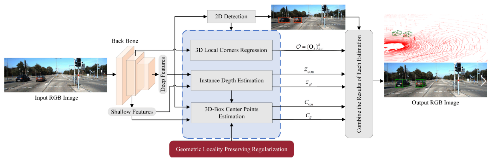

* 图片特征抽取，使用不带全连接层的 VGG-16

* 图片特征处理部分，有4个模块
    - 2D Detection，就是通常的目标检测
    - Car Depth Estimation，个人理解指**相机坐标系下物体的z值**
    - 3D Box Center Point Estimation —— **本文认为是主要的挑战**
        * 中心点 horizontal offset，对于判断汽车在哪个车道很重要，引入了之前提到的 local geometric relation
    - 3D Box Corner Regression，利用2D Detection的结果和图片特征，回归8个3D坐标

* **Geometric-Locality-Preserving Regularization**
    1. 假设训练集有 M 个物体，**S** 是大小为 MxM 的**相似度矩阵**，其中 $s_{ij}$ 表示物体 $i$ 和 $j$ 的局部几何相似度，计算方法如下
        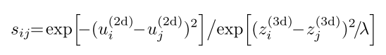
        - $u_{i}^{(2d)}$ 代表物体 $i$ **在像平面**的 horizontal offset
        - $z_{i}^{(3d)}$ 代表物体 $i$ 的**3D** ground truth depth
        - 假设：当 $i$ 和 $j$ 具有相似的 depth，并且像平面 2D bbox 离得近时，$s_{ij}$的值较大；当 $i$ 和 $j$ 具有的 depth 差别较大或者，2D bbox 离得远时，$s_{ij}$的值较小

    2. 用神经网络的一个 $fully \quad connected \quad layer$ 实现这样的假设
        - $y_{i} = \textbf{W} x_{i} + \textbf{b}$，$y_{i}$ 实际是个二维向量 $(u_{i}^{(3d)}, z_{i}^{(3d)})$
        - $x_{i}$ 是全连接层的输入，$\textbf{W}$ 是对应的权重，$\textbf{b}$ 是偏置项
        - 如果两个物体在真实3D空间离得近，**MoNet3D** 试图优化 $\textbf{W}$，让$s_{ij}$变大？？（不太理解原文说的，而且$s_{ij}$也没参与全连接层的计算）
        - 定义一个正则化项 $R(\textbf{W})$，使其最小化  
            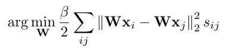
        - 对 $R(\textbf{W})$ 向量化 —— 高效计算
            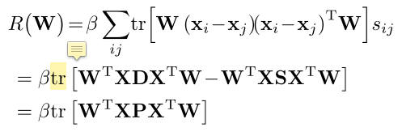
            - **X** = $[x_{1},x_{2},...,x_{M}]$
            - **D** 是对角矩阵，$d_{ii} = \sum_{j} s_{ij}$
            - **P** = **D** - **S**
* 损失函数
    1. 2D Detection，把原始图像划分成 32x32 的grids，用 YOLO 检测，每个 `grid` 产生两个bbox（？？不懂为什么么限定这个），每个bbox表示为 $b_{2d}^g = (u^{(2d)}, v^{(2d)}, d, h)$ 以及 $Pr_{obj}$，$b_{2d}^g$ 的四个量分别代表中心点横纵坐标、高、宽，然后用 NMS + ROIAlign，这部分的损失函数表示为
        - $$ L_{2d} = L_{conf} + \alpha L_{b2d} $$
        - $$ L_{conf} = \mathcal{E}_{g} [\mathcal{S}(\hat{Pr}_{obj}^{g}), Pr_{obj}^{g}] $$
        - $$ L_{b2d} = {\sum_{g}}_{g}^{obj} \cdot \mathcal{L}_{1}(\hat{b}_{2d}^{g}, b_{2d}^{g})$$
        - $ \mathcal{S}(\cdot)$ 是 softmax fuction
        - $ \mathcal{E}(\cdot)$ 是 cross entropy fuction
        - $\mathcal{L}_{1}$ 是 L1 distance
        - $\alpha$ 是平衡因子

    2. Car Depth Estimation，$z_{g}$ 代表某个 `grid` 中的 ground truth 物体深度，估计物体深度时，先用 deep features 预测一个粗略的——coarse深度$$ \hat{z}_{coa}^{g}$$，再用 shallow features 产生的预测 $$z_{\delta}^{g}$$ 作调整，这部分的损失函数表示为
        - $$ L_{z} = \gamma L_{zcoa} + L_{\delta z} $$
        - $$ L_{zcoa} = {\sum_{g}}_{g}^{obj} \cdot \mathcal{L}_{1}(\hat{z}_{coa}^{g}, z^{g}) $$
        - $$ L_{\delta z} = {\sum_{g}}_{g}^{obj} \cdot \mathcal{L}_{1}(\hat{z}_{coa}^{g} + z_{\delta}^{g}, z^{g}) $$
        - $\delta$ 是平衡因子

    3. 3D Box Estimation，预测3D中心点 $C_{3d} = (u^{(3d)}, v^{(3d)}, z^{(3d)})$ 和 立方体八个顶点 $$ \mathcal{O} = {\{\textbf{O}_k\}}_{k=1}^8 $$（8个顶点用 deep features 回归估计）。2D Box 的中心点 $C_{2d} = (u^{(2d)}, v^{(2d)})$，根据成像模型，像素坐标和相机坐标的关系为：
        - 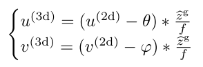
        - $f$ 是焦距，$\theta$、$\varphi$ 是成像平面中心点横纵坐标
        - 3D中心点损失函数为：
        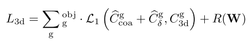
        - 3D Box 8个顶点损失函数为：  
        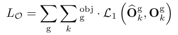

### 实验
* 实验设置
    - 数据集使用`KITTI`，train/test split：3712/3769 images
    - 3 types of objects：
        * easy —— the bounding box height is **greater than 40 pixels**, all the objects are visible and truncated by no more than 15%
        * moderate —— the bounding box height is **greater than 25 pixels**, most objects are visible and truncated by no more than 30%
        * hard —— the bounding box height is **greater than 25 pixels**, and most of the objects are **invisible and not truncated by more than 50%**
    - 3D 物体定位方面，计算 $(u^{(3d)}, v^{(3d)}, z^{(3d)})$ 的相对准确率
    - 3D 物体检测方面，考虑了两个 IOU threshold
        * average 3D accuracy rate
        * bird’s-eye view average accuracy
* 3D 物体定位和检测的结果
    - 定位结果，$u^{(3d)}$ is 94.74%, $v^{(3d)}$ is 97.21%, and $z^{(3d)}$ is 96.25%；之前的方法 M3D $u^{(3d)}$ is 90.59%
    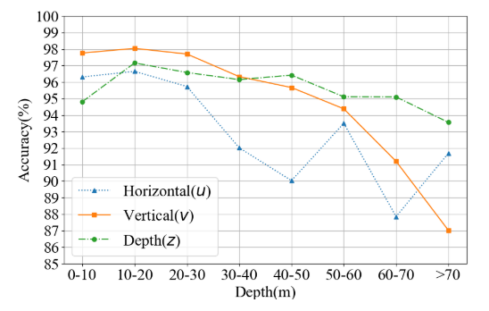
    - 检测结果
    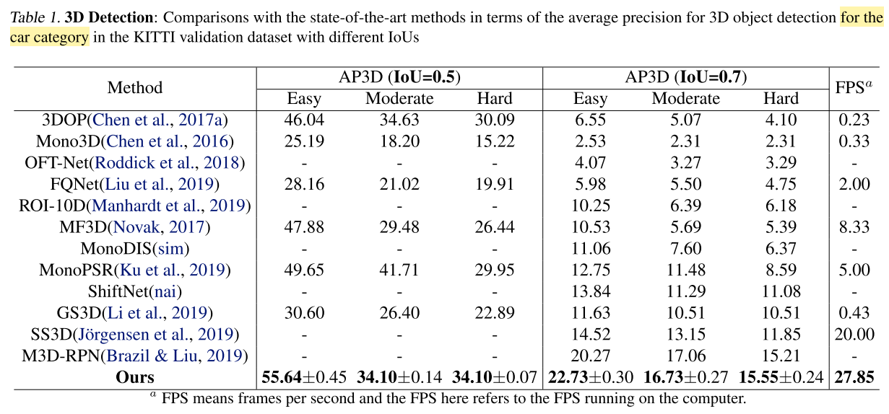
    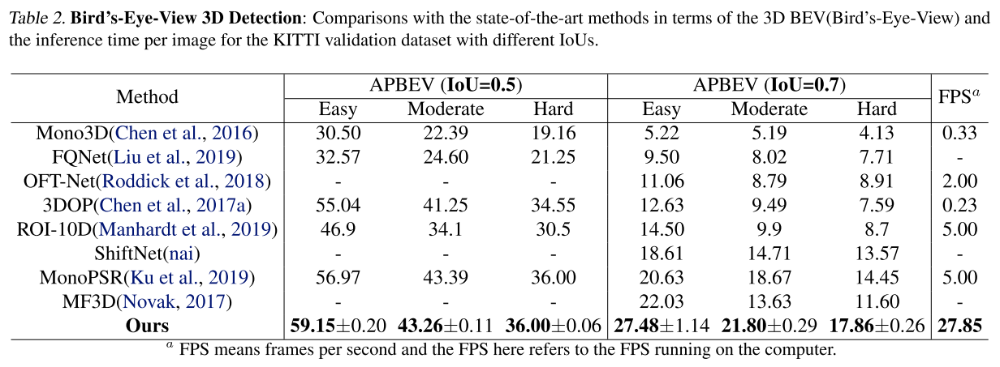
    - 相机在左下角（？？为什么结果是这样的）
    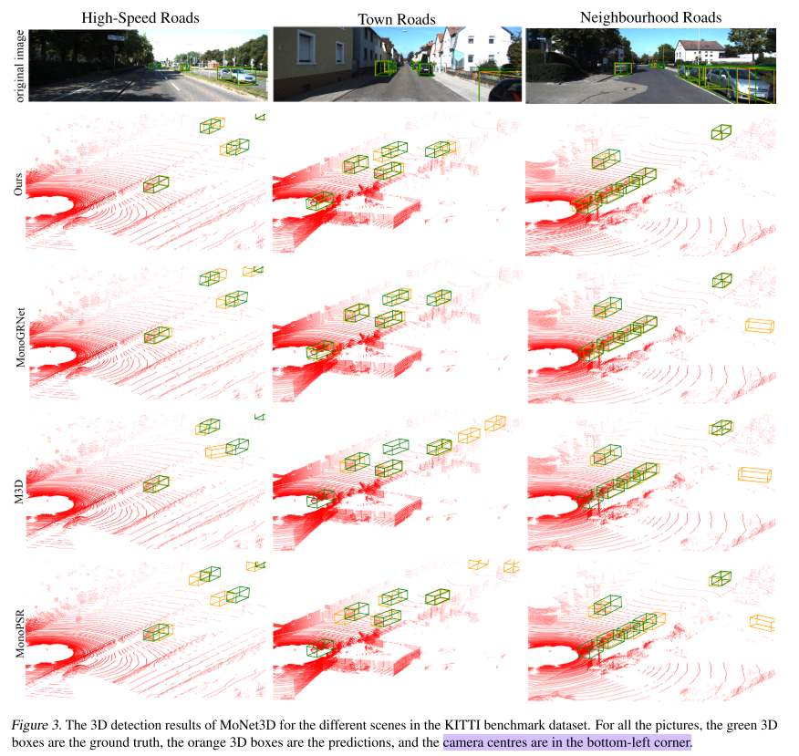

### 总结和讨论
1. 提出了 MoNet3D，把 _local geometric relation_ 作为正则化项加入损失函数，提高3D定位和检测的准确率
2. 较好的实时性 —— 27.85 FPS（？？全文没有讲解速度快的原因，使用什么样的设备达到这样的速度）
* 当前条件，单目视觉3D仅适用于 low speed、short distance 的场景；在高速运动的场景，使用 LiDAR 才能达到可用的程度
* 考虑 2D Detection、3D Detection 相互促进