这篇博客分享的是 AAAI 2019 的一篇文章。该文研究利用单目相机采集的图片，对汽车进行3D定位和检测；主要的贡献是在3D定位和检测过程中
引入了 `geometric knowledge`，并在KITTI数据集进行了测试和消融实验，证明了 `geometric knowledge` 有助于提升3D定位和检测效果；文章称MonoGRNet在Geforce GTX Titan X处理速度为 0.06 sec/frame。

论文标题：[MonoGRNet: A Geometric Reasoning Network for Monocular 3D Object Localization](https://arxiv.org/abs/1811.10247)

论文作者：Zengyi Qin, Jinglu Wang, Yan Lu （来自清华大学、MIT、Microsoft）

## 简介
2D物体检测在一些场景发挥了作用，它是物体跟踪、行人重识别等的基础，但是在机器人、自动驾驶、AR/VR领域，2D物体检测就不够用了，因为缺乏
* 物体真实尺寸信息
* 物体在3D空间的位置信息

本文解决的问题是：从单目图像，定位物体在整个环境中的 3D bounding box（文中术语是 ABBox-3D，amodal 3D bounding box）。2D 物体检测是在像平面上分析，扩展到3D会引来歧义。

许多基于单目的3D检测SOTA方法，通常会估计 pixel-level depth（_不太了解，这方面论文读的比较少_），然后估计物体的3D BBox。本文作者认为估计像素深度的方式，对于物体检测、定位不友好，因为这种方式目标是**最小化所有像素深度的误差之和的平均值**，达到整幅图片最优；然而一幅图像中，很可能物体只占一小部分，更多的是背景，优化过程容易忽略有物体的部分，从而导致3D物体检测和定位效果不佳。

本文提出的 **MonoGRNet**，不去估计 pixel-level depth，而是估计  instance-level depth，二者的区别很明显。直观想法是用神经网络的 deep feature maps 估计coarse instance depth，再用 shallow feature maps 对前面的depth调整。

有了物体的 depth，还需估计 horizontal 和 vertical 位置。本文首先预测物体3D中心在像平面的投影，再结合depth和相机成像模型，得到物体最终的3D位置。这个过程体现了 **Geometric Reasoning**。

## 相关工作
* 2D Object Detection
    * Region Proposal based Method
        * Girshick, R. 2015. Fast r-cnn. In Proceedings of the IEEE international conference on computer vision, 1440–1448.
        * Ren, S.; He, K.; Girshick, R.; and Sun, J. 2017. Faster r-cnn: towards real-time object detection with region proposal networks. IEEE Transactions on Pattern Analysis & Machine Intelligence.
    * Single Stage Detection
        * Redmon, J.; Divvala, S.; Girshick, R.; and Farhadi, A. 2016. You only look once: Unified, real- time object detection. In Proceedings of the IEEE conference on computer vision and pattern recognition, 779–788.
        * Redmon, J., and Farhadi, A. 2017. Yolo9000: Better, faster, stronger. In Computer Vi- sion and Pattern Recognition (CVPR), 6517–6525. IEEE.
        * Liu, W.; Anguelov, D.; Erhan, D.; Szegedy, C.; Reed, S.; Fu, C.-Y.; and Berg, A. C. 2016. Ssd: Single shot multibox detector. In European conference on computer vision (ECCV), 21–37. Springer.
        * Fu, C.-Y.; Liu, W.; Ranga, A.; Tyagi, A.; and Berg, A. C. 2017. Dssd: Deconvolutional single shot detector. arXiv preprint arXiv:1701.06659.
    * Multi-net
        * Teichmann, M.; Weber, M.; Zoell- ner, M.; Cipolla, R.; and Urtasun, R. 2016. Multinet: Real-time joint semantic reasoning for autonomous driving. arXiv preprint arXiv:1612.07695.（组合YOLO、RoIAlign of Mask-RCNN）
* 3D Object Detection
    * Single-view RGB（其实就是单目图像）
        * Chen, X.; Kundu, K.; Zhang, Z.; Ma, H.; Fidler, S.; and Urtasun, R. 2016. Monocular 3d object detection for autonomous driving. In Conference on Computer Vision and Pattern Recognition (CVPR), 2147–2156.
        * Xu, B., and Chen, Z. 2018. Multi-level fusion based 3d object detection from monocular images. In Computer Vision and Pattern Recognition (CVPR), 2345–2353.
        * Chabot, F.; Chaouch, M.; Rabarisoa, J.; Teuli`ere, C.; and Chateau, T. 2017. Deep manta: A coarse-to-fine many-task network for joint 2d and 3d vehicle analy- sis from monocular image. In Computer Vision and Pattern Recognit.(CVPR), 2040–2049.
        * Kehl, W.; Manhardt, F.; Tombari, F.; Ilic, S.; and Navab, N. 2017. Ssd-6d: Making rgb-based 3d detection and 6d pose estimation great again. In Proceedings of the International Conference on Computer Vision (ICCV 2017), Venice, Italy, 22–29.
    * multi-view RGB
        * Chen, X.; Ma, H.;Wan, J.; Li, B.; and Xia, T. 2017. Multi-view 3d object detection network for au- tonomous driving. In IEEE CVPR, volume 1, 3.
        * Chen, X.; Kundu, K.; Zhu, Y.; Berne- shawi, A. G.; Ma, H.; Fidler, S.; and Urtasun, R. 2015. 3d object proposals for accurate object class detection. In Advances in Neural Information Processing Systems, 424–432.
        * Wang, J.; Fang, T.; Su, Q.; Zhu, S.; Liu, J.; Cai, S.; Tai, C.-L.; and Quan, L. Image-based building regularization using structural linear features. IEEE Transactions on Visualization Computer Graphics.
    * RGB-D
        * Qi, C. R.; Liu, W.; Wu, C.; Su, H.; and Guibas, L. J. 2017. Frustum pointnets for 3d object de- tection from rgb-d data. arXiv preprint arXiv:1
        * Song, S., and Xiao, J. 2016. Deep sliding shapes for amodal 3d object detection in rgb-d im- ages. In The IEEE Conference on Computer Vision and Pattern Recognition (CVPR).
        * Liu, J.; Wang, J.; Fang, T.; Tai, C.-L.; and Quan, L. 2015. Higher-order crf structural segmentation of 3d reconstructed surfaces. In IEEE International Conference on Computer Vision.
        * Zhang, H.; Wang, J.; Fang, T.; and Quan, L. 2014. Joint segmentation of images and scanned point cloud in large-scale street scenes with low-annotation cost. IEEE Transactions on Image Processing 23(11):4763–4772.
* Monocular Depth Estimation
    * Eigen, D., and Fergus, R. 2015. Predicting depth, surface normals and semantic labels with a common multi-scale convolutional architecture. In Proceedings ofthe IEEE International Conference on Computer Vision, 2650–2658.
    * Fu, H.; Gong, M.;Wang, C.; Batmanghelich, K.; and Tao, D. 2018. Deep ordinal regression network for monocular depth estimation. In Computer Vision and Pattern Recognition (CVPR).

## 主要方法
* 问题定义
    - 输入：an RGB image
    - 输出：$$ B_{3d} = (B_{2d}, Z_c, \textbf{c}, \mathcal{O}) $$
        * 2D BBox $B_{2d}$
        * 汽车3D空间的 depth $Z_c$（相机坐标系下）
        * 物体3D center在像平面的投影点 $\textbf{c}$
            * 用几何方法求出：3D center ($X_{c}, Y_{c}, Z_{c}$)
        * 3D BBox 
            * 相对于3D center，有8个corner points $ \mathcal{O} = \{\textbf{O}_k\} $, $k = 1,...,8$

* **MonoGRNet** 整体结构
    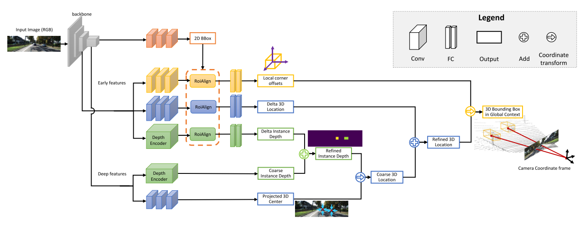
    * 2D BBox Detection
    * Instance Depth Estimation
    * 3D Location Estimation —— 体现了 Geometric Reasoning
    * 3D BBox Regression

* 涉及到几个坐标系
    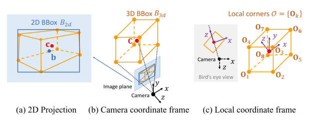
    - 图(a)说明**物体3D中心点，投影到像平面，不一定和2D BBox中心点重合**
    - 图(c) local coordinate frame，以物体3D中心为原点，**相机原点和物体3D中心连线为z轴**

* 2D BBox Detection
    * 利用现成的 Multinet，组合了 YOLO、size-adaptive RoIAlign
    * 一幅 $W \times H$ 的图片，划分成 $S_x \times S_y$ 的网格$\mathcal{G}$，每个网格表示成 $\textbf{g}$，产生一个预测 $(Pr_{obj}^{\textbf{g}}, B_{2d}^{\textbf{g}})$
    * 主干网络输出的 feature map，大小也为 $S_x \times S_y$ $\rightarrow$ 特征图的一个像素对应元素图片的一个 $\textbf{g}$
    * $ B_{2d} = (\delta_{xb}, \delta_{yb}, w, h) $
        - $(\delta_{xb}, \delta_{yb})$ 是相对于 $\textbf{g}$ 的物体中心点坐标
        - 物体宽和高 $(w, h)$

* Instance Depth Estimation
    * 每个$\mathcal{G}$ 中的 $\textbf{g}$，预测一个物体的 3D depth $\leftarrow$ 距离限制 $\delta_{scope}$
    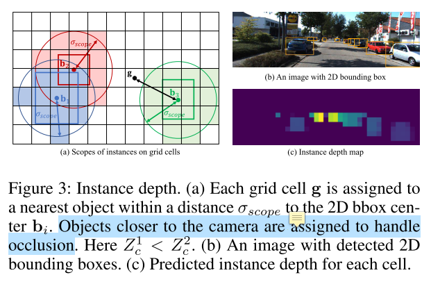
    * deep feature map 预测 coarse depth $Z_{cc}$，shallow feature map 调整 coarse depth $\delta_{Z_{c}}$，$ Z_{c} = Z_{cc} + \delta_{Z_{c}}$
    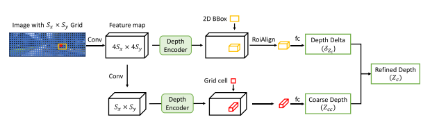

* 3D Location Estimation
    * 估计 $ \textbf{C} = (X_{c}, Y_{c}, Z_{c})$
    * 相机成像模型
        - 
        - $f_x$、$f_y$分别是 X、Y 轴上的焦距；$p_x$、$p_y$是图像的中心点坐标
        - 
    * deep feature map 预测物体投影中心相对于 $\textbf{g}$ 的坐标 $\delta_{\textbf{c}} = (\delta_{x_{c}}, \delta_{y_{c}})$，所以物体投影中心在像平面的坐标为 $\delta_{\textbf{c}} + \textbf{g}$
    * 所以，有了$Z_c$ 和 物体投影中心 $\textbf{c}$，就能得到 $\textbf{C}_s = (X_c, Y_{c}, Z_{c})$
    * shallow feature map 得到 $\delta_{\textbf{C}}$，用来调整 $(X_{c}, Y_{c}, Z_{c})$；最终位置 $\textbf{C} = \textbf{C}_s + \delta_\textbf{C}$

* 3D BBox Regression
    * 估计8个顶点 $ \mathcal{O} = \{\textbf{O}_k\} $, $k = 1,...,8$
    * **直接估计8个顶点在相机坐标系的位置，具有歧义性** —— 不同的物体，由于相机视角，可能产生相同的投影
        - 参考前人的工作，在 local coordinate frame 下估计顶点坐标
    * 计算出来的顶点是相对于物体3D中心的，还需要转换到相机坐标系
        - $$ \textbf{O}_{k}^{cam} = \textbf{R} \textbf{O}_{k} + \textbf{C}$$
        - $\textbf{R}$ 可求，$\textbf{C}$ 就是上面计算出来的中心点

* Loss Functions
    * 2D Detection Loss
        - 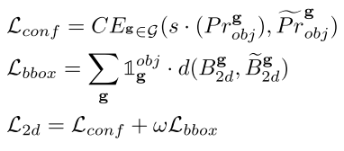
    * Instance Depth Loss
        - 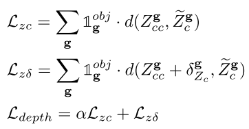
    * 3D Localization Loss
        - 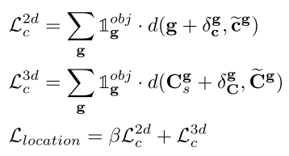
    * Local Corner Loss
        - $$ \mathcal{L}_{corners} = \sum_{\textbf{g}} \sum_{k} \mathbbm{1}_{\textbf{g}}^{obj} \cdot d(\textbf{O}_k, \tilde{\textbf{O}}_k) $$
    * Joint 3D Loss
        - $$ \mathcal{L}_{joint} = \sum_{\textbf{g}} \sum_{k} \mathbbm{1}_{\textbf{g}}^{obj} \cdot d(\textbf{O}_k^{cam}, \tilde{\textbf{O}}_k^{cam}) $$

* 一些实现细节
    - VGG-16 backbone，不带全连接层，抽取特征
    - KITTIBox (Teichmann et al. 2016) for 2D detection
    - DORN (Fu et al. 2018) for depth encoder
    - 7.7M paprameters for all 2D and 3D modules

## 实验
* 3D Location Estimation
    - 评价指标：mean erros，$\rightarrow$ 预测的物体位置和距离最近的ground truth
    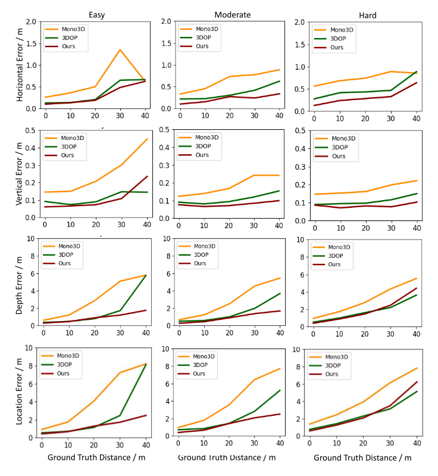
    - 三个维度，depth error 占主导

* 3D Detection
    - 评价指标：3D Average Precision ($AP_{3D}$) at different Intersection of Union (IoU) thresholds
    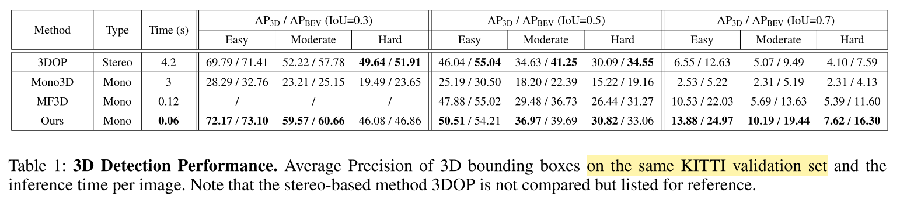

* Local 3D Bounding Box Regression
    - 估计box宽、高、长
    - 估计box朝向 orientation，用相机坐标系下的方位角计算（？？不太理解如何）
    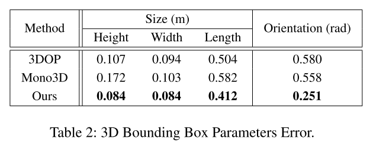

* 一些可视化案例
    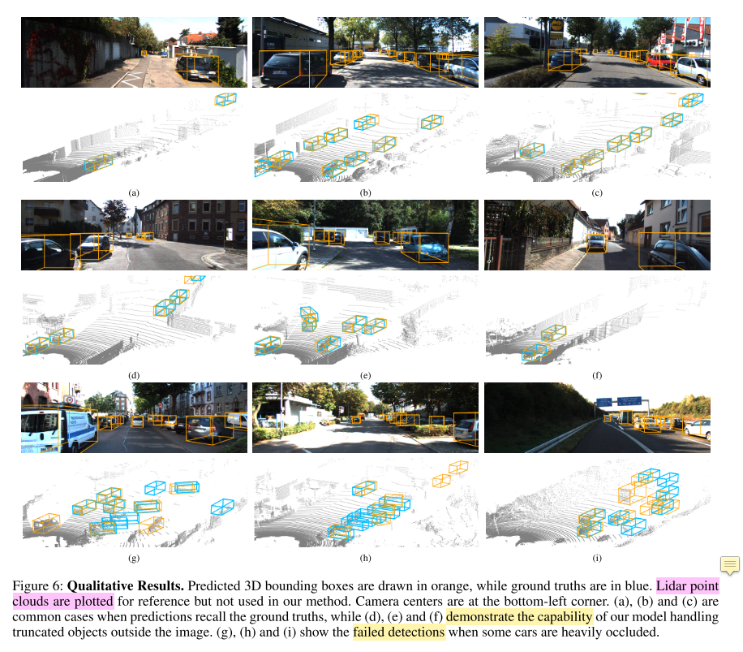
    - (a)(b)(c) : common areas
    - (d)(e)(f) : truncated objects
    - (g)(h)(i) : failed detections

* Ablation Study
    * 如果直接把 2D BBox 中心点 $\textbf{b}$ 当作物体3D中心在像平面的投影点 $\textbf{c}$，进行定位
        - horizontal location error rises from 0.27m to 0.35m
        - vertical error increases from 0.09m to 0.69m
        - 当物体被截断时，$\textbf{c}$ 可能落在像平面外，$\textbf{b}$ 总是在像平面
    * 如果直接估计 3D BBox 在相机坐标系下的8个顶点
        - average orientation error increases from 0.251 to 0.442 radians
        - height, width and length errors of the 3D bounding box almost remain the same

## 总结
* 提出了单目图像的3D物体检测和定位模型 `MonoGRNet`
* 直接进行 instance-level depth estimation，而不是 pixel-level depth estimation
* 把像平面**2D BBox中心点**和**物体3D中心在像平面的投影点**区分开来，利用相机模型进行 `geometric reasoning`

## 思考
* 其实本文3D定位的核心：先估计物体在相机坐标系的深度，**再利用相机成像模型**，把2D平面的点转换到3D空间
* 3D BBox直接用神经网络估计相对于中心点的坐标值