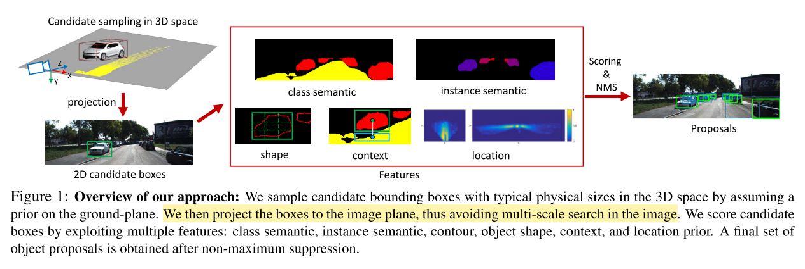
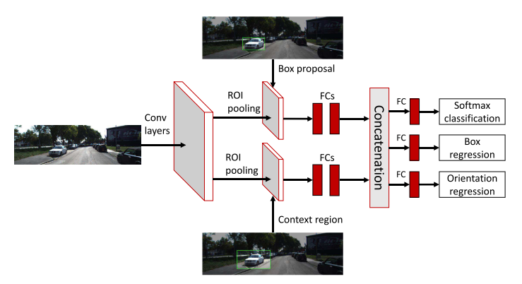
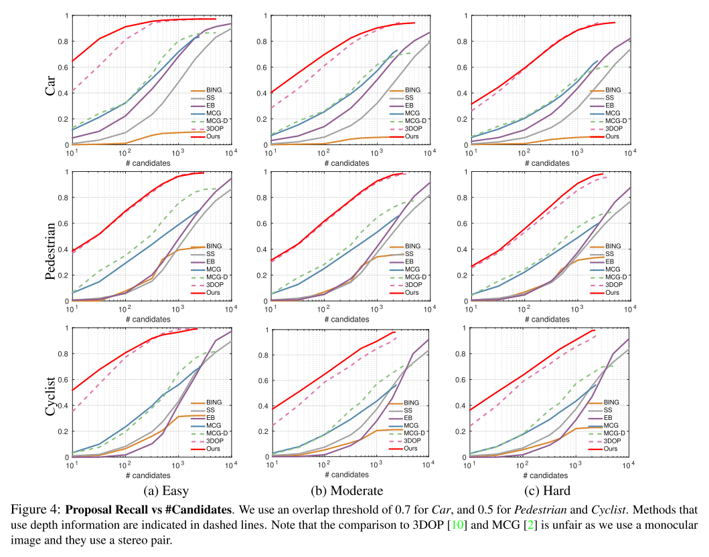
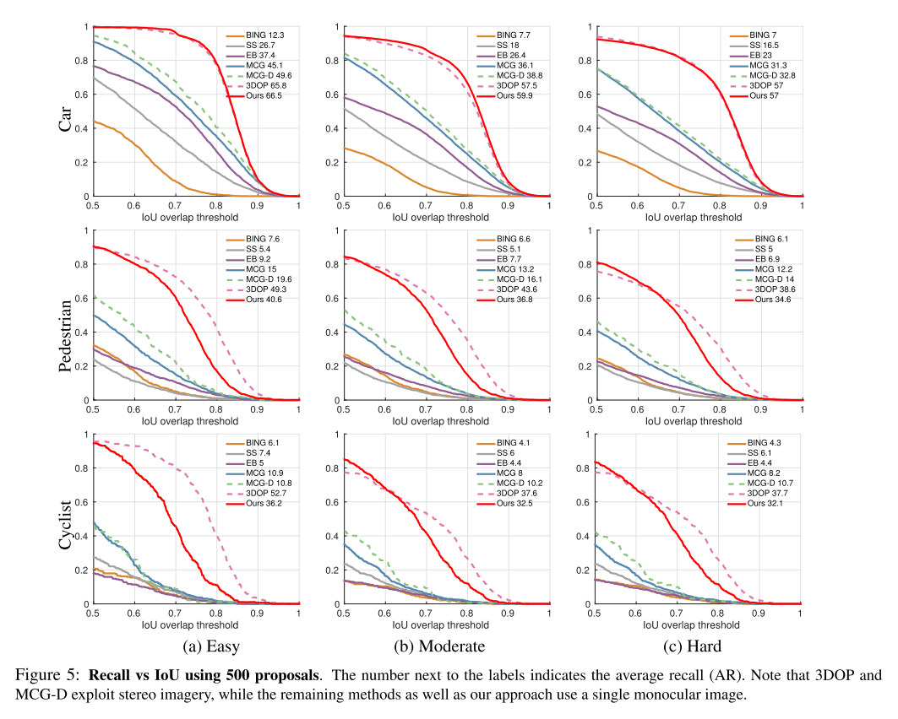
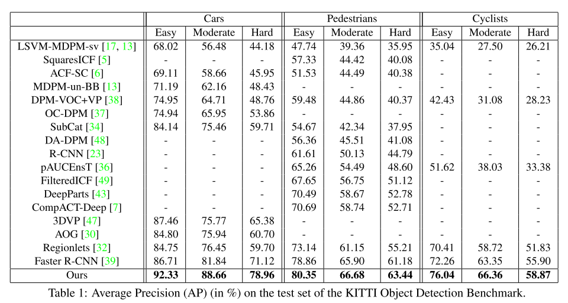
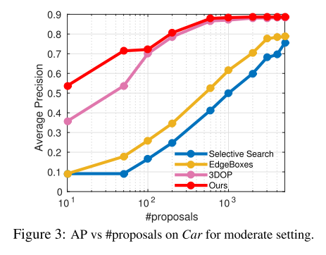
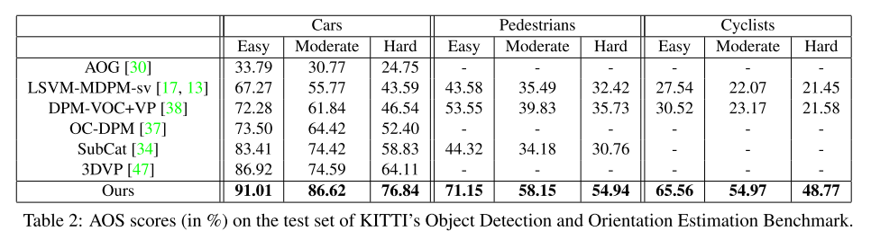
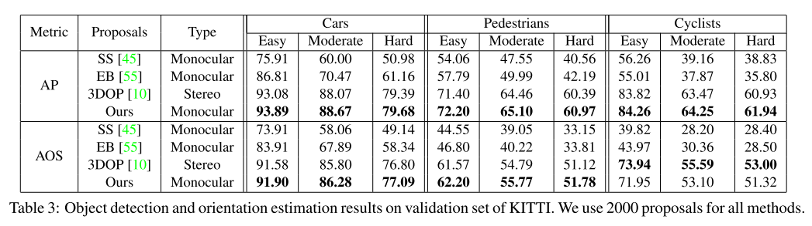
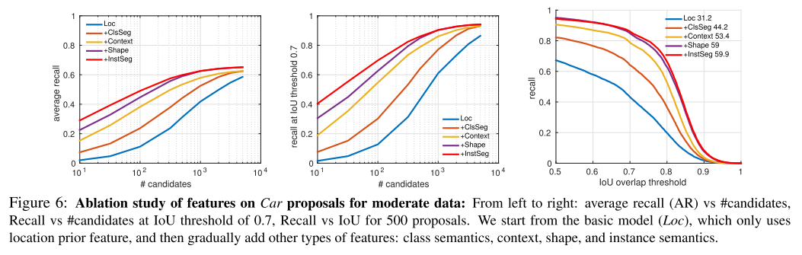
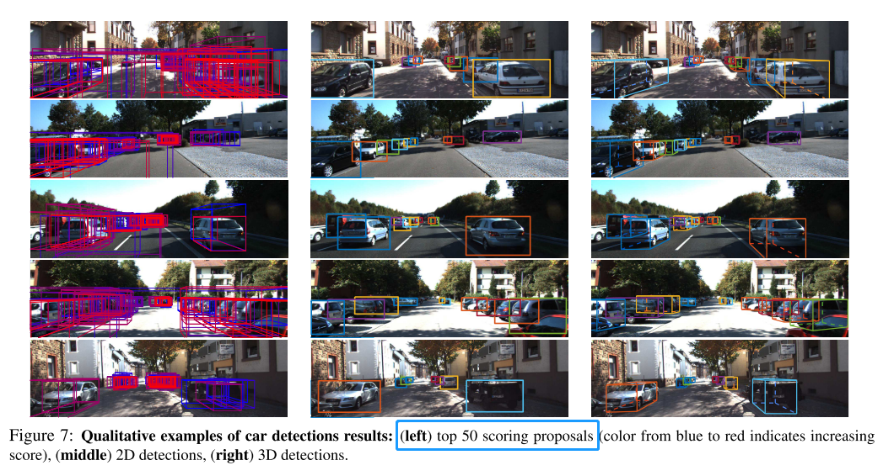

这篇博客分享的是 CVPR 2016 的一篇论文，该论文研究自动驾驶场景中物体3D检测问题。从时间上来看该文算是自动驾驶3D物体检测
比较早的研究了，其中的方法在当时来看比较前沿，但是现在看有点老旧——部分模块还在用SVM等机器学习模型，因为这个领域的进展非常快，每年都会涌现大量文章，清一色基于深度学习模型。选择分享这篇文章，是因为它比较经典，引用量达接近400 —— 后续文章在做介绍和对比试验的时候不约而同提到了它。

论文标题：[Monocular 3D Object Detection for Autonomous Driving](https://www.cv-foundation.org/openaccess/content_cvpr_2016/papers/Chen_Monocular_3D_Object_CVPR_2016_paper.pdf)

论文作者：Xiaozhi Chen, Kaustav Kundu, Ziyu Zhang, Huimin Ma, Sanja Fidler, Raquel Urtasun（来自清华大学、多伦多大学）

### 简介
当前（本文指2016年之前的几年），自动驾驶系统大部分依赖于雷达和人工标注的地图，本文关注从单目图像进行2D和3D物体检测。最近的目标检测工作流程，习惯上先生成各式各样的 object proposals，这样做的好处有两个：一是避免没有目的地全部搜索从而加速计算，二是能提高物体检测召回率。本文沿用了这样的思路。

生成 object proposal 的方法，有下面几类：
* over-segment the image into superpixels and group these using several similarity measures [45, 2]
* explore an exhaustive set of windows using simple “objectness” features [1, 11], or contour information
* recent works learn how to propose promising object candidates using
    * ensembles of binary segmentation models [27]
    * parametric energies [29]
    * window classifiers based on CNN features [18]

这些方法在 PASCAL VOC 数据集上展示出了较好的效果，也就是说在2D检测方面表现良好，但是放到自动驾驶场景 —— KITTI数据集，之前表现好的方法就落后许多了。当前KITTI数据集上表现最好的是 Chen et al. 提出的方法，用双目图像生成3D object proposals。

本文的方法与此类似，利用单目图片上下文和语义信息，让模型学习生成 class-specific 3D object proposals。这些 proposals 通过详尽地把3D BBox 放到地平面并用简单有效的图片特征对它们打分的方式生成，图片特征包括：物体类别语义，物体实例语义，物体形状、位置，物体上下文（指物体外加所在地面）。实验表明该模型在KITTI数据集达到了单目图像SOTA，与双目效果接近。

### 相关工作
* Object Proposal Generation
    * RGB
        * K. Van de Sande, J. Uijlings, T. Gevers, and A. Smeulders. Segmentation as selective search for object recognition. In ICCV, 2011.
        * L. Zitnick and P. Doll´ar. Edge boxes: Locating object proposals from edges. In ECCV. 2014.
        * J. Carreira and C. Sminchisescu. Cpmc: Automatic object segmentation using constrained parametric min-cuts. PAMI, 34(7):1312–1328, 2012.
        * P. Arbelaez, J. Pont-Tusetand, J. Barron, F. Marques, and J. Malik. Multiscale combinatorial grouping. In CVPR. 2014.
        * M. Cheng, Z. Zhang, M. Lin, and P. Torr. BING: Binarized normed gradients for objectness estimation at 300fps. In CVPR, 2014.
        * T. Lee, S. Fidler, and S. Dickinson. A learning framework for generating region proposals with mid-level cues. In ICCV, 2015.
    * RGB-D
        * D. Banica and C. Sminchisescu. Cpmc-3d-o2p: Semantic segmentation of rgb-d images using cpmc and second order pooling. In CoRR abs/1312.7715, 2013.
        * S. Gupta, R. Girshick, P. Arbelaez, and J. Malik. Learning rich features from RGB-D images for object detection and segmentation. In ECCV. 2014.
        * D. Lin, S. Fidler, and R. Urtasun. Holistic scene understanding for 3d object detection with rgbd cameras. In ICCV, 2013.
        * A. Karpathy, S. Miller, and L. Fei-Fei. Object discovery in 3d scenes via shape analysis. In ICRA, 2013.
    * Video
        * D. Oneata, J. Revaud, J. Verbeek, and C. Schmid. Spatio-temporal object detection proposals. In ECCV, 2014.
    * learn to propose objects
        * T. Lee, S. Fidler, and S. Dickinson. A learning framework for generating region proposals with mid-level cues. In ICCV, 2015.
        * P. Kr ahenb uhl and V. Koltun. Geodesic object proposals. In ECCV, 2014.
        * P. Kr ahenb uhl and V. Koltun. Learning to propose objects. In CVPR, 2015.
        * A. Ghodrati, A. Diba, M. Pedersoli, T. Tuytelaars, and L. V. Gool. Deepproposal: Hunting objects by cascading deep convolutional layers. In arXiv:1510.04445, 2015.
* 3D Object Detection
    * X. Chen, K. Kundu, Y. Zhu, A. Berneshawi, H. Ma, S. Fidler, and R. Urtasun. 3d object proposals for accurate object class detection. In NIPS, 2015.（**双目**）
    * M. Zia, M. Stark, and K. Schindler. Towards scene understanding with detailed 3d object representations. IJCV, 2015.
    * B. Pepik, M. Stark, P. Gehler, and B. Schiele. Multi-view and 3d deformable part models. PAMI, 2015.
    * P. F. Felzenszwalb, R. B. Girshick, D. McAllester, and D. Ramanan. Object detection with discriminatively trained part based models. PAMI, 2010.（**DPM**）
    * S. Fidler, S. Dickinson, and R. Urtasun. 3d object detection and viewpoint estimation with a deformable 3d cuboid model. In NIPS, 2012.
    * E. Ohn-Bar and M. M. Trivedi. Learning to detect vehicles by clustering appearance patterns. IEEE Transactions on Intelligent Transportation Systems, 2015.（**visual and geometric information**）
    * C. Long, X. Wang, G. Hua, M. Yang, and Y. Lin. Accurate object detection with location relaxation and regionlets relocalization. In ACCV, 2014.
    * S. Wang, S. Fidler, and R. Urtasun. Holistic 3d scene understanding from a single geo-tagged image. In CVPR, 2015.
    * Y. Xiang, W. Choi, Y. Lin, and S. Savarese. Data-driven 3d voxel patterns for object category recognition. In CVPR, 2015.（**3DVP**）

### 主要方法
* 模型整体结构
    
    - 红色箭头`projection`这一步，我理解的是把3D投影到2D，就可以利用图片信息了，中间红色大方框正是图片的各种特征，然后用评分方法给出proposal得分，后续用NMS处理
    - 问题是：上面的操作都在2D图片上进行，最后怎么得到3D Proposals？？扩展的方法是什么？？
    - **注意**：这里仅是生成 3D proposals，**还不是 3D BBox**，生成 3D BBox 使用了前人的方法，并不是本文的创新

* Generating 3D Object Proposals
    * 物体的形式化定义：$ \textbf{y} = (x, y, z, \theta, c, t) $
    * $(x, y, z)$ 是3D BBox中心
    * $\theta$ 是物体的方位角 —— 代表物体朝向，对于画框很关键
    * $ c \in C =$ {Cars, Pedestrians, Cyclists} on KITTI
    * 3D BBox的大小用3D templates $t$ 表示，**文章称从训练数据学习**
    * 3D Object Proposals 的打分函数
        - $$ E(x,y) = \textbf{w}_{c,sem}^{T} \phi_{c,sem}(\textbf{x}, \textbf{y}) + \textbf{w}_{c,inst}^{T} \phi_{c,inst}(\textbf{x}, \textbf{y}) + \\ \textbf{w}_{c,cont}^{T} \phi_{c,cont}(\textbf{x}, \textbf{y}) + \textbf{w}_{c,loc}^{T} \phi_{c,loc}(\textbf{x}, \textbf{y}) + \\ \textbf{w}_{c,shape}^{T} \phi_{c,shape}(\textbf{x}, \textbf{y}) $$
        - 下面会分析其中的每一项

    * Semantic Segmentation
        - 分割类别：car, pedestrian, cyclist and road
        - 考虑了两种类型的特征
        - 第一种类型：按像素粒度算，类别为 $c$ 的物体出现在2D BBox的百分比
        - $$ \phi_{c,seg}(\textbf{x}, \textbf{y}) = \frac{\sum_{i \in \Omega(\textbf{y})}S_c(i)}{|\Omega(\textbf{y})|}$$
            - $\Omega(\textbf{y})$ 是3D BBox $\textbf{y}$在像平面投影的像素集合
            - $S_c$ 物体类别 $c$ 的 segmentation mask
        - 第二种类型：按像素粒度算，除类别为 $c$ 的物体外其他像素出现在2D BBox的百分比
        - $$ \phi_{c,non-seg,c'}(\textbf{x}, \textbf{y}) = \frac{\sum_{i \in \Omega(\textbf{y})}S_{c'}(i)}{|\Omega(\textbf{y})|}$$
            - 包含了**道路**、**其他所有类别**的特征
            - 整体优化，使这一项尽可能小
        - 具体地
            - [41, 52] jointly learn the convolutional fea- tures as well as the pairwise Gaussian MRF potentials to smooth the output labeling.
            - SegNet [3] performs semantic labelling
            - use the pre-trained model on PASCAL VOC + COCO from [52] for $Car$ segmentation
            - pre-trained SegNet model from [3] for $Pedestrian$ and $Cyclist$ segmentation
            - KITTI 数据集语义分割的标注很少，所以没在上面finetune
            - **road benchmark of KITTI** to finetune the network of [41] for road
            - 多次提到积分图 —— integral images，**没明白是什么？？**

    * Shape
        - 计算 Semantic Segmentation 后物体的轮廓(instead of the original image)
        - 创建了 two grids，一个grid大小为 1 x 1，另一个大小为 $K \times K$，得到 $(1 + K \times K)$ 的特征向量
        - tries to place a bounding box tightly around the object

    * Instance Segmentation
        - exploit the approach of [51, 50], which uses a CNN to create both instance-level pixel labeling as well as ordering in depth
        - re-trained their model so that no overlap (not even in terms of sequences) exist between our training and valida- tion.
        - Note that this approach is **only available for Cars**

    * Context
        - 编码物体及上下文，e.g.: cars are on the road, and thus we can see road below them
        - use a rectangle below the 2D projection of the 3D bounding box as the contextual region.
        - set its height to 1/3 of the height of the box, and use the same width, as in [33]
    * Location
        - 从两个角度编码位置信息：birds' eye view, image plane
        - learn the prior using kernel density estimation (KDE) with a fixed standard deviation of 4m for the 3D prior and 2 pixels for the image domain
        - The 3D prior is learned using the 3D ground-truth bounding boxes available in KITTI

* 3D Proposal Learning and Inference
    - 使用 exhaustive search as inference 创建 candidate proposals
    - 使用 structured SVM 学习模型权重，我理解的是学习 $E(x,y)$ 右侧各子模块的权重
    - 此模块损失函数：3D IoU

* CNN Scoring of Top Proposals
    - 有了 3D Proposals，要对 proposals 处理：抛弃或者预测category、BBox、orientation
    - 使用论文 Chen et al. 的方法，结构图如下
    - 
    - 基于 Fast R-CNN 搭建，计算整幅图片特征后分成2个分支
        - one branch encodes features from the proposal regions
        - another is specific to context regions by enlarging the proposal regions by a factor of 1.5（参考之前的工作）
        - 每个分支有 RoI pooling + 2 FC layers
        - RoIs are obtained by projecting the proposals or context regions onto the conv5 feature maps.
    - 此模块最终的输出组合了两个分支的特征
    - 多任务损失函数 —— category labels, bounding box offsets, and object orientation
        - category loss as cross entropy
        * orientation loss as a smooth ℓ1
        * bounding box offset loss as a smooth ℓ1

* 一些实现细节
    * Sampling Strategy（不理解为什么起这样的名字）
        - 在 proposal gener- ation model，把物体放到了地平面
        - KITTI中，相机位置已知，**对于所有图像地平面是固定的？？**
        - 认为像平面正交于地平面，相机距离地平面 $h_{cam} = 1.65m$
        - 但是对于地面有斜坡的情况并不成立，所以调整为 $h_{cam} = 1.65m + \delta $，$\delta \in \{0,\pm\sigma\}$ for $Car$，$\delta \in \{0,\pm\sigma,\pm2\sigma\}$ for $Predestrian$ and $Cyclist$。$\sigma$ 是高斯分布标准差的极大似然估计

    * Network Setup
        - 用 VGG-16 初始化模型，**对应哪部分呢？？**
        - CNN Scoring of Top Proposals 的两个分支用 VGG-16 的全连接层初始化
        - KITTI图片中的小物体，扩大输入图像3.5倍 following [10]

### 实验
* 数据集：KITTI object detection benchmark
    - Car, Pedestrian, and Cyclist, with 7,481 training and 7,518 test images
    - 根据 occlusion and truncation levels，每个类别评价时有3种模式：easy, moderate, hard

* 评估指标：
    - 对于 proposals generation，使用 **recall** following [22, 45]
        - ？？**对比 recall 是否有意义**，因为最后的目标是 3D object detection，过多的 proposals 会降低模型推理速度
        - （用这个评价有些少见，对于这个论文想要强调的点，可能是有利的）
        - IoU threshold to 70% for Car and 50% for Pedestrian and Cyclist following the KITTI setup
    - 对于 3D object detection，有两个子任务
        - object detection，使用 **average precision (AP)**
        - object detection and orientation estimation，使用 **Average Orientation Similarity (AOS)**

* Baselines
    - 3DOP [10], MCG-D [21], MCG [2], Selective Search (SS) [45], BING [11], and Edge Boxes (EB) [55]
    - 3DOP and MCG-D exploit **depth information**, while the remaining methods as well as our approach only use a single RGB image
    - all of the above approaches, but 3DOP, are **class independent** (trained to detect any foreground object)
    - while we use **class-specific** weights as well as **semantic segmentation** in our features

* Proposals Generation 结果
    
    

* KITTI Object Detection Benchmark

* KITTI Object Detection and Orientation Estimation Benchmark

* Ablation Study

* Showcased Examples

### 思考和讨论
* 这篇文章就是会写，把别人的工作组合在一起，但强调自己的贡献
* 从头到尾讲的是2D图像的操作，**3D框、朝向是怎么得到？？**难道是 CNN Scoring of Top Proposals 的输出？？