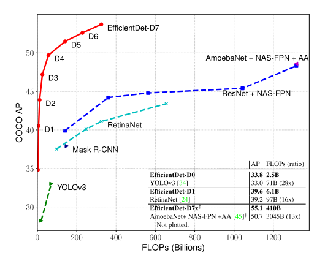

目标检测是计算机视觉的一大研究主题，长期以来热度不减。深度学习大规模应用于视觉领域后，目标检测的研究进展飞快，例如：每年各大CV顶会论文，目标检测的主题占很大比例。随着检测准确率的提升，这方面的研究倾向于关注模型效率，追求更高的检测精度和更快的检测效率，同时往往和神经架构搜索结合，探索不同的模型架构，以适配不同的资源条件。本文介绍的这篇论文，是 Google 提出的目标检测模型 —— EfficientDet，**实验表明兼具准确率和效率优势**，它实际上是一个系列：共有 D0-D7 八个检测器，从最基本的 EfficientDet D0 出发，运用神经架构搜索和模型缩放技术，扩展出了 D1-D7，每种检测器的检测精度和效率不同，满足不同的资源场景的需求。

**FLOPs** 指整个神经网络加法和乘法的运算次数，根据网络结构求得

EfficientDet 一些亮点：
* EfficientDet-D0 uses 28x fewer FLOPs than YOLOv3 under similar accuracy constraint
* EfficientDet-D7 achieves state-of-the-art 55.1 AP with 77M parameters and 410B FLOPs
    * outperforming previous best detector AmoebaNet-based NAS-FPN by 4 AP
    * while being 2.7x smaller and using 7.4x fewer FLOPs

论文题目：[EfficientDet: Scalable and Efficient Object Detection](https://arxiv.org/abs/1911.09070)

论文作者：Mingxing Tan Ruoming Pang Quoc V. Le (from Google Research, Brain Team)

### 简介
目标检测模型在检测准确度方面有了很大进步，但随之而来的问题是模型结构越来越复杂、参数越来越多、训练成本越来越昂贵，例如 AmoebaNet-based NAS-FPN detector 达到 SOTA 的检测准度时有 167M 参数，3045B 次加法和乘法运算，由于模型本身巨大的计算量和资源需求，很难实现整个系统高效运行，不适合部署在现实场景。

有一些研究工作已经在关注更加高效的网络架构，比如 one-stage detectors 、anchor-free detectors、对已有模型压缩。作者认为这些工作存在两个问题：
* 追求模型效率时，牺牲了准确率
* 提出的检测器只能在特定软硬件资源条件下工作，不能适配不同的资源场景：from mobile devices to data centers
    * 我认为这个理由比较牵强，是用来写作的目的，因为有的检测器就是为了解决特定的问题，而不是大范围的问题

本文的直观想法是：能否建立一个 scalable detection architecture，兼具 higher accuracy、better efficiency，来适配不同的资源限制条件？所以本文研究的重点是：基于 one-stage detectors，检测器中backbone、feature fusion、class/box network 架构设计。面临的挑战有：
* efficient multi-scale feature fusion
    * 类似的工作 FPN、PANet、NAS-FPN，说明这块很重要
    * 我觉得更多是为了呼应提出的 Bi-directional Feature Pyramid Network (BiFPN)
* model scaling
    * 缩放一个轻量、高准确度的网络，有助于兼顾accuracy、efficiency
    * 我觉得这个是重点

整体流程：
* 用 EfficentNet 作为提取图片特征的主干网络
    * EfficentNet 是一个图片分类器系列 B0-B7，经过缩放得来
* 用本文重点强调的 BiFPN 对特征进行融合
* 再输入到目标分类和边界框回归网络

### 相关工作
* One-Stage Detectors
    * Tsung-Yi Lin, Piotr Doll´ar, Ross Girshick, Kaiming He, Bharath Hariharan, and Serge Belongie. Focal loss for dense object detection. ICCV, 2017. 1,
    * Joseph Redmon and Ali Farhadi. Yolo9000: better, faster, stronger. CVPR, 2017.
    * Laurent Sifre. Rigid-motion scattering for image classifica- tion. Ph.D. thesis section 6.2, 2014.
    * Wei Liu, Dragomir Anguelov, Dumitru Erhan, Christian Szegedy, Scott Reed, Cheng-Yang Fu, and Alexander C Berg. SSD: Single shot multibox detector. ECCV, 2016.
    * Jonathan Huang, Vivek Rathod, Chen Sun, Menglong Zhu, Anoop Korattikara, Alireza Fathi, Ian Fischer, ZbigniewWo- jna, Yang Song, Sergio Guadarrama, et al. Speed/accuracy trade-offs for modern convolutional object detectors. CVPR, 2017.
    * Hei Law and Jia Deng. Cornernet: Detecting objects as paired keypoints. ECCV, 2018.
    * Qijie Zhao, Tao Sheng, YongtaoWang, Zhi Tang, Ying Chen, Ling Cai, and Haibin Ling. M2det: A single-shot object de- tector based on multi-level feature pyramid network. AAAI, 2019.
    * Xingyi Zhou, Dequan Wang, and Philipp Krhenbhl. Objects as points. arXiv:1904.07850, 2019.

* Two-Stage Detectors
    * Zhaowei Cai and Nuno Vasconcelos. Cascade r-cnn: Delving into high quality object detection. CVPR, pages 6154–6162, 2018.
    * Ross Girshick. Fast r-cnn. ICCV, 2015.
    * Kaiming He, Georgia Gkioxari, Piotr Doll´ar, and Ross Gir- shick. Mask r-cnn. ICCV, pages 2980–2988, 2017.
    * Shaoqing Ren, Kaiming He, Ross Girshick, and Jian Sun. Faster r-cnn: Towards real-time object detection with region proposal networks. NIPS, 2015.

* Multi-Scale Feature Representations
    * perform direct predictions from pyramidal feature hierarchy extracted from backbone networks
        - Zhaowei Cai, Quanfu Fan, Rogerio S Feris, and Nuno Vas- concelos. A unified multi-scale deep convolutional neural network for fast object detection. ECCV, pages 354–370, 2016.
        - Wei Liu, Dragomir Anguelov, Dumitru Erhan, Christian Szegedy, Scott Reed, Cheng-Yang Fu, and Alexander C Berg. SSD: Single shot multibox detector.
        - Pierre Sermanet, David Eigen, Xiang Zhang, Micha¨el Math- ieu, Rob Fergus, and Yann LeCun. Overfeat: Integrated recognition, localization and detection using convolutional networks. ICLR, 2014.
    * FPN proposes a top-down pathway to combine multi-scale features
        - Tsung-Yi Lin, Piotr Doll´ar, Ross Girshick, Kaiming He, Bharath Hariharan, and Serge Belongie. Feature pyramid networks for object detection. CVPR, 2017.
        - Shu Liu, Lu Qi, Haifang Qin, Jianping Shi, and Jiaya Jia. Path aggregation network for instance segmentation. CVPR, 2018.
        - Peng Zhou, Bingbing Ni, Cong Geng, Jianguo Hu, and Yi Xu. Scale-transferrable object detection. CVPR, pages 528– 537, 2018.
        - Golnaz Ghiasi, Tsung-Yi Lin, Ruoming Pang, and Quoc V. Le. Nas-fpn: Learning scalable feature pyramid architecture for object detection. CVPR, 2019.
        - Md Amirul Islam, Mrigank Rochan, Neil DB Bruce, and Yang Wang. Gated feedback refinement network for dense image labeling. CVPR, pages 3751–3759, 2017.

* Model Scaling
    * Mingxing Tan and Quoc V. Le. Efficientnet: Rethinking model scaling for convolutional neural networks. ICML, 2019.
    * Tsung-Yi Lin, Piotr Doll´ar, Ross Girshick, Kaiming He, Bharath Hariharan, and Serge Belongie. Focal loss for dense object detection. ICCV, 2017. 1,
    * Barret Zoph, Ekin D. Cubuk, Golnaz Ghiasi, Tsung-Yi Lin, Jonathon Shlens, and Quoc V. Le. Learning data aug- mentation strategies for object detection. arXiv preprint arXiv:1804.02767, 2019. 1,
    * Andrew Howard, Mark Sandler, Grace Chu, Liang-Chieh Chen, Bo Chen, Mingxing Tan, Weijun Wang, Yukun Zhu, Ruoming Pang, Vijay Vasudevan, Quoc V. Le, and Hartwig Adam. Searching for mobilenetv3. ICCV, 2019.
    * Mingxing Tan, Bo Chen, Ruoming Pang, Vijay Vasudevan, and Quoc V Le. Mnasnet: Platform-aware neural architec- ture search for mobile. CVPR, 2019.

### 主要方法
* BiFPN