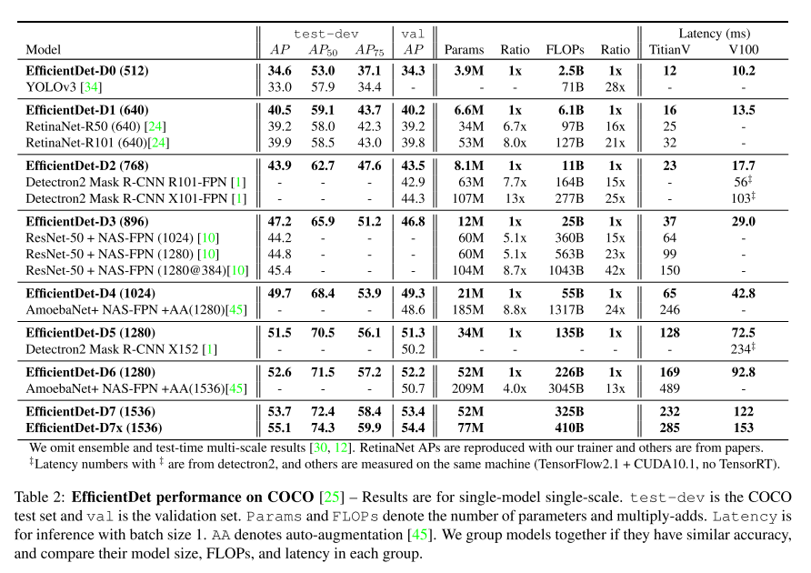

目标检测是计算机视觉的一大研究主题，长期以来热度不减。深度学习大规模应用于视觉领域后，目标检测的研究进展飞快，例如：每年各大CV顶会论文，目标检测的主题占很大比例。随着检测准确率的提升，这方面的研究倾向于关注模型效率，追求更高的检测精度和更快的检测效率，同时往往和神经架构搜索结合，探索不同的模型架构，以适配不同的资源条件。本文介绍的这篇论文，是 Google 提出的目标检测模型 —— EfficientDet，**实验表明兼具准确率和效率优势**，它实际上是一个系列：共有 D0-D7 八个检测器，从最基本的 EfficientDet D0 出发，运用神经架构搜索和模型缩放技术，扩展出了 D1-D7，每种检测器的检测精度和效率不同，满足不同的资源场景的需求。

**FLOPs**：指整个神经网络加法和乘法的运算次数，根据网络结构求得

EfficientDet 一些亮点：
* EfficientDet-D0 uses 28x fewer FLOPs than YOLOv3
    * under similar accuracy constraint
* EfficientDet-D7 achieves state-of-the-art 55.1 AP 
    * with 77M parameters and 410B FLOPs
    * outperforming previous best detector AmoebaNet-based NAS-FPN by 4 AP
    * while being 2.7x smaller and using 7.4x fewer FLOPs

论文题目：[EfficientDet: Scalable and Efficient Object Detection](https://arxiv.org/abs/1911.09070)

论文作者：Mingxing Tan Ruoming Pang Quoc V. Le (from Google Research, Brain Team)

### 简介
目标检测模型在检测准确度方面有了很大进步，但随之而来的问题是模型结构越来越复杂、参数越来越多、训练成本越来越昂贵，例如 AmoebaNet-based NAS-FPN detector 达到 SOTA 的检测准度时有 167M 参数，3045B 次加法和乘法运算，由于模型本身巨大的计算量和资源需求，很难实现整个系统高效运行，不适合部署在现实场景。

有一些研究工作已经在关注更加高效的网络架构，比如 one-stage detectors 、anchor-free detectors、对已有模型压缩。作者认为这些工作存在两个问题：
* 追求模型效率时，牺牲了准确率
* 提出的检测器只能在特定软硬件资源条件下工作，不能适配不同的资源场景：from mobile devices to data centers
    * 我认为这个理由比较牵强，是用来写作的目的，因为有的检测器就是为了解决特定的问题，而不是大范围的问题

本文的直观想法是：能否建立一个 scalable detection architecture，兼具 higher accuracy、better efficiency，来适配不同的资源限制条件？所以本文研究的重点是：基于 one-stage detectors，检测器中backbone、feature fusion、class/box network 架构设计。面临的挑战有：
* efficient multi-scale feature fusion
    * 类似的工作 FPN、PANet、NAS-FPN，说明这块很重要
    * 我觉得更多是为了呼应提出的 Bi-directional Feature Pyramid Network (BiFPN)
* model scaling
    * 缩放一个轻量、高准确度的网络，有助于兼顾accuracy、efficiency
    * 我觉得这个是重点

整体流程：
* 用 EfficentNet 作为提取图片特征的主干网络
    * EfficentNet 是一个图片分类器系列 B0-B7，经过缩放得来
* 用本文重点强调的 BiFPN 对特征进行融合
* 再输入到目标分类和边界框回归网络

### 相关工作
* One-Stage Detectors
    * Tsung-Yi Lin, Piotr Doll´ar, Ross Girshick, Kaiming He, Bharath Hariharan, and Serge Belongie. Focal loss for dense object detection. ICCV, 2017. 1,
    * Joseph Redmon and Ali Farhadi. Yolo9000: better, faster, stronger. CVPR, 2017.
    * Laurent Sifre. Rigid-motion scattering for image classifica- tion. Ph.D. thesis section 6.2, 2014.
    * Wei Liu, Dragomir Anguelov, Dumitru Erhan, Christian Szegedy, Scott Reed, Cheng-Yang Fu, and Alexander C Berg. SSD: Single shot multibox detector. ECCV, 2016.
    * Jonathan Huang, Vivek Rathod, Chen Sun, Menglong Zhu, Anoop Korattikara, Alireza Fathi, Ian Fischer, ZbigniewWojna, Yang Song, Sergio Guadarrama, et al. Speed/accuracy trade-offs for modern convolutional object detectors. CVPR, 2017.
    * Hei Law and Jia Deng. Cornernet: Detecting objects as paired keypoints. ECCV, 2018.
    * Qijie Zhao, Tao Sheng, YongtaoWang, Zhi Tang, Ying Chen, Ling Cai, and Haibin Ling. M2det: A single-shot object detector based on multi-level feature pyramid network. AAAI, 2019.
    * Xingyi Zhou, Dequan Wang, and Philipp Krhenbhl. Objects as points. arXiv:1904.07850, 2019.

* Two-Stage Detectors
    * Zhaowei Cai and Nuno Vasconcelos. Cascade r-cnn: Delving into high quality object detection. CVPR, pages 6154–6162, 2018.
    * Ross Girshick. Fast r-cnn. ICCV, 2015.
    * Kaiming He, Georgia Gkioxari, Piotr Doll´ar, and Ross Gir- shick. Mask r-cnn. ICCV, pages 2980–2988, 2017.
    * Shaoqing Ren, Kaiming He, Ross Girshick, and Jian Sun. Faster r-cnn: Towards real-time object detection with region proposal networks. NIPS, 2015.

* Multi-Scale Feature Representations
    * perform direct predictions from pyramidal feature hierarchy extracted from backbone networks
        - Zhaowei Cai, Quanfu Fan, Rogerio S Feris, and Nuno Vas- concelos. A unified multi-scale deep convolutional neural network for fast object detection. ECCV, pages 354–370, 2016.
        - Wei Liu, Dragomir Anguelov, Dumitru Erhan, Christian Szegedy, Scott Reed, Cheng-Yang Fu, and Alexander C Berg. SSD: Single shot multibox detector.
        - Pierre Sermanet, David Eigen, Xiang Zhang, Micha¨el Math- ieu, Rob Fergus, and Yann LeCun. Overfeat: Integrated recognition, localization and detection using convolutional networks. ICLR, 2014.
    * FPN proposes a top-down pathway to combine multi-scale features
        - Tsung-Yi Lin, Piotr Doll´ar, Ross Girshick, Kaiming He, Bharath Hariharan, and Serge Belongie. Feature pyramid networks for object detection. CVPR, 2017.
        - Shu Liu, Lu Qi, Haifang Qin, Jianping Shi, and Jiaya Jia. Path aggregation network for instance segmentation. CVPR, 2018.
        - Peng Zhou, Bingbing Ni, Cong Geng, Jianguo Hu, and Yi Xu. Scale-transferrable object detection. CVPR, pages 528–537, 2018.
        - Golnaz Ghiasi, Tsung-Yi Lin, Ruoming Pang, and Quoc V. Le. Nas-fpn: Learning scalable feature pyramid architecture for object detection. CVPR, 2019.
        - Md Amirul Islam, Mrigank Rochan, Neil DB Bruce, and Yang Wang. Gated feedback refinement network for dense image labeling. CVPR, pages 3751–3759, 2017.

* Model Scaling
    * Mingxing Tan and Quoc V. Le. Efficientnet: Rethinking model scaling for convolutional neural networks. ICML, 2019.
    * Tsung-Yi Lin, Piotr Doll´ar, Ross Girshick, Kaiming He, Bharath Hariharan, and Serge Belongie. Focal loss for dense object detection. ICCV, 2017. 1,
    * Barret Zoph, Ekin D. Cubuk, Golnaz Ghiasi, Tsung-Yi Lin, Jonathon Shlens, and Quoc V. Le. Learning data augmentation strategies for object detection. arXiv preprint arXiv:1804.02767, 2019. 1,
    * Andrew Howard, Mark Sandler, Grace Chu, Liang-Chieh Chen, Bo Chen, Mingxing Tan, Weijun Wang, Yukun Zhu, Ruoming Pang, Vijay Vasudevan, Quoc V. Le, and Hartwig Adam. Searching for mobilenetv3. ICCV, 2019.
    * Mingxing Tan, Bo Chen, Ruoming Pang, Vijay Vasudevan, and Quoc V Le. Mnasnet: Platform-aware neural architec- ture search for mobile. CVPR, 2019.

### 主要方法
* BiFPN
    * 对backbone抽取的特征进行融合，为什么先介绍它？我觉得是作者想强调这部分创新点，backbone部分使用的已发表的工作
    * 问题定义
        * 输入：a list of multi-scale features $\overrightarrow{P^{in}} = (P_{l_1}^{in}, P_{l_2}^{in}, ...)$
            - $P_{l_i}^{in}$ 是backbone $l_i$ 层的特征
        * 输出：a list of new features $\overrightarrow{P^{out}} = f(\overrightarrow{P^{in}})$
            * 目标是找到一个变换 $f$ 有效地融合不同层特征

    * 拿FPN举例说明
        
        * 3-7 层是输入特征 $\overrightarrow{P^{in}} = (P_{3}^{in}, ..., P_{7}^{in})$，$P_{i}^{in}$ 表示第i层的feature map，它的分辨率等于输入图片的 $1/2^i$
        * 例如：输入图片的大小是 640 x 640，那么 $P_{3}^{in}$ 表示 80 x 80 的特征图 $\leftarrow$ 640/$2^3$ = 80，其他层依次类推
        * FPN 集成backbone不同层特征的方式是 top-down pathway：
            - ${P}_{7}^{out} = Conv({P}_{7}^{in})$
            - ${P}_{6}^{out} = Conv({P}_{6}^{in} + Resize({P}_{7}^{out}))$
            - $\cdots$
            - ${P}_{3}^{out} = Conv({P}_{3}^{in} + Resize({P}_{4}^{out}))$
            - $Resize$ 通常是 upsampling or downsampling op
            - $Conv$ 通常是卷积操作

    * Cross-Scale Connections —— 这一部分探究融合不同层次特征的方法，追求高的检测精度和运行速度
        * 从FPN的结构看出，信息流是从上到下的，也就是说单向的
        * PANet 提出双向特征融合的方法，既有从上到下的信息流，也有从下到上的
        * NAS-FPN [10] 采用神经架构搜索的方式，选取较优的特征融合方式
            - 需要费很多时间、动用许多GPU设备，才可能找到好的架构
            - 搜索结果可解释性差
        * 本文提出的 BiFPN，作了几点改进
            - 移除只有一条入边的结点，作者这样的结点贡献很小，当然删除后无疑简化了网络：**？？不太清楚以什么网络为基础，以及如何做这样的操作**
            - 同层的输入、输出结点，增加一条边：类似 skip connection 的操作
            - unlike PANet [26]，把每个 bidirectional (top-down and bottom-up) path 当作特征融合的一层或一个block，然后repeat the same layer multiple times

    * Weighted Feature Fusion
        * 通常的特征融合方法，没有区别每层的输入特征对输出的贡献，本文认为应该区别对待，即对每层特征加权，加权的方式有几种：
        * unbounded fusion：$O = \sum_{i} w_i \cdot I_i$，$w_i$ 是个可学习的权重，具体可以是标量（per-feature）、向量（per-channel）、多维Tensor（per-pixel）。本文认为采用标量的形式，达到的效果与其他形式类似。但是标量的取值范围变化很大 —— 可以是非常大的值、非常小的值，因此要采用归一化的权重。（**？？不明白说这些有什么用，大家都懂，而且本文没采用这种方式加权特征**）
        * softmax-based fusion: $O = \sum_{i} \frac{e_{w_i}}{\sum_{j}e_{w_j}} \cdot I_i$，相当于对归一化做的变形，这种方式的问题是计算量很大，会降低模型效率
        * fast normalized fusion: $O = \sum_{i} \frac{w_i}{\epsilon + \sum_{j}w_j}$，$\epsilon$ = 0.0001，其实没有多大改变，就是关注到了很多细节之处。
            - 后面的实验表明 fast normalized fusion 这样做提高了模型运行效率

    * As a concrete example, here we describe the two fused features at level 6 for BiFPN
        - 
        - $P^{td}_{6}$ is the intermediate feature at level 6 on the top-down pathway
        - and P^{out}_6 is the output feature at level 6 on the bottom-up pathway
        - 为了进一步提高效率(**从这里来看，这篇论文写作技巧很好，到处强调自己的东西，把使用前人的工作的描述放在边边角角**)
            - use depthwise separable convolution [7, 37] for feature fusion
            - and add batch normalization and activation after each convolution

* EfficientDet
    
    * Architecture
        - ImageNet-pretrained **EfficientNets** as the backbone network
        - BiFPN as feature network，输入是 backbone L3-7 的特征
        - features are fed to a **class and box network** to produce object class and bounding box predictions
            - 物体类别预测、物体边界框回归两个网络，共享所有层的特征

    * Compound Scaling
        - 之前的缩放方法：堆叠 FPN layer、使用更大的backbone，对模型效率不够好
        - 本文受 **EfficientNets** 启发，设定一个 compound coefficient $\phi$，同时缩放 all dimensions of backbone , BiFPN, class/box network, and resolution.
        - Backbone network
            * 复用 width/depth scaling coefficients of **EfficientNet-B0** to **B6**
            * EfficientNet 是在ImageNet上训练的，学习到了大量常见物体的特征
        - BiFPN network
            * 线性增加 BiFPN 的深度 $D_{bifpn}$(#layers) $\leftarrow$ 网络深度需要是整数
            * 指数增加 BiFPN 的宽度 $W_{bifpn}$(#channels) $\leftarrow$ 与EfficientNet的操作类似
            * 因此，$ W_{bifpn} = 64 \cdot (1.35^\phi)$，$D_{bifpn} = 3 + \phi$
                - 1.35 是从 {1.2, 1.25, 1.3, 1.35, 1.4, 1.45} 网格搜索得到
        - Box&Class prediction network
            - 让网络宽度与BiFPN保持一致，线性增加深度 $\rightarrow$ $D_{box} = D_{class} = 3 + \lfloor \phi/3 \rfloor$
        - input image resolution
            * 线性增加分辨率，$R_{input} = 512 + \phi \cdot 128$；由于之前BiFPN的设计，为了让分辨率能被 $2^7$ 整除
        - 至此，变换不同的 $\phi$，就能得到一系列不同架构的检测器
        

### 实验
* EfficientDet for Object Detection
    * 数据集：
        - COCO 2017 detection datasets [25] with 118K **training images**
        - report accuracy for both **test-dev** (20K test images with no public ground-truth) and **val** with **5K validation images**
    * 

* EfficientDet for Semantic Segmentation
    * 主要是为目标检测设计的，这里是为了看语义分割的效果
    * modify EfficientDet model to keep feature level {P2, P3, ..., P7} in BiFPN, but **only use P2** for the final per-pixel classification
    * only **evaluate a EfficientDet-D4 based model**, which uses a Ima- geNet pretrained EfficientNet-B4 backbone (similar size to ResNet-50)
    * 

* Ablation Study
    * all accuracy results here are for COCO validation set
    * Disentangling Backbone and BiFPN
        - 
    * BiFPN Cross-Scale Connections
        - 
    * Softmax vs. Fast Normalized Fusion
        - 
    * Compound Scaling
        - 

### 总结与讨论
* 这篇论文告诉我们
    - 选取一个好的 base backbone，同时缩放网络宽度、深度、输入图片分辨率，要由于单独缩放其中的某些量
    * BiFPN 架构由于 FPN 和 NAS-FPN
