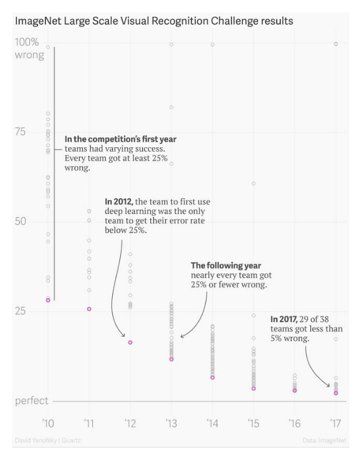
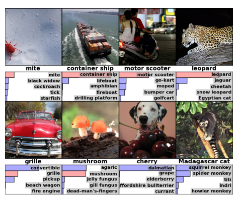
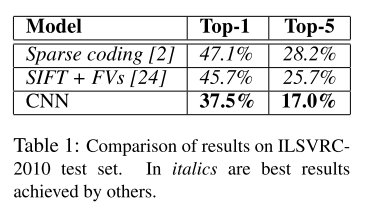
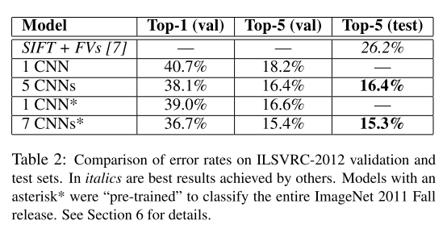
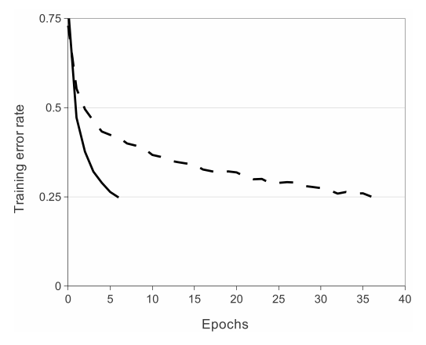
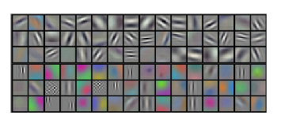
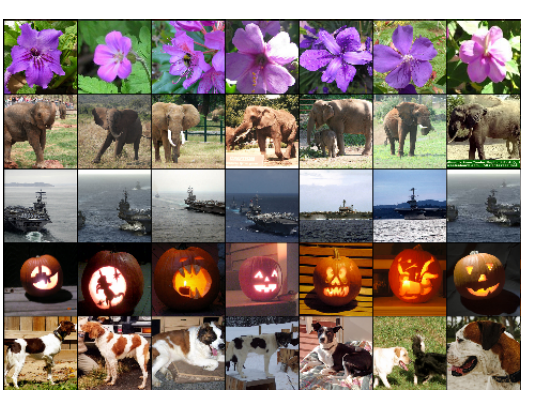

今天分享的这篇论文发表时间是2012年，算是比较早了，是把深度卷积神经网络成功应用在计算机视觉领域的开山之作，目前被引用量接近 70000，可见影响力非常之大，可以说做视觉的论文十有八九会引用它。网络上对它的讲解非常之多，再拿出来阅读，是因为它很经典，搞清楚深度卷积神经网络一些最基本的东西。

* 论文标题：[ImageNet Classification with Deep Convolutional Neural Networks](https://dl.acm.org/doi/10.1145/3065386)

* 论文作者：Alex Krizhevsky, Ilya Sutskever, Geoffrey E. Hinton（多伦多大学）

* 收录情况：NIPS 2012

这篇论文提出的神经网络被称为 AlexNet，它的成名源于一个视觉识别竞赛 ImageNet Large Scale Vision Recognition Challenge (ILSVRC)——2010年开办，每年一次，2017年年结束。ImageNet是一个计算机视觉领域的公开数据集，规模非常之大——涵盖22000个类别的1500万张标注图片，目的是让研究人员的算法在上面做实验，

* Image Classification
* Object Detection
* Semantic Segmentation

比较不同算法的优劣，促进视觉研究的进步。ILSVRC 使用的是 ImageNet 的一部分数据，包含~120万张图片，分成1000类，每类~1200张图片，划分成训练集（100万张标注图片）、验证集（5万张标注图片，用于自己评估算法效果）、测试集（15万张无标签图片，预测结果提交到主办方评估）参赛者需要开发算法把测试集图片分到正确的类别。这其实是个比较困难的任务。



### 简介
* AlexNet 是一个8层的神经网络，5个卷积层 + 3个全连接层
* 几个创新点 —— 现在看来是 tricks：
    * 激活函数使用 ReLU
    * 分布式训练 —— 使用了两块GPU
    * 使用 Normalization
    * 使用 Overlapping Pooling
    * Dropout 应用到了全连接层
* 现在看似很简单，实际上经历了长期探索

### 相关工作
> 作者论文里没单独写相关工作这一章，但是在实验部分与几个方法图片识别方法对比了，可能是当时把这些方法写成论文的很少，简单介绍一下它们

* A. Berg, J. Deng, and L. Fei-Fei. Large scale visual recognition challenge 2010. www.imagenet.org/challenges. 2010.
    - 方法命名为 Sparse coding
* J. Sánchez and F. Perronnin. High-dimensional signature compression for large-scale image classification. In ComputerVision andPattern Recognition (CVPR), 2011 IEEE Conference on, pages 1665–1672. IEEE, 2011.
    - SIFT + FV
* J. Deng, A. Berg, S. Satheesh, H. Su, A. Khosla, and L. Fei-Fei. ILSVRC-2012, 2012. URL http://www.image-net.org/challenges/LSVRC/2012/.
    - SIFT+ FVs

### 模型结构

* 输入：224 x 224 的RGB图片
* 输出：1000维的向量，每维表示对应类别的概率
* 参数量计算
    * 对于AlexNet：模型参数只存在于**卷积层**、**全连接层**
    * 一些预备知识
        - $O_w = \lfloor \frac{I_w - k_w + 2P_w}{s_w} \rfloor$ + 1；$O_h = \lfloor \frac{I_h - k_h + 2P_h}{s_h} \rfloor$ + 1
        - $I_w$ 是输入feature map的宽图，$k_w$ 是卷积核宽度，$P_w$ 是padding宽度，$s_w$ 是stride宽度，$O_w$是卷积操作后输出feature map的宽图
        - 下标为h的是对应量的高度，宽、高一般情况下相同，可以设置不同
        - 每层的参数总量 #$Params$ = #$Weights$ + #$Biases$
        - 一个卷积层：输入特征图 $w \times h$，channel 个数 $c$，卷积核个数 n
            - #$Weights$ = $w \cdot h \cdot c \cdot n$
            - #$Biases$ = $n$
        - 一个全连接层：输入神经元个数 $i$，输出神经元个数 $o$
            - #$Weights$ = $i \cdot o$
            - #$Biases$ = $o$


{: .center-block :}
| Layer | Input | #Channels | Kernel | Padding | Stride | Output | #_Weights_ | #_Biases_ | #_Params_ |
| :---- | :---- | :----- | :----- | :------ | :----- | :----- | :------- | :------ | :---------- |
| Conv1 | 224x224 | 3 | (11x11x3) x 48 x 2	| 2 | 4 | 55x55x48 | 34,848	| 48 x 2 | 34,944 |
| Conv2 | 55x55 | 48 | (5x5x48) x 128 x 2	| 2 | 1 | 55x55 | 307200 | 128 x 2 | 307,456 |
| MaxP1 | 55x55 | `-` | `-` | 0 | 2 | 27x27 | 0 | 0 | 0 |
| Conv3	| 27x27 | 128 |(3x3x128) x 384 x 2 | 1 | 1 | 27x27 | 884,736	| 384 x 2   | 885,504 |
| MaxP2 | 27x27 | `-` | `-` | 0 | 2 | 13x13 | 0 | 0 | 0 |
| Conv4	| 13x13 | 192 | (3x3x192) x 192 x 2 | 1 | 1 | 13x13 | 663552 | 192 x 2	| 663,936 |
| Conv5	| 13x13 | 192 | (3x3x192) x 128 x 2 | 1 | 1 | 13x13 | 442368 | 128 x 2	| 442,624 |
| MaxP3 | 13x13| `-` | `-` | 0 | 2 | 6x6 | 0 | 0 | 0 |
| FC1	| 6x6 | 256 | `-` | `-` | `-` | 4096	| 37,748,736 |	4,096 |	37,752,832 |
| FC2	| 4096 | 1 | `-` | `-` | `-` | 4096 | 16,777,216 |	4,096 |	16,781,312 |
| FC3	| 4096 | 1 |`-` | `-` | `-` | 1000 | 4,096,000	 |  1,000 | 4,097,000 |
| **Total**	| `-` | `-` | `-` | `-` | `-` | `-` | `-` | `-` | 60,965,608 |


### 一些实现细节
* 原始实现用了2块GPU 580，每块 3GB 显存
    * 第1、2、4、5层的神经元，平均划分到2块GPU，这些神经元只参与所在 GPU 内部的计算 —— intra-GPU connections
    * 第3、6、7、8层的神经元，平均划分到2块GPU，这些神经元参与到全部 2块GPU 的计算 —— inter-GPU connections
    * 那时 TensorFlow 项目刚刚起步（2011年发起），还没有 PyTorch（2016年发起）
        - 还没用上这些深度学习框架，需要很清楚GPU的结构和工作原理
        - 需要具备很强的工程能力：自行划分神经网络和图片数据到多块GPU，手写前向传播、反向传播算法
* 作者认为 ILSVRC 给的数据不足训练 ~60M 参数的神经网络，很容易过拟合，为此采取一些手段
    - 用于训练的图片 224x224 是从原图片 256x256 上抽取的 patches，每幅图片能抽取很多patches，这样实际用于训练的数据是给定的2048倍
    - 更改训练图片 RGB channels 的比例关系，具体来说（？？不明白为什么这样做）
        - 对ImageNet训练集RGB像素值进行 PCA
        - 对于每张训练图片，上面的像素 $I_{xy} = [I_{xy}^R, I_{xy}^G, I_{xy}^B]_T$，增加以下量
            - $ [\textbf{p}_1, \textbf{p}_2, \textbf{p}_3]$ = $ [\alpha_1 \lambda_1, \alpha_2 \lambda_2, \alpha_3 \lambda_3] $
            - $\textbf{p}_i, \lambda_i$ 分别是 `RGB像素值` 3x3 协方差矩阵的第i个 eigenvector、eigenvalue
            - $\alpha_i$ 取自均值为0、标准差为0.1的高斯分布，一张图片每重新输入网络一遍，更新一次 $\alpha_i$
            - 作者认为，这样做能**捕获自然图片的重要性质——物体对于照明强度和色彩变化具有不变性**
            - 实验表明，这样做能减少 top-1 error rate 1%
* 全连接层 FC1, FC2，应用了dropout，丢弃概率是0.5 $\rightarrow$ 模型收敛需要的 iterations 变成原来的2倍
* AlexNet 在~100万图片上训练了90 epochs，耗时5~6天
    - 训练一个模型周期很长，要保证代码完全正确，需要耐心和定力

### 实验
* 评价指标：top-1、top-5 error rate
    
    * top-1 error rate：对于测试集的每张图片，预测输出1000维的向量，其中最大的值对应的类别即为预测的类别，和真实类别比较的错误率
    * top-5 error rate：对于测试集的每张图片，预测输出1000维的向量，其中最大的top-5个值对应的类别即为预测的类别，如果包含真实类别，就算预测正确，否则错误，由此计算的错误率
* 
    - 2010年，也就是ILSVRC竞赛举办的第一年，作者就参加了
    - 这是测试集结果，ILSVRC-2010 **测试集标签公开**
    - 表中第一行、第二行是其他人的方案取得的最好结果
        - 第一行：在不同特征上训练的稀疏编码模型，预测结果取平均
        - 第一行：在 Fisher Vector 上训练的两个分类器，预测结果取平均，其中Fisher Vector由两种类型的稠密采样特征计算得到
        - 这些方案不是端到端的
    - 表中第三行，当时他们的方案就是CNN
* 
    - ILSVRC-2012 **测试集标签不公开**，所以从训练数据划出了一部分验证集
    - 第一行其他人的方案，ILSVRC-2012 第二名
    - 第二行：本文描述的CNN架构
    - 第三行：5个CNN模型，预测结果取平均
    - 第四行（*表示使用了预训练）：1个CNN + extra sixth convolutional layer over the last pooling layer
        - 在整个 ImageNet 2011 Fall Release(15M images, 22K categories)上预训练，然后 **fine-tuning** on ILSVRC-2012
    - 第五行（*表示使用了预训练）：2个CNN + 第三行的5个CNN
        - 前2个CNN在整个 ImageNet 2011 Fall Release(15M images, 22K categories)上预训练，然后 **fine-tuning** on ILSVRC-2012
* 使用不同的激活函数，神经网络预测错误率下降速度对比
    
    * 一个4层的卷积神经网络，在CiFAR-10上训练，虚线是使用 tanh 激活函数，实线是用 ReLU 激活函数
    * 使用 ReLU 激活函数比 tanh 快6倍，后一个激活函数计算量大
* 模型学到了什么？
    - 
    - 上图每行16个grid，共6行，每个grid代表一个kernel
    - 前三行的结果是 `conv1` 在第一块GPU `48` 个卷积核的可视化效果，`color-agnostic`
    - 后三行的结果是 `conv1` 在第二块GPU `48` 个卷积核的可视化效果，`color-specific`
    - 作者说这种特殊现象在每次运行期间都会发生，**与特定的随机初始化权重方法无关**
    - 
    - 上图第1列的图片来自测试集；剩余的6列来自训练集，并且有如下关系
        - 这些测试集、训练集的图片，经过AlexNet 最后一个 hidden layer 产生的特征向量，Euclidean distance最小

### PyTorch 实现
1. 定义 `AlexNet` 网络结构  
    ```python
    import torch
    import torch.nn as nn

    class AlexNet(nn.Module):
        def __init__(self, num_classes=1000):
            super(AlexNet, self).__init__()
            self.features = nn.Sequential(
                nn.Conv2d(3, 96, kernel_size=11, stride=4, padding=2),
                nn.ReLU(inplace=True),
                nn.MaxPool2d(kernel_size=3, stride=2),
                nn.Conv2d(96, 256, kernel_size=5, padding=2),
                nn.ReLU(inplace=True),
                nn.MaxPool2d(kernel_size=3, stride=2),
                nn.Conv2d(256, 384, kernel_size=3, padding=1),
                nn.ReLU(inplace=True),
                nn.Conv2d(384, 384, kernel_size=3, padding=1),
                nn.ReLU(inplace=True),
                nn.Conv2d(384, 256, kernel_size=3, padding=1),
                nn.ReLU(inplace=True),
                nn.MaxPool2d(kernel_size=3, stride=2),
            )
            self.classifier = nn.Sequential(
                nn.Dropout(),
                nn.Linear(256 * 6 * 6, 4096),
                nn.ReLU(inplace=True),
                nn.Dropout(),
                nn.Linear(4096, 4096),
                nn.ReLU(inplace=True),
                nn.Linear(4096, num_classes),
            )

        def forward(self, x):
            x = self.features(x)
            x = torch.flatten(x, 1)
            x = self.classifier(x)
            return x

    def alexnet(pretrained=False, progress=True, **kwargs):
        """
        Args:
            pretrained (bool): If True, returns a model pre-trained
                               on ImageNet
            progress (bool): If True, displays a progress bar of the
                             download to stderr
        """
        model = AlexNet(**kwargs)
        if pretrained:
            state_dict = load_state_dict_from_url(model_urls['alexnet'],
                                                  progress=progress)
            model.load_state_dict(state_dict)
        return model
    ```

2. 定义一些对图片的操作，在加载数据时应用这些操作  
    ```python
    import torchvision.transforms as transforms

    transform = transforms.Compose([
        transforms.Resize(256),
        transforms.CenterCrop(224),
        transforms.ToTensor(),
        transforms.Normalize(mean=[0.485, 0.456, 0.406],
                             std=[0.229, 0.224, 0.225]),
    ])
    ```

2. 准备训练图片、测试图片、标签数据  
    ```python
    import torchvision

    train_data = torchvision.datasets.ImageNet(
        root='./data', 
        train=True, 
        download=True, 
        transform=transform
    )
    trainloader = torch.utils.data.DataLoader(
        train_data, 
        batch_size=4, 
        shuffle=True, 
        num_workers=2
    )

    test_data = torchvision.datasets.ImageNet(
        root='./data', 
        train=False, 
        download=True, 
        transform=transform)
    testloader = torch.utils.data.DataLoader(
        test_data, 
        batch_size=4, 
        shuffle=False, 
        num_workers=2
    )

    with open('image_classes.txt') as f:
    classes = [line.strip() for line in f.readlines()]
    ```

3. 【可选】对数据进行可视化  
    ```python
    import matplotlib.pyplot as plt
    import numpy as np

    # function to show some random images
    def imshow(img):
        img = img / 2 + 0.5     # unnormalize
        npimg = img.numpy()
        plt.imshow(np.transpose(npimg, (1, 2, 0)))
        plt.show()

    # get some random training images
    dataiter = iter(trainloader)
    images, labels = dataiter.next()

    # show images
    imshow(torchvision.utils.make_grid(images))
    # print labels
    print(' '.join('%5s' % classes[labels[j]] for j in range(4)))
    ```

3. 准备AlexNet模型，并查看模型结构  
    ```python
    model = alexnet()

    # check model architecture or description
    model.eval()
    ```

4. 【可选】对某些数据集，需要改变物体类别数目、全连接层输入/输出维度，
    ```python
    # updating the second classifier
    model.classifier[4] = nn.Linear(4096,1024)

    # updating the third and the last classifier 
    # that is the output layer of the network.
    model.classifier[6] = nn.Linear(1024,10)
    ```

4. 设置使用 `GPU` / `CPU` 设备  
    ```python
    # initializing a device 
    device = torch.device("cuda:0" if torch.cuda.is_available() else "cpu")

    print(device)

    # move model to the specified device
    model.to(device)
    ```

5. 定义损失函数、优化器，开始训练 AlexNet  
    ```python
    import torch.optim as optim

    # set loss function
    criterion = nn.CrossEntropyLoss()

    # set optimizer
    optimizer = optim.SGD(model.parameters(), lr=0.001, momentum=0.9)

    # loop over the dataset multiple times
    epochs = 90

    for epoch in range(epochs):
        running_loss = 0.0
        for i, data in enumerate(trainloader, 0):
            # get the inputs; data is a list of [inputs, labels]
            inputs, labels = data[0].to(device), data[1].to(device)

            # zero the parameter gradients
            optimizer.zero_grad()

            # forward + backward + optimize
            output = model(inputs)
            loss = criterion(output, labels)
            loss.backward()
            optimizer.step()

            # print statistics
            running_loss += loss.item()
            if i % 2000 == 1999:    # print every 2000 mini-batches
                print('[%d, %5d] loss: %.3f' %
                    (epoch + 1, i + 1, running_loss / 2000))
                running_loss = 0.0

    print('Finished Training of AlexNet')
    ```

6. 测试刚刚训练的 AlexNet  
    ```python
    # testing Accuracy
    correct = 0
    total = 0
    with torch.no_grad():
        for data in testloader:
            # move input images and labels to specified device
            images, labels = data[0].to(device), data[1].to(device)
            outputs = model(images)
            _, predicted = torch.max(outputs.data, 1)
            total += labels.size(0)
            correct += (predicted == labels).sum().item()

    print('Accuracy of the network on the 10000 test images: \
           %d %%' % (100 * correct / total))
    ```
