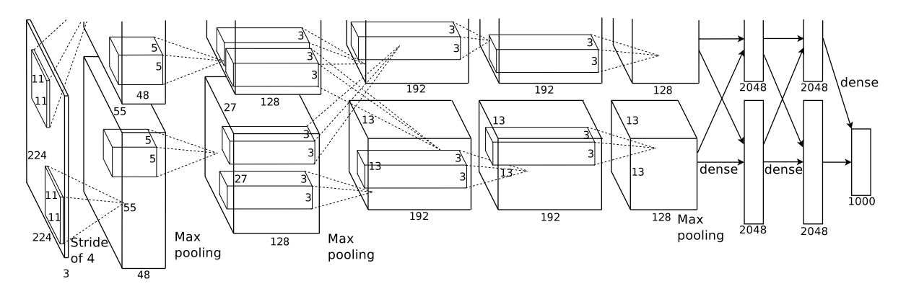

今天分享的这篇论文发表时间是2012年，算是比较早了，是把深度卷积神经网络成功应用在计算机视觉领域的开山之作，目前被引用量接近 70000，可见影响力非常之大，可以说做视觉的论文十有八九会引用它。网络上对它的讲解非常之多，再拿出来阅读，是因为它很经典，搞清楚深度卷积神经网络一些最基本的东西。

* 论文标题：[ImageNet Classification with Deep Convolutional Neural Networks](https://dl.acm.org/doi/10.1145/3065386)

* 论文作者：Alex Krizhevsky, Ilya Sutskever, Geoffrey E. Hinton（多伦多大学）

* 收录情况：NIPS 2012

这篇论文提出的神经网络被称为 AlexNet，它的成名源于一个视觉识别竞赛 ImageNet Large Scale Vision Recognition Challenge (ILSVRC)——2010年开办，每年一次，2017年年结束。ImageNet是一个计算机视觉领域的公开数据集，规模非常之大——涵盖22000个类别的1500万张标注图片，目的是让研究人员的算法在上面做实验，

* Image Classification
* Object Detection
* Semantic Segmentation

比较不同算法的优劣，促进视觉研究的进步。ILSVRC 使用的是 ImageNet 的一部分数据，包含~120万张图片，分成1000类，每类~1200张图片，划分成训练集（100万张标注图片）、验证集（5万张标注图片，用于自己评估算法效果）、测试集（15万张无标签图片，预测结果提交到主办方评估）参赛者需要开发算法把测试集图片分到正确的类别。这其实是个比较困难的任务。

### 简介
* AlexNet 是一个8层的神经网络，5个卷积层 + 3个全连接层
* 几个创新点 —— 现在看来是 tricks：
    * 激活函数使用 ReLU
    * 分布式训练 —— 使用了两块GPU
    * 使用 Normalization
    * 使用 Overlapping Pooling
    * Dropout 应用到了全连接层
* 现在看似很简单，实际上经历了长期探索

### 模型结构

* 输入：224 x 224 的RGB图片
* 输出：1000维的向量，每维表示对应类别的概率
* 参数量计算
    * 对于AlexNet：模型参数只存在于**卷积层**、**全连接层**
    * 一些预备知识
        - $O_w = \lfloor \frac{I_w - k_w + 2P_w}{s_w} \rfloor$ + 1；$O_h = \lfloor \frac{I_h - k_h + 2P_h}{s_h} \rfloor$ + 1
        - $I_w$ 是输入feature map的宽图，$k_w$ 是卷积核宽度，$P_w$ 是padding宽度，$s_w$ 是stride宽度，$O_w$是卷积操作后输出feature map的宽图
        - 下标为h的是对应量的高度，宽、高一般情况下相同，可以设置不同
        - 每层的参数总量 #$Params$ = #$Weights$ + #$Biases$
        - 一个卷积层：输入特征图 $w \times h$，channel 个数 $c$，卷积核个数 n
            - #$Weights$ = $w \cdot h \cdot c \cdot n$
            - #$Biases$ = $n$
        - 一个全连接层：输入神经元个数 $i$，输出神经元个数 $o$
            - #$Weights$ = $i \cdot o$
            - #$Biases$ = $o$


{: .center-block :}
| Layer | Input | #Channels | Kernel | Padding | Stride | Output | #_Weights_ | #_Biases_ | #_Params_ |
| :---- | :---- | :----- | :----- | :------ | :----- | :----- | :------- | :------ | :---------- |
| Conv1 | 224x224 | 3 | (11x11x3) x 48 x 2	| 2 | 4 | 55x55x48 | 34,848	| 48 x 2 | 34,944 |
| Conv2 | 55x55 | 48 | (5x5x48) x 128 x 2	| 2 | 1 | 55x55 | 307200 | 128 x 2 | 307,456 |
| MaxP1 | 55x55 | `-` | `-` | 0 | 2 | 27x27 | 0 | 0 | 0 |
| Conv3	| 27x27 | 128 |(3x3x128) x 384 x 2 | 1 | 1 | 27x27 | 884,736	| 384 x 2   | 885,504 |
| MaxP2 | 27x27 | `-` | `-` | 0 | 2 | 13x13 | 0 | 0 | 0 |
| Conv4	| 13x13 | 192 | (3x3x192) x 192 x 2 | 1 | 1 | 13x13 | 663552 | 192 x 2	| 663,936 |
| Conv5	| 13x13 | 192 | (3x3x192) x 128 x 2 | 1 | 1 | 13x13 | 442368 | 128 x 2	| 442,624 |
| MaxP3 | 13x13| `-` | `-` | 0 | 2 | 6x6 | 0 | 0 | 0 |
| FC1	| 6x6 | 256 | `-` | `-` | `-` | 4096	| 37,748,736 |	4,096 |	37,752,832 |
| FC2	| 4096 | 1 | `-` | `-` | `-` | 4096 | 16,777,216 |	4,096 |	16,781,312 |
| FC3	| 4096 | 1 |`-` | `-` | `-` | 1000 | 4,096,000	 |  1,000 | 4,097,000 |
| **Total**	| `-` | `-` | `-` | `-` | `-` | `-` | `-` | `-` | 60,965,608 |


### 一些实现细节
* 原始实现用了2块GPU 580，每块 3GB 显存
    * 第1、2、4、5层的神经元，平均划分到2块GPU，这些神经元只参与所在 GPU 内部的计算 —— intra-GPU connections
    * 第3、6、7、8层的神经元，平均划分到2块GPU，这些神经元参与到全部 2块GPU 的计算 —— inter-GPU connections
    * 那时 TensorFlow 项目刚刚起步（2011年发起），还没有 PyTorch（2016年发起）
        - 还没用上这些深度学习框架，需要很清楚GPU的结构和工作原理
        - 需要具备很强的工程能力：自行划分神经网络和图片数据到多块GPU，手写前向传播、反向传播算法
* 作者认为 ILSVRC 给的数据不足训练 ~60M 参数的神经网络，很容易过拟合，为此采取一些手段
    - 用于训练的图片 224x224 是从原图片 256x256 上抽取的 patches，每幅图片能抽取很多patches，这样实际用于训练的数据是给定的2048倍
    - 更改训练图片 RGB channels 的比例关系，具体来说（？？不明白为什么这样做）
        - 对ImageNet训练集RGB像素值进行 PCA
        - 对于每张训练图片，上面的像素 $I_{xy} = [I_{xy}^R, I_{xy}^G, I_{xy}^B]_T$，增加以下量
            - $ [\textbf{p}_1, \textbf{p}_2, \textbf{p}_3]$ = $ [\alpha_1 \lambda_1, \alpha_2 \lambda_2, \alpha_3 \lambda_3] $
            - $\textbf{p}_i, \lambda_i$ 分别是 `RGB像素值` 3x3 协方差矩阵的第i个 eigenvector、eigenvalue
            - $\alpha_i$ 取自均值为0、标准差为0.1的高斯分布，一张图片每重新输入网络一遍，更新一次 $\alpha_i$
            - 作者认为，这样做能**捕获自然图片的重要性质——物体对于照明强度和色彩变化具有不变性**
            - 实验表明，这样做能减少 top-1 error rate 1%
* 全连接层 FC1, FC2，应用了dropout，丢弃概率是0.5 $\rightarrow$ 模型收敛需要的 iterations 变成原来的2倍
* AlexNet 在~100万图片上训练了90 epochs，耗时5~6天
    - 训练一个模型周期很长，要保证代码完全正确，需要耐心和定力

### 实验
* 评价指标：top-1、top-5 error rate
    * top-1 error rate：对于测试集的每张图片，预测输出1000维的向量，其中最大的值对应的类别即为预测的类别，和真实类别比较的错误率
    * top-5 error rate：对于测试集的每张图片，预测输出1000维的向量，其中最大的top-5个值对应的类别即为预测的类别，如果包含真实类别，就算预测正确，否则错误，由此计算的错误率
* 
* 
* 使用不同的激活函数，神经网络预测错误率下降速度对比
    
    * 一个4层的卷积神经网络，在CiFAR-10上训练，虚线是使用 tanh 激活函数，实线是用 ReLU 激活函数
    * 使用 ReLU 激活函数比 tanh 快6倍，后一个激活函数计算量大
* 模型学到了什么？
    - 
    - 上图每行16个grid，共6行，每个grid代表一个kernel
    - 前三行的结果是 `conv1` 在第一块GPU `48` 个卷积核的可视化效果
    - 后三行的结果是 `conv1` 在第二块GPU `48` 个卷积核的可视化效果

### PyTorch 实现
```python
import torch
import torch.nn as nn

class AlexNet(nn.Module):

    def __init__(self, num_classes=1000):
        super(AlexNet, self).__init__()
        self.features = nn.Sequential(
            nn.Conv2d(3, 96, kernel_size=11, stride=4, padding=2),
            nn.ReLU(inplace=True),
            nn.MaxPool2d(kernel_size=3, stride=2),
            nn.Conv2d(96, 256, kernel_size=5, padding=2),
            nn.ReLU(inplace=True),
            nn.MaxPool2d(kernel_size=3, stride=2),
            nn.Conv2d(256, 384, kernel_size=3, padding=1),
            nn.ReLU(inplace=True),
            nn.Conv2d(384, 384, kernel_size=3, padding=1),
            nn.ReLU(inplace=True),
            nn.Conv2d(384, 256, kernel_size=3, padding=1),
            nn.ReLU(inplace=True),
            nn.MaxPool2d(kernel_size=3, stride=2),
        )
        self.classifier = nn.Sequential(
            nn.Dropout(),
            nn.Linear(256 * 6 * 6, 4096),
            nn.ReLU(inplace=True),
            nn.Dropout(),
            nn.Linear(4096, 4096),
            nn.ReLU(inplace=True),
            nn.Linear(4096, num_classes),
        )

    def forward(self, x):
        x = self.features(x)
        x = torch.flatten(x, 1)
        x = self.classifier(x)
        return x
```

Updating...

