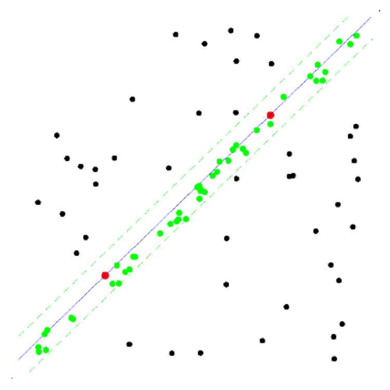
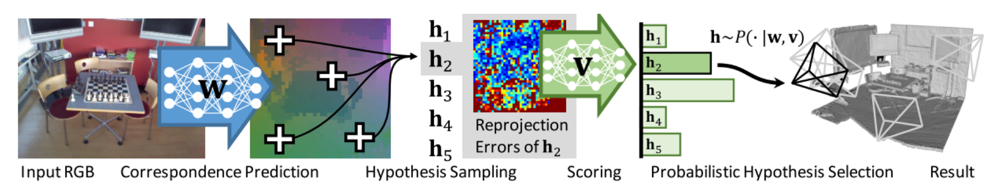

RANSAC是提升模型估计鲁棒性一个经典的算法，被用在很多计算机视觉应用。但是目前为止，把RANSAC当作深度学习pipeline一个组成部分的方法还没有，原因是RANSAC选择hypothesis的步骤，
不可求导。这篇论文中，设计了两种方法，让RANSAC选择hypothesis的步骤可导。其中最有前景的方法受到了强化学习的启发，就是把 deterministic hypothesis selection 替换为
probabilistic selection，这样就能求**损失函数**对模型中的**所有可学习参数**的导数，进而把RANSAC和深度学习结合起来。这种方法叫作 Differentiable RANSAC（DSAC）。
本文做了一个示例，把DSAC应用于 Camera Localization，实验证明把RANSAC和深度学习结合起来直接估计相机姿态，能够达到更高的准确性。文章同时认为DSAC可嵌入其他深度学习任务。

文章标题：[DSAC - Differentiable RANSAC for Camera Localization](https://arxiv.org/abs/1611.05705)

文章作者：Eric Brachmann1, Alexander Krull1, Sebastian Nowozin（来自TU Dresden、微软）

### 回顾RANSAC
用一个简单例子说明：有一个点集P，现在想用一条直线拟合这个点集，使得这条直线最能反映点的分布情况。RANSAC解决此问题方法如下：
0. 设定迭代次数 k，误差阈值$\tau$
1. 第i次迭代：
    1. 从点集随机取2个点，这2个点组成了minimal set（因为两点就能确定一条直线），用minimal set计算模型参数（斜率a和截距b）—— current hypothesis  
    2. 计算点集P中所有点与 current hypothesis 的误差，确定 inlier set
2. 输出最大 inlier set 对应的模型

### 简介

### 相关工作
* RANSAC 变体（都是很早之前的工作了）
    - M. A. Fischler and R. C. Bolles. Random sample consen- sus: A paradigm for model fitting with applications to image analysis and automated cartography. Commun. ACM, 1981.
    - O. Chum and J. Matas. Matching with prosac ” progressive sample consensus. In CVPR, 2005.
    - O. Chum, J. Matas, and J. Kittler. Locally Optimized RANSAC. 2003.
    - D. Nist´er. Preemptive ransac for live structure and motion estimation. In ICCV, 2003.
    - P. H. S. Torr and A. Zisserman. MLESAC: A new robust esti- mator with application to estimating image geometry. CVIU, 2000.
    - R. Raguram, J.-M. Frahm, and M. Pollefeys. A comparative analysis of ransac techniques leading to adaptive real-time random sample consensus. In ECCV, 2008.
* Differentiable Algorithms in CNN
    - J. Long, E. Shelhamer, and T. Darrell. Fully convolutional networks for semantic segmentation. In CVPR, 2015.
    - D. Eigen and R. Fergus. Predicting depth, surface normals and semantic labels with a common multi-scale convolu- tional architecture.
    - M. D. Zeiler and R. Fergus. Visualizing and understanding convolutional networks. In ECCV, 2014.
    - A. Krizhevsky, I. Sutskever, and G. E. Hinton. Imagenet classification with deep convolutional neural networks. In NIPS, 2012.
    - D. G. Lowe. Distinctive image features from scale-invariant keypoints. IJCV, 2004.
    - J. Revaud, P. Weinzaepfel, Z. Harchaoui, and C. Schmid. Deepmatching: Hierarchical deformable dense matching. IJCV, 2016.
    - S. Shalev-Shwartz and A. Shashua. On the sample complex- ity of end-to-end training vs. semantic abstraction training. CoRR, 2016.
    - K. M. Yi, E. Trulls, V. Lepetit, and P. Fua. Lift: Learned invariant feature transform. In ECCV, 2016.
    - R. Arandjelovi´c, P. Gronat, A. Torii, T. Pajdla, and J. Sivic. NetVLAD: CNN architecture for weakly supervised place recognition. In CVPR, 2016.
    - R. Arandjelovic and A. Zisserman. All about vlad. In CVPR, 2013.
    - J. Schulman, N. Heess, T. Weber, and P. Abbeel. Gradient estimation using stochastic computation graphs. In NIPS, 2015.
* Camera Localiztion
    - J. Shotton, B. Glocker, C. Zach, S. Izadi, A. Criminisi, and A. Fitzgibbon. Scene coordinate regression forests for cam- era relocalization in rgb-d images. In CVPR, 2013.
    - A. Guzman-Rivera, P. Kohli, B. Glocker, J. Shotton, T. Sharp, A. Fitzgibbon, and S. Izadi. Multi-output learn- ing for camera relocalization. In CVPR, 2014.
    - J. Valentin, M. Nießner, J. Shotton, A. Fitzgibbon, S. Izadi, and P. H. S. Torr. Exploiting uncertainty in regression forests for accurate camera relocalization. In CVPR, 2015.
    - E. Brachmann, F. Michel, A. Krull, M. Y. Yang, S. Gumhold, and C. Rother. Uncertainty-driven 6d pose estimation of ob- jects and scenes from a single rgb image. In CVPR, 2016.
    - A. Krull, E. Brachmann, F. Michel, M. Y. Yang, S. Gumhold, and C. Rother. Learning analysis-by-synthesis for 6d pose estimation in rgb-d images. In ICCV, 2015.
    - A. Kendall, M. Grimes, and R. Cipolla. Posenet: A convolu- tional network for real-time 6-dof camera relocalization. In ICCV, 2015.
     

### 主要方法

**本文把DSAC应用到"相机定位"问题。**  相机位姿有6个自由度，即3个旋转自由度 + 3个平移自由度，这些自由度以真实世界坐标系（scene's coordinate frame，3D坐标系）为参考。
1. 问题定义：对于RGB图片I，目标是估计参数$\tilde{\textbf{h}}$，使得2D-3D空间如下转换关系成立
    - $$ Y(I) = \{\textbf{y}(I, i)|\forall i\} $$
    - $\textbf{y}(I, i)$是像素$i$在世界坐标系的位置。
    - 下文中，用$\textbf{y}_i$表示$\textbf{y}(I, i)$，用$Y(I)$表示图片I所有像素点的世界坐标系位置集合。再用$Y$表示$Y(I)$。
    
2. 用RANSAC从$Y$估计$\tilde{\textbf{h}}$的步骤如下：
    1. 生成hypotheses集合。生成一个hypothesis时，从$Y(I)$中挑选一个minimal set $$Y_J, J = \{j_1, j_2, \codts, j_n\}$$，$n$是minimal set元素个数。从2D-3D的对应关系均匀采样，样本索引 $j_m \in [1,\cdots,|Y|]$，以此得到$Y_J$。假设函数$\textbf{H}$，使得$$\textbf{h}_J = \textbf{H}(Y_J)$$成立。在相机定位问题中，$\textbf{H}$是 perspective-n-point(PNP) 算法。
    2. 对集合中的hypothesis打分。标量值函数 $s(\textbf{h}_J, Y)$评估$\textbf{h}_J$的consensus——可以用inlier set元素个数评价。
    这里用3D世界坐标$\textbf{y}_i$的重投影误差判断inlier point
        - $$e_i = || \textbf{p}_i - C\textbf{h}_J\textbf{y}_i ||$$
    3. 选择最好的hypothesis。
        - $$\textbf{h}_{AM} = argmax_{\textbf{h}_{J}} ~s(\textbf{h}_J, Y) ||$$
    4. 进一步优化hypothesis。
        - 优化函数 $$\textbf{R}(\textbf{h}_{AM}, \textbf{Y})$$
        -  $\textbf{R}$可能用上所有的2D-3D对应关系$Y$，一种常用的做法是从$Y$选一个内点集，用这个内点集重新计算函数 $\textbf{H}$
        - 最后的输出 $$\tilde{\textbf{h}}_{AM} = \textbf{R}(\textbf{h}_{AM}, \textbf{Y})$$

### 实验

### 总结