这篇论文研究的问题是从单张RGB图片，运用深度学习的方法，同时建模室内布局，物体姿态和Mesh，取得了较好的效果。这篇文章是对其他工作的follow，
之前NeurIPS/ECCV出现过研究同样问题的文章，有必要同时看一下，弄清楚一些来龙去脉。

* 论文名称：[Total3DUnderstanding: Joint Layout, Object Pose and Mesh Reconstruction for Indoor Scenes from a Single Image](https://arxiv.org/abs/2002.12212)

* 论文作者：Yinyu Nie, Xiaoguang Han, Shihui Guo, Yujian Zheng, Jian Chang, Jian Jun Zhang（伯恩茅斯大学、港中文、深圳大数据研究所、厦大）

* 收录情况：CVPR 2020

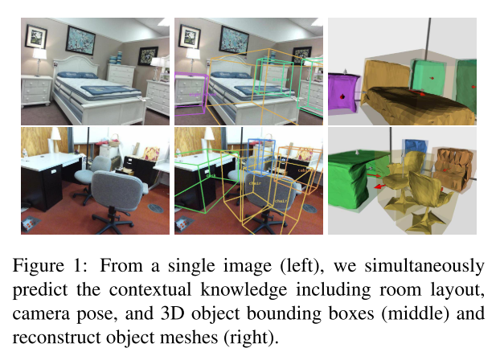

### 主要方法
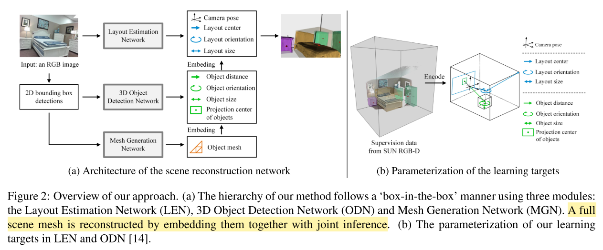

1. 3D Object and Layout Estimation
    * 让世界坐标系和相机坐标系一致，y-axis 垂直于地面，x-axis 指向相机
        - 相机不一定静止，后面可能运动，这里只是说让二者开始保持一致，我是这么理解的
        - 因此，相机姿态可以用$\textbf{R}(\beta, \gamma)$表示，$\beta$表示pitch角，$\gamma$表示roll角
        - 世界坐标系中，物体的3D bbox的中心点$\textbf{C} \in \mathbb{R}^3$，尺寸$\textbf{s} \in \mathbb{R}^3$，朝向$\theta \in [-\pi, \pi]$
        - 对于室内的物体（？？？为什么还分室内室外），3D中心$\textbf{C}$ 表示成像平面2D投影 $\textbf{c} \in \mathbb{R}^2$，物体到相机平面的距离 $d \in \mathbb{R}$

    * 给定相机内参矩阵$\textbf{K} \in \mathbb{R}^{3 \times 3}$（原文把内参矩阵搞成了一个向量，写的不对），$\textbf{C}$ 可以表示成（相机投影模型的变形）
        - $$ \textbf{C} = \textbf{R}^{-1}(\beta, \gamma) \cdot d \cdot \frac{\textbf{K}^{-1}[\textbf{c}, 1]^{T}}{\parallel \textbf{K}^{-1}[\textbf{c}, 1]^{T} \parallel_{2}}$$

    * 2D 投影中心 $\textbf{c}$ 由两部分组成
        - $\textbf{c}^{b}$，bbox 中心点
        - $$\boldsymbol{\delta} \in \mathbb{R}^2$$，偏移量

    * 从2D detection $\textbf{I}$到 3D box corners（？？？这些描述不太准确吧），网络进行了$\textbf{F}$变换
        - $$\textbf{F}(\textbf{I} | \boldsymbol{\delta}, d, \beta, \gamma, \textbf{s}, \theta) \in \mathbb{R}^{3 \times 8}$$
        - 3D Object Detection Network 预测 $$(\boldsymbol{\delta}, d, \textbf{s}, \theta)$$
        - Layout Estimation Network 预测 $\textbf{R}(\beta, \gamma)$ 和 $(\textbf{C}, \textbf{s}^{l}, \theta^{l})$

    * Object Detection Network（ODN）
        - 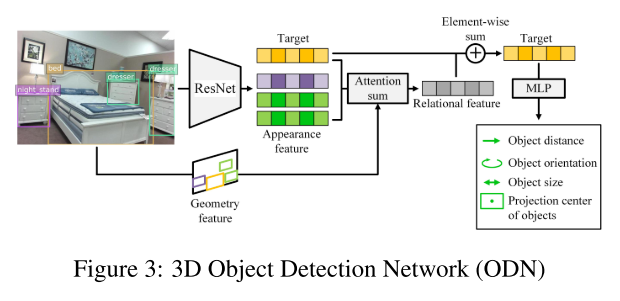

        - 本文认为每个物体与周围环境有 multi-lateral 的关系，所以预测物体边界框是要考虑室内所有物体

        - ODN模块设计时受到了别人的启发：2D 物体检测时，使用 attention 机制能提升效果；所以增加了 Attention sum
            * 参考的论文是：$Relation~networks~for~object~detection{*}$. CVPR 2018

        - 3D 物体检测时
            * (1) 根据2D检测结果，用 ResNet-34 抽取物体 appearance feature；编码 2D bbox的相对位置和尺寸信息 $\Rightarrow$ geometry feature
            * (2) 对于每个 target object（？？？理解成当前正在计算的 object），计算与其他物体的 relational feature，计算的方法同样参考了 $^{*}$ 中的 $\textbf{object relation module}$
                * 从上图可以看出，target object feature 和 relational feature 采用的是元素级别的加法，形成组织target object特征
            * (3) 最后用两层的MLP，预测 $$(\boldsymbol{\delta}, d, \textbf{s}, \theta)$$

        - 本文认为：对于室内场景重建，$\textbf{object relation module}$ 反映了现实世界中固有的性质——物体与其他物体有着相邻、相似关系

    * Layout Estimation Network（LEN）
        * 这部分网络架构与 ODN 相同，只是不带 relational feature，预测
            1. camera pose：$\textbf{R}(\beta, \gamma)$
            2. 整个场景的布局 3D box：$(\textbf{C}, \textbf{s}^l, \theta^{l})$

2. Mesh Generation for Indoor Objects(MGN)
    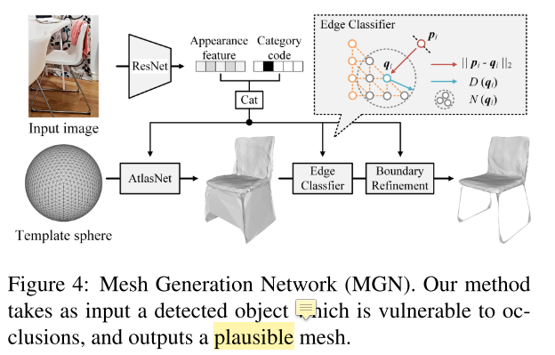
    - 输入：（1）检测的物体类别（2）ResNet-18 产生的物体特征
    - 输出：object mesh
    - 把输入进行编码，结合 Template sphere，用AtlasNet产生初步的 object mesh
    - edge classifier 用一个二分类函数移除 redundant meshes
    - boundary refinement module 【参考文献30】对 boundary 进行平滑，产生 final object mesh

    - 这部分也是在前人基础上的改进，前人的方法称为TMN：Deep mesh reconstruction from single rgb images via topology modification networks. CVPR 2019

    - TMN 通过变形、修改 MESH 拓扑近似物体形状，其中需要预定义的距离阈值来从目标形状中移除分离的面（detached faces）。

    - 本文认为TMN定义 threshold 存在问题，因为 object mesh 的尺度不尽相同，而且方差很大，此外还有北京、遮挡引起的尺度估计错误

    - 本文认为应该通过 local geometry 决定是否保留一个面。提出一种可调整的方法来修改基于 ground truth local density 的mesh
        * $\textbf{p}_i \in \mathbb{R}^{3}$ 是重建的mesh上的一点
        * $\textbf{q}_i \in \mathbb{R}^{3}$ 是ground truth mesh上离$\textbf{p}_i$最近的一点
        * 设计了一个二分类器 $f(*)$ 预测 $\textbf{p}_{i}$ 是否与 ground truth mesh 接近
            - 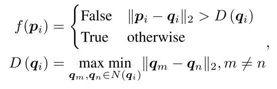
            - $$N(\textbf{q}_{i})$$ 是 $$\textbf{p}_{i}$$ 在 ground truth mesh 的邻居
            - $$D(\textbf{q}_{i})$$ 是 $$\textbf{q}_{i}$$ 的 local density
        * 分类器的设计思路：
            - mesh 形状估计时，如果一个点属于 ground truth 的邻居 $N(*)$，模板上的这个点应该被保留，后续实验表明这种方法优于TMN单一阈值设置的方法

    - 本文认为TMN移除 faces 的方式存在问题，转向移除 mesh edges 的思路
        * 移除 伪正边 能降低不正确的 connections，这些connections会被 edge loss 惩罚（参见文献【50】）
        * 用二分类器 $f(*)$ 在 mesh edges 上随机采样点，如果该点的 average classification score低，就把该点所在的 edges 去除（？？？怎么判断点在哪条边，一个点可以在无穷条边上）

3. Joint Learning for Total 3D Understanding
    - 这部分讲解学习目标和损失函数

    - Individual Loss
        * ODN 预测相机坐标系下的3D box，$$(\boldsymbol{\delta}, d, \textbf{s}, \theta)$$
        
        * LEN 预测layout box，$(\beta, \gamma, \textbf{C}, \textbf{s}^l, \theta^{l})$，把相机姿态和3D物体变换到世界坐标系

        * 分类和回归（长度和角度）损失函数（见[这篇论文](https://auniquesun.com/2020-11-19-cooperative-scene-understanding/)中的实现细节：直接回归角度误差会很大，先分类到一个区间范围，再回归）
            - $\mathcal{L}^{cls,reg} = \mathcal{L}^{cls} + \lambda_r \mathcal{L}^{reg}$ 优化 $(\beta, \gamma, \textbf{s}, \textbf{s}^l, \theta, \theta^{l})$
            - 【参考文献14】

        * L2 loss 预测 $\textbf{C}$ 和 $$\boldsymbol{\delta}$$

        * Chamfer loss for MGN

        * edge loss $\mathcal{L}_e$

        * boundary loss $\mathcal{L}_b$

        * cross entropy loss $\mathcal{L}_{ce}$ 分类 edges in mesh modification

    - Joint Loss
        * 思路：（1）相机姿态估计应该和3D object detection相互促进（2）object meshes应该和3D object detection相互促进

        * 对于第一点，采用 cooperative loss $\mathcal{L}_{co}$

        * 对于第二点，采用 global loss $\mathcal{L}_{g}$
            * $$ \mathcal{L}_{g} = \frac{1}{N} \sum_{i=1}^{N} \frac{1}{| \mathbb{S}_i |} \sum_{\textbf{q} \in \mathbb{S}_i} \min_{\textbf{p} \in \mathbb{M}_i} \parallel \textbf{p} - \textbf{q} \parallel_{2}^{2}$$
            * $\textbf{p}$、$\textbf{q}$是两个点，分别位于重建的 mesh $\mathbb{M}_i$ 和 ground truth surface $\mathbb{S}_i$，$i$ 代表第$i$个物体
            * $N$ 是物体总数，$\| \mathbb{S}_i \|$ 是 $\mathbb{S}_i$ 上的点数
        
        * $$ \mathcal{L} = \sum_{ x \in \{\boldsymbol{\delta},d,\textbf{s},\theta\} } \lambda_{x}\mathcal{L}_x + \sum_{ y \in \{\beta,\gamma,\textbf{C},\textbf{s},\theta^{l}\} } \lambda_{y}\mathcal{L}_y + \sum_{ z \in \{c,e,b,ce,\theta^{l}\} } \lambda_{z}\mathcal{L}_z + \lambda_{co}\mathcal{L}_{co} + \lambda_{g}\mathcal{L}_g $$
            - 前三项分别对应ODN、LEN、MGN的损失
            - 后两项是各模块相互作用的总共损失

### 实验
* 数据集：       
    * SUN RGB-D. 10335张带有3D layout、object bbox、depth map的真实室内场景图片
        * train/test split
        * NYU-37 object labels for evaluation: layout、camera pose estimation、3D object detection
    * Pix3D. 395 furniture models with 9 categories，包含10069张图片
        * train/test split
        * 用来 mesh generation 的监督

* 评价指标：
    * $\textbf{3D IoU}$ for layout estimation
    * $\textbf{mean absolute error}$ for camera pose
    * $\textbf{mAP}$ for object detetion
    * $\textbf{Chamfer distance}$ for mesh generation

* 实现细节
    * 2D detector 在coco上训练，在 SUN RGB-D 调优
    * MGN中的template sphere有2562个单位半径的顶点，移除边的阈值是平均分类分数低于0.2
    * 分别在 SUN RGB-D训练ODN、LEN，在Pix3D 训练MGN
    * 然后把 Pix3D 和 SUN RGB-D 组合起来，联合训练三个子网络，这么做是为了和单独训练做对比实验

* Qualitative Analysis
    * Object Reconstruction
    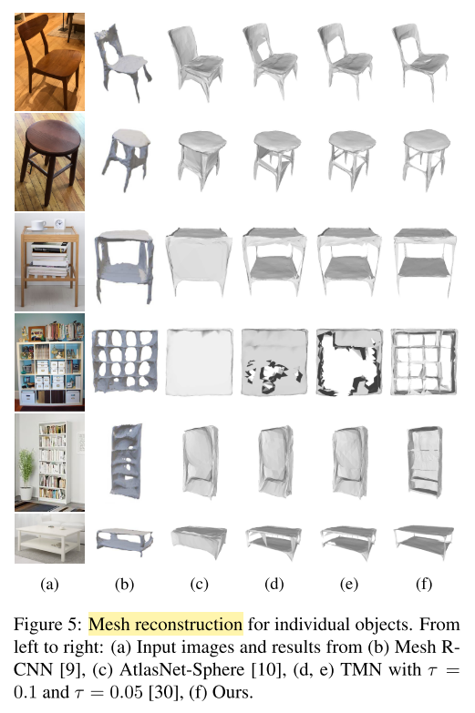
    * Scene Reconstruction
    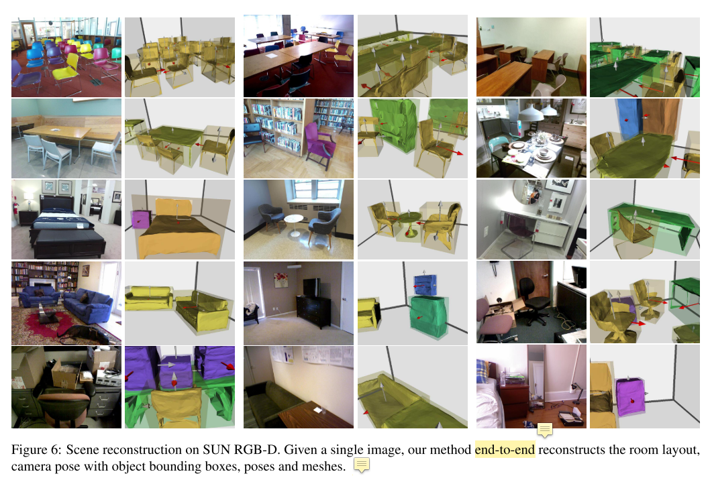

* Quantitative Analysis  
    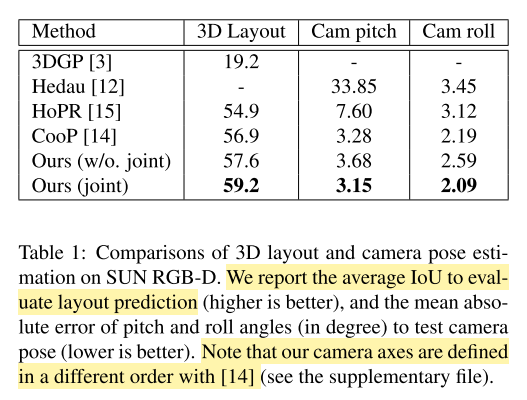
    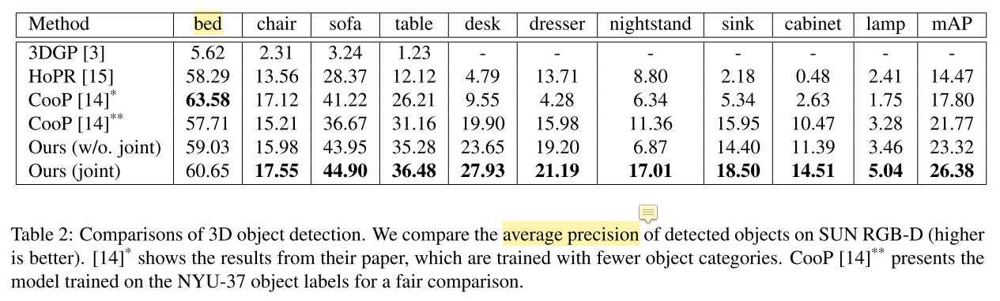
    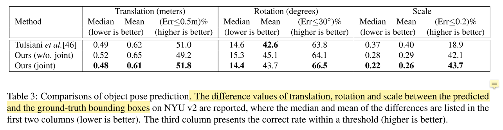
    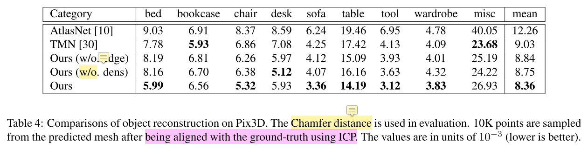
    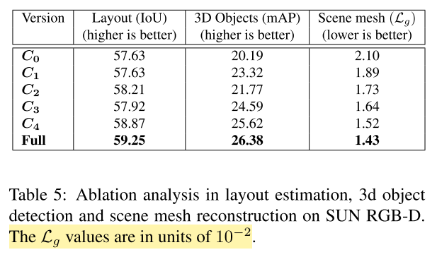
    - C0：without relational features (in ODN) and joint training (Baseline)

    - C1：Baseline + relational features

    - C2：Baseline + (only) cooperative loss $\mathcal{L}_{co}$ in joint training

    - C3：Baseline + (only) global loss $\mathcal{L}_{g}$ in joint training

    - C4：Baseline + joint training ($$\mathcal{L}_{g} + \mathcal{L}_{co}$$)

    - Full：Baseline + relational features + joint training