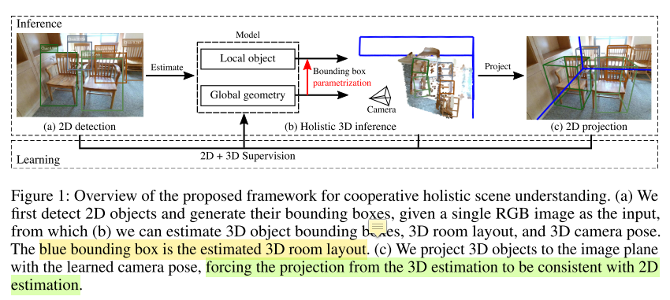

* 论文名称：[Cooperative Holistic Scene Understanding: Unifying 3D Object, Layout, and Camera Pose Estimation](https://arxiv.org/abs/1810.13049)

* 论文作者：Siyuan Huang, Siyuan Qi, Yinxue Xiao, Yixin Zhu, Ying Nian Wu, Song-Chun Zhu（来自UCLA）

* 收录情况：NeurIPS 2018

### 简介
虽然人类能比较容易的感知一个3D场景（**200ms内完成**；Potter, 1975, 1976, Schyns and Oliva, 1994, Thorpe et al., 1996），但是3D场景的整体理解在计算机视觉研究中是个基础又有挑战性的问题，主要的困难是：单张RGB图片包含大量带有歧义的3D信息。3D场景整体理解包含几项任务：

* 相机3D姿态估计。RGB图片来自相机，搞清楚相机在哪个位置，从哪个角度拍摄了照片，有助于提升2D图片和3D场景的一致性 $consistency$。
* 场景3D布局估计。通常指室内场景，相机3D姿态与场景3D布局组合起来，能反映场景的全局几何性质 $global ~geometry$。
* 场景中物体3D检测。反映的是局部信息 $local~ details$

但是一些已知的方法或者不够高效，或者解决了部分问题
* Traditional Methods
    * Abhinav Gupta, Martial Hebert, Takeo Kanade, and David M Blei. Estimating spatial layout of rooms using volumetric reasoning about objects and surfaces. In Conference on Neural Information Processing Systems (NIPS), 2010
    * Yibiao Zhao and Song-Chun Zhu. Image parsing with stochastic scene grammar. In Conference on Neural Information Processing Systems (NIPS), 2011
    * Wongun Choi, Yu-Wei Chao, Caroline Pantofaru, and Silvio Savarese. Understanding indoor scenes using 3d geometric phrases. In IEEE Conference on Computer Vision and Pattern Recognition (CVPR), 2013
    * Yinda Zhang, Shuran Song, Ping Tan, and Jianxiong Xiao. Panocontext: A whole-room 3d context model for panoramic scene understanding. In European Conference on Computer Vision (ECCV), 2014
    * Hamid Izadinia, Qi Shan, and Steven M Seitz. Im2cad. In IEEE Conference on Computer Vision and Pattern Recognition (CVPR), 2017
    * Siyuan Huang, Siyuan Qi, Yixin Zhu, Yinxue Xiao, Yuanlu Xu, and Song-Chun Zhu. Holistic 3d scene parsing and reconstruction from a single rgb image. In European Conference on Computer Vision (ECCV), 2018
    * Alexander G Schwing, Sanja Fidler, Marc Pollefeys, and Raquel Urtasun. Box in the box: Joint 3d layout and object reasoning from single images. In IEEE International Conference on Computer Vision (ICCV), 2013

* Deep Learning, **training individual modules separately**
    * Arsalan Mousavian, Dragomir Anguelov, John Flynn, and Jana Košecká. 3d bounding box estimation using deep learning and geometry. In IEEE Conference on Computer Vision and Pattern Recognition (CVPR), 2017
    * Chen-Yu Lee, Vijay Badrinarayanan, Tomasz Malisiewicz, and Andrew Rabinovich. Roomnet: End-to-end room layout estimation. In IEEE International Conference on Computer Vision (ICCV), 2017
    * Wadim Kehl, Fabian Manhardt, Federico Tombari, Slobodan Ilic, and Nassir Navab. Ssd-6d: Making rgb-based 3d detection and 6d pose estimation great again. In IEEE Conference on Computer Vision and Pattern Recognition (CVPR), 2017
    * Abhijit Kundu, Yin Li, and James M Rehg. 3d-rcnn: Instance-level 3d object reconstruction via render-and-compare. In IEEE Conference on Computer Vision and Pattern Recognition (CVPR), 2018
    * Chuhang Zou, Alex Colburn, Qi Shan, and Derek Hoiem. Layoutnet: Reconstructing the 3d room layout from a single rgb image. In IEEE Conference on Computer Vision and Pattern Recognition (CVPR), 2018
    * Chen Liu, Jimei Yang, Duygu Ceylan, Ersin Yumer, and Yasutaka Furukawa. Planenet: Piece-wise planar reconstruction from a single rgb image. In IEEE Conference on Computer Vision and Pattern Recognition (CVPR), 2018
    * Shubham Tulsiani, Saurabh Gupta, David Fouhey, Alexei A Efros, and Jitendra Malik. Factoring shape, pose, and layout from the 2d image of a 3d scene. In IEEE Conference on Computer Vision and Pattern Recognition (CVPR), 2018  —— without modeling relations explicitly

* Another Stream of Approaches, **taking RGB-D image and camera pose as input**
    * Dahua Lin, Sanja Fidler, and Raquel Urtasun. Holistic scene understanding for 3d object detection with rgbd cameras. In IEEE International Conference on Computer Vision (ICCV), 2013
    * Shuran Song and Jianxiong Xiao. Sliding shapes for 3d object detection in depth images. In European Conference on Computer Vision (ECCV), 2014
    * Shuran Song, Fisher Yu, Andy Zeng, Angel X Chang, Manolis Savva, and Thomas Funkhouser. Semantic scene completion from a single depth image. In IEEE Conference on Computer Vision and Pattern Recognition (CVPR), 2017
    * Zhuo Deng and Longin Jan Latecki. Amodal detection of 3d objects: Inferring 3d bounding boxes from 2d ones in rgb-depth images. In IEEE Conference on Computer Vision and Pattern Recognition (CVPR), 2017
    * Chuhang Zou, Zhizhong Li, and Derek Hoiem. Complete 3d scene parsing from single rgbd image. arXiv preprint arXiv:1710.09490, 2017
    * Charles R Qi, Wei Liu, Chenxia Wu, Hao Su, and Leonidas J Guibas. Frustum pointnets for 3d object detection from rgb-d data. In IEEE Conference on Computer Vision and Pattern Recognition (CVPR), 2018
    * Jean Lahoud and Bernard Ghanem. 2d-driven 3d object detection in rgb-d images. In IEEE International Conference on Computer Vision (ICCV), 2017
    * Yinda Zhang, Mingru Bai, Pushmeet Kohli, Shahram Izadi, and Jianxiong Xiao. Deepcontext: Context-encoding neural pathways for 3d holistic scene understanding. In IEEE International Conference on Computer Vision (ICCV), 2017a

本文要解决的问题：
* 2D-3D consistency. 2D像平面和3D世界的一致性
* Cooperation. 人类感知系统非常擅长融合不同视觉信息，设计算法时应当遵循这样的原则，让不同模块协同工作
* Physically Plausible. 建模出来的3D场景，应该与物理世界一致

### 主要方法

1. 这部分主要描述 3D bbox 的参数化表示 $parametrization$（其实很简单）和用于3D scene understanding 的神经网络
    - $global~ geometric~ network$: 3D room layout、camera pose
    - $local~ object~ network$: 3d object

1. Parametrization
    * 3D objects
        - $X^W \in \mathbb{R}^{3 \times 8}$ 表示世界坐标系中的3D物体，它的维度下面会解释
        - 中心点 $C^W \in \mathbb{R}^{3}$不好求（RGB图片没有深度信息），分解为
            * 物体在像平面2D bbox 中心 $C^{I} \in \mathbb{R}^{2}$
            * 相机中心到3D物体的中心距离 $D$
            * 相机内参 $K \in \mathbb{R}^{3 \times 3}$
            * 相机内参 $R(\phi, \psi) \in \mathbb{R}^{3 \times 3}$，$T \in \mathbb{R}^{3}$，$\phi$和$\psi$是相机旋转角（？？？）
            * 如上图所示，3D 物体中心投影到像平面，不一定与2D bbox重合，记这个偏移量为 $\delta^I \in \mathbb{R}^{2}$
            * 综上，$C^W$ 可用下面公式计算
                - $$ C^W = T + DR(\phi, \psi)^{-1} \frac{K^{-1}[C^I + \delta^I, 1]^{T}}{\parallel K^{-1}[C^I + \delta^I, 1]^{T} \parallel_{2}}$$
            * 当相机坐标系原点与世界坐标系重合时，$T$ 变成 $\overleftarrow{0}$（是我的理解，原文是这么说的：从第一人称视角得到数据时，$T$ 变成 $\overleftarrow{0}）
            * 因此，可以记 $C^W = p(C^I, \delta^{I}, D, \phi, \psi, K)$，其中 $p$ 是可导的 $projection ~ function$
            * 从 $C^W$ 的计算方式看，考虑了2D object center $C^I$，有助于维护2D-3D的一致性，减少3D bbox估计的方差（作者的观点，其实未必）。同时，里面集成了camera pose，体现了各个组件 $cooperative ~promoting$。

        - 尺寸 $S^W \in \mathbb{R}^{3}$
        - 方向 $R(\theta^{W}) \in \mathbb{R}^{3 \times 3}$，$\theta^{W}$ 是沿$z$轴线的方位角
        - 组合起来，$X^W = h(C^W, R(\theta^{W}), S)$，$h(\cdot)$是边界框函数
            - **8个顶点，每个顶点3维**

    * 3D Room Layout
        - 与3D objects类似，$X^L \in \mathbb{R}^{3 \times 8}$ 
        - 中心点 $C^L \in \mathbb{R}^{3}$
        - 尺寸 $S^L \in \mathbb{R}^{3}$
        - 方向 $R(\theta^{L}) \in \mathbb{R}^{3 \times 3}$，$\theta^{L}$ 是旋转角
        
2. Direct Estimations
* $global~geometry~network$(GGN)
    - 输入：RGB图片
    - 输出：3D room layout + 3D camera pose
    - 损失函数：$\mathcal{L}_{GGN} = \mathcal{L}_{\phi} + \mathcal{L}_{\psi} + \mathcal{L}_{C^L} + \mathcal{L}_{S^L} + \mathcal{L}_{\theta^L}$

* $local~object~network$(LON)
    - 输入：2D image patches
    - 输出：distance $d$ + size $S^W$ + heading angle $\theta^{W}$ + 2D offsets $\delta^{I}$
    - 损失函数：$ \mathcal{L}_{LON} = \frac{1}{N} \sum_{j=1}^{N} (\mathcal{L}_{D_j} + \mathcal{L}_{\delta^{I}_j} + \mathcal{L}_{S^W_j} + \mathcal{L}_{\theta^W_j}) $
    - $N$ 是场景中的物体数
    - **直接拟合物体属性(e.g. 方位角)**不是一个好的方法，可能导致大的误差，所以采用了另外一种方法：
        1. 预定义几个 size templates
        2. 首先把物体对应的属性(e.g. 方位角) 分类到一个template，然后在template内部预测属性误差
        3. 拿方位角举例，$\mathcal{L}_{\phi} = \mathcal{L}_{\phi - cls} + \mathcal{L}_{\phi -reg}$

### 需要弄清楚
1. 相机$\phi,\psi$具体是啥，最好用一幅图来说明
2. 以及$C^W$的计算公式