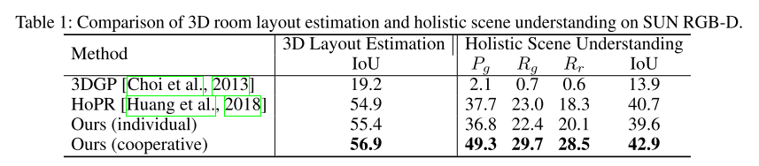
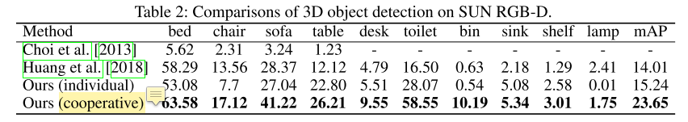

这篇文章和[上一篇](https://auniquesun.com/2020-11-19-cooperative-scene-understanding/)出自同一个作者，都是做3D场景理解和重建的，研究的内容有很多重叠，研究的方法有所区别，可以看到对一个问题做深入之后，能同时出几篇文章。这篇文章使用深度学习和概率模型相结合的方法，并且多了场景重建的部分，其中一些细节描述更细。

* 论文名称：[Holistic 3D Scene Parsing and Reconstruction from a Single RGB Image](https://arxiv.org/abs/1808.02201)

* 论文作者：Siyuan Huang, Siyuan Qi, Yixin Zhu, Yinxue Xiao, Yuanlu Xu, Song-Chun Zhu（来自UCLA）

* 收录情况：ECCV 2018

### 简介

本文提出一种方法——Holistic Scene Grammar(HSG)，利用单张RGB图片解析和重建3D场景，重建的时候用到了一些CAD模型。HSG 能表示3D场景的结构信息，刻画室内场景的功能 + 几何空间的联合分布特性（functional and geometric space）。HSG 捕捉到了室内场景隐含的几方面维度：  

* latent human context, describing the affordance and the functionality of a room arrangement 
* geometric constraints over the scene configuration
* physical constraints that guarantee physically plausible parsing and reconstruction

本文采用 analysis-by-synthesis 方式进行 parsing & reconstruction，使得输入图像和渲染后的图像的差异在以下几个方面最小化：

* space of depth
* surface normal（表面法向量）
* object segmentation map

优化时，模型被表示成一个语法解析图——parse graph，使用 Markov Chain Monte Carlo 进行推理，这样就能够对不可导的解空间进行优化，比如

* object localization
* 3D layout
* hidden human context

在SUN RGB-D的实验达到了3D layout estimation, 3D object detection, scene understanding当前最优。

### 相关工作
* scene parsing
    - discriminative approaches
        - Dai, J., He, K., Sun, J.: Boxsup: Exploiting bounding boxes to supervise convolu- tional networks for semantic segmentation. In: ICCV. (2015)
        - Noh, H., Hong, S., Han, B.: Learning deconvolution network for semantic segmen- tation. In: ICCV. (2015)
        - Zheng, S., Jayasumana, S., Romera-Paredes, B., Vineet, V., Su, Z., Du, D., Huang, C., Torr, P.H.: Conditional random fields as recurrent neural networks. In: ICCV. (2015)
        - Chen, L.C., Papandreou, G., Kokkinos, I., Murphy, K., Yuille, A.L.: Deeplab: Semantic image segmentation with deep convolutional nets, atrous convolution, and fully connected crfs. IEEE Transactions on Pattern Analysis and Machine Intelligence (TPAMI) (2017)
        - Long, J., Shelhamer, E., Darrell, T.: Fully convolutional networks for semantic segmentation. In: CVPR. (2015)
        - Lin, G., Milan, A., Shen, C., Reid, I.: Refinenet: Multi-path refinement networks for high-resolution semantic segmentation. In: CVPR. (2017)
        - Zhao, H., Shi, J., Qi, X., Wang, X., Jia, J.: Pyramid scene parsing network. In: CVPR. (2017)
    - generative approaches
        - Zhao, Y., Zhu, S.C.: Image parsing with stochastic scene grammar. In: Conference on Neural Information Processing Systems (NIPS). (2011)
        - Zhao, Y., Zhu, S.C.: Scene parsing by integrating function, geometry and appear- ance models. In: CVPR. (2013)
        - Choi, W., Chao, Y.W., Pantofaru, C., Savarese, S.: Understanding indoor scenes using 3d geometric phrases. In: CVPR. (2013)
        - Lin, D., Fidler, S., Urtasun, R.: Holistic scene understanding for 3d object detection with rgbd cameras. In: ICCV. (2013)
        - Guo, R., Hoiem, D.: Support surface prediction in indoor scenes. In: ICCV. (2013)
        - Zhang, Y., Song, S., Tan, P., Xiao, J.: Panocontext: A whole-room 3d context model for panoramic scene understanding. In: ECCV. (2014)
        - Zhang, Y., Song, S., Yumer, E., Savva, M., Lee, J.Y., Jin, H., Funkhouser, T.: Physically-based rendering for indoor scene understanding using convolutional neu- ral networks. In: CVPR. (2017)
        - Zou, C., Li, Z., Hoiem, D.: Complete 3d scene parsing from single rgbd image. arXiv preprint arXiv:1710.09490 (2017)

* scene reconstruction from a single image
    1. 
        * Hedau, V., Hoiem, D., Forsyth, D.: Recovering the spatial layout of cluttered rooms. In: CVPR. (2009)
        * Lee, D.C., Hebert, M., Kanade, T.: Geometric reasoning for single image structure recovery. In: CVPR. (2009)
        * Mallya, A., Lazebnik, S.: Learning informative edge maps for indoor scene layout prediction. In: ICCV. (2015)
        * Dasgupta, S., Fang, K., Chen, K., Savarese, S.: Delay: Robust spatial layout esti- mation for cluttered indoor scenes. In: CVPR. (2016)
        * Ren, Y., Li, S., Chen, C., Kuo, C.C.J.: A coarse-to-fine indoor layout estimation (cfile) method. In: Asian Conference on Computer Vision (ACCV). (2016)
        * Izadinia, H., Shan, Q., Seitz, S.M.: Im2cad. In: CVPR. (2017)
        * Lee, C.Y., Badrinarayanan, V., Malisiewicz, T., Rabinovich, A.: Roomnet: End- to-end room layout estimation. In: ICCV. (2017)
        * Zhao, H., Lu, M., Yao, A., Guo, Y., Chen, Y., Zhang, L.: Physics inspired op- timization on semantic transfer features: An alternative method for room layout estimation. In: CVPR. (2017)
    2. 
        * Salas-Moreno, R.F., Newcombe, R.A., Strasdat, H., Kelly, P.H., Davison, A.J.: Slam++: Simultaneous localisation and mapping at the level of objects. In: CVPR. (2013)
        * Aubry, M., Maturana, D., Efros, A.A., Russell, B.C., Sivic, J.: Seeing 3d chairs: exemplar part-based 2d-3d alignment using a large dataset of cad models. In: CVPR. (2014)
        * Lim, J.J., Khosla, A., Torralba, A.: Fpm: Fine pose parts-based model with 3d cad models. In: ECCV. (2014)
        * Song, S., Xiao, J.: Sliding shapes for 3d object detection in depth images. In: ECCV. (2014)
        * Tulsiani, S., Malik, J.: Viewpoints and keypoints. In: CVPR. (2015)
        * Bansal, A., Russell, B., Gupta, A.: Marr revisited: 2d-3d alignment via surface normal prediction. In: CVPR. (2016)
        * Song, S., Xiao, J.: Deep sliding shapes for amodal 3d object detection in rgb-d images. In: CVPR. (2016)
        * Wu, J., Xue, T., Lim, J.J., Tian, Y., Tenenbaum, J.B., Torralba, A., Freeman, W.T.: Single image 3d interpreter network. In: ECCV. (2016)
        * Deng, Z., Latecki, L.J.: Amodal detection of 3d objects: Inferring 3d bounding boxes from 2d ones in rgb-depth images. In: CVPR. (2017)
    3. 
        * Zhao, Y., Zhu, S.C.: Scene parsing by integrating function, geometry and appear- ance models. In: CVPR. (2013)
        * Choi, W., Chao, Y.W., Pantofaru, C., Savarese, S.: Understanding indoor scenes using 3d geometric phrases. In: CVPR. (2013)
        * Song, S., Lichtenberg, S.P., Xiao, J.: Sun RGB-D: A RGB-D scene understanding benchmark suite. In: CVPR. (2015)
        * Song, S., Yu, F., Zeng, A., Chang, A.X., Savva, M., Funkhouser, T.: Semantic scene completion from a single depth image. In: CVPR. (2017)

* scene grammer
    * Jiang, Y., Koppula, H., Saxena, A.: Hallucinated humans as the hidden context for labeling 3d scenes. In: CVPR. (2013)
    * Zhao, Y., Zhu, S.C.: Image parsing with stochastic scene grammar. In: Conference on Neural Information Processing Systems (NIPS). (2011)
    * Zhao, Y., Zhu, S.C.: Scene parsing by integrating function, geometry and appear- ance models. In: CVPR. (2013)
    * Jiang, Y., Saxena, A.: Modeling high-dimensional humans for activity anticipation using gaussian process latent crfs. In: Robotics: Science and Systems (RSS). (2014)

### Holistic Scene Grammar

1. HSG的组成
    * 功能空间$\mathbb{F}$中 latent hierarchy structure
    * 几何空间$\mathbb{G}$中的 terminal object entities

2. 对于人工合成的环境，几何空间中物体的排列布置，应该来自功能空间的投影（？？？如何理解这句话）

3. 功能空间被建模成**概率上下文无关文法** $probabilistic ~context~free~grammar$（PCFG），用来捕获功能群组（functional groups）的等级结构；几何空间捕获物体的空间上下文（spatial context among objects）关系，捕获的方式是在terminal nodes上定义一个 Markov Random Field；这两个空间共同构成了随机上下文敏感文法 $stochastic~context-sensitive~grammar$（SCSG）—— 就是指本文的HSG

4. HSG 从场景根节点出发，到终端节点结束。一个室内场景能表示成一张 parse graph($\textbf{pg}$)，如上图所示。

    - 形式化定义：HSG表示为一个5元组$\langle S, V, R, E, P \rangle$
        * S 是室内场景的根节点
        * V 是顶点集，包括非终端节点$V_f \in \mathbb{F}$和终端节点$V_g \in \mathbb{G} $
        * R 是生产规则
        * E 是终端节点间的上下文关系，对应$\textbf{pg}$中的水平links（图中紫色、蓝色、绿色块间的水平连接）
        * P 是定义在$\textbf{pg}$的概率模型

    - 功能空间$\mathbb{F}$：非终端节点 $$V_f = {V_f^c, V_f^a, V_f^o, V_f^l} \in \mathbb{F}$$
        * 场景类别节点$V_f^c$
        * 场景类别节点$V_f^a$
        * 场景类别节点$V_f^o$
        * 场景类别节点$V_f^l$

    - 几何空间$\mathbb{G}$：终端节点 $$V_g = {V_g^o, V_g^l} \in \mathbb{G}$$，是 ojbect entities 和 room layout的CAD models
        * 物体表示为一个CAD模型
        * 物体外观参数：3D size，location， orientation
        * 房间布局表示为一个立方体，进一步分解成房间的5个平面——left、right、middle wall、floor、ceiling（？？？为什么立方体会分出来5个平面）

    - 生产规则$R$
        * $S \rightarrow V^c_f$: scene → category 1 \| category 2 \| . . . (e.g., scene → office \| kitchen)
        * $V_f^c \rightarrow V^a_f$: category → activity groups · layout (e.g., office → (walking,reading) · layout)
        * $V_f^c \rightarrow V^a_f$: activity group → functional objects (e.g., sitting → (desk, chair))
        * 其中，$\cdot$ 表示 determinstic decomposition；$\|$ 表示alternative explanations；() 表示组合

4. 最后，a scene configuration 能表示成一个$\textbf{pg}$，终端节点是物体和布局，$$\textbf{pg} = \{pg_f, pg_g\}, E \in pg_g$$

### Inference

### 实验
* 数据集：SUN RGB-D(在好多类似论文用了)
* 评测任务：3D scene parsing, 3D reconstruction, 3D scene understanding

* Qualitative Results

* Quatitative Results

