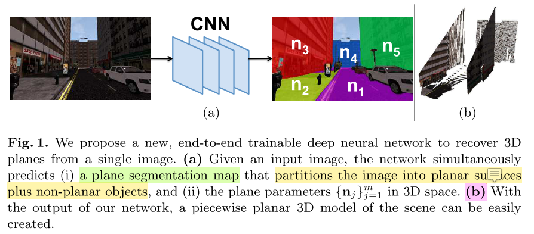
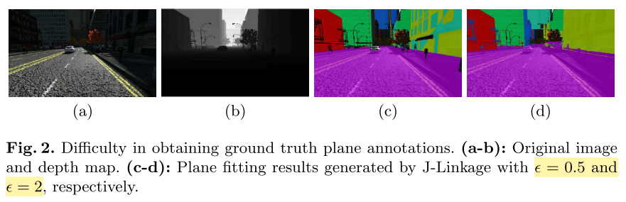
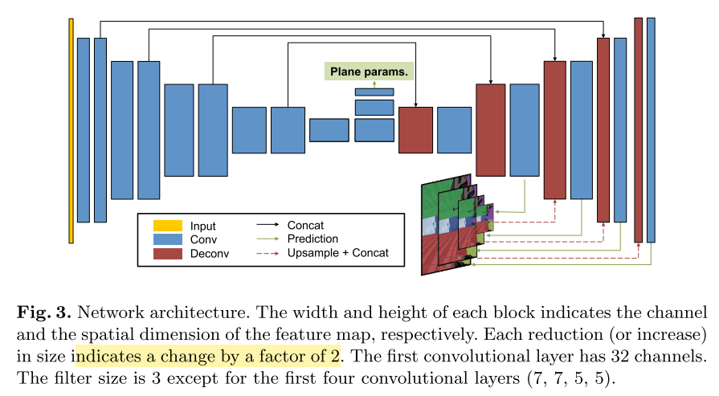
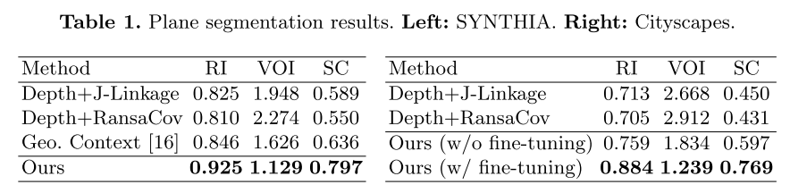
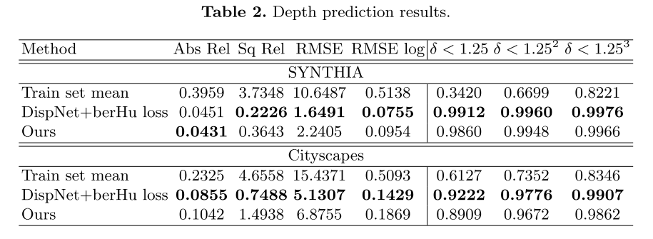

* 论文名称：[Recovering 3D Planes from a Single Image via](https://openaccess.thecvf.com/content_ECCV_2018/html/Fengting_Yang_Recovering_3D_Planes_ECCV_2018_paper.html)

* 论文作者：Fengting Yang and Zihan Zhou（Pennsylvania State University）

* 收录情况：ECCV 2018

### 简介
1. 从单张图片进行3D重建是个有挑战性的任务，之前的工作提出了基于结构规则的方法，这些结构有 planar surfaces, repetitive patterns, symmetrics, rectangles, cuboids 等等。提取到这些结构的3D模型往往很有用，因为它们提供了高层的、压缩的场景几何性质表示，对于大规模地图压缩、语义场景理解、人机交互等很有用。

2. 本文研究的问题是恢复3D平面——man-made 环境最常见的结构。前人对这个问题展开了一些研究，提出各种方法拟合场景的 piecewise planar。这些方法属于 2.$bottom-up~approach$
    1. 检测图片中的直线段、角、结合点灯几何特征
    2. 通过对检测到的空间几何性质分组，找到planar regions

3. 尽管这些方法很受欢迎，但是$ottom-up~approach$存在潜在的问题
    1. man-made环境不能保证检测到可靠几何性质——纹理很差、特殊表面
    2. 检测到的几何特性，存在大量不相关单特征和异常值，使得基于几何特性的分组非常困难

4. 本文提出了一种不同的方法恢复3D plane，这种方法不依赖于对 low-level geometric primitives（线段、小图像块） 的分组。
    - 设计了一个端到端的神经网络，直接识别场景中的 planar surfaces，如最上面的图片所示，网络
    - 输入：单幅rgb图片
    - 输出：
        1. segmentation map that identifies the planar surfaces in the image
        2. the parameters of each plane in the 3D space

    - 遇到的挑战是缺乏大规模带标注的3D planes数据集，为了避免投入大量人工标注成本，提出了 plane structure-induced loss，将问题转化为 single image depth prediction 问题，从而利用大量现有RGB-D数据集训练神经网络，而且把数据集中的像素类别标签考虑进来。

### 获取标准平面标签存在的困难
* （1）图片中的平面区域边界往往很复杂，让人工标注会费很多时间，但是训练神经网络又需要大量带标签的数据。（2）如何从图片准确抽取各个平面的3D表示参数，仍然是一个没有解决的问题。

* 一种解决思路是：利用RGB-D数据集，把像素转化成带深度值的3D表面图，然后用 multi-model 拟合算法对3D表面上的点进行聚类，但这也不是一项容易的任务。
    - 主要的困难是：设置一个合适的阈值，来区分一个点是不是属于一个 model instance（可理解为一个物体），该阈值的设置与选取的算法无关（听起来有点不太合理，阈值的设定和算法相关是很正常的事情）

* 为了解决这样的困难，本文使用了 **SYNTHIA** 数据集，该数据集提供了大量用真实图片合成的城市场景及其对应的深度图。数据集通过渲染一个城市生成，该城市在Unity开游戏平台上开发，所以得到的深度地图是不带噪声的（noise-free）。为了从3D点云检测到平面，本文利用了多模态拟合方法——J-Linkage。该方法与 RANSAC 相似，是基于采样一致性的方法。
    - J-Linkage 一个关键的参数是 $\epsilon$，控制模型 hypothesis 和对应hypothesis数据点的最大距离
    - 下图是设置不同 J-Linkage 生成平面分割图的效果
    
    
    - 作者用大段落举这个例子，是想说明这种方法得到的平面标注数据质量并不很高，再用来训练神经网络容易学到错误的信息，目的是下文引出自己的方法，文章写作技巧很高

### Plane Structure-Induced Loss
1. 上文阐述了获得可靠数据标签的挑战，这使得本文另辟蹊径，开发了另一方法进行3D平面恢复。有一个具体的问题：是否可以利用大规模的RGB-D / 3D 数据集，训练神经网络识别平面等几何结构，于此同时不需获取几何结构的ground truth标签？
    - 一个重要的想法是：如果能从图片恢复出3D平面，那么就能用这些平面（部分地）解释场景的几何性质 —— 通常用3D点云表示
    - $\{I_i, D_i\}_{i=1}^n$ n 个数据对 $\sim$ (RGB image, depth map)，相机内参K已知，对于数据集中所有图片都相同

    - 图片 $I_i$ 的像素 $\textbf{q} = [x, y, 1]^T$，它对应的3D点
        - $$ Q = D_i(\textbf{q}) \cdot K^{-1} \textbf{q} $$

    - 三维向量 $\textbf{n} \in \mathbb{R}$ 表示场景中的一个平面
        - 如果 $Q$ 位于该平面，则有 $\textbf{n}^T Q = 1$

2. 基于以上观测，假设图片 $I_i$ 有 $m$ 个平面，本文的目标是训练一个神经网络输出：
    1. 每个像素的概率图 $S_i$，$S_i(\textbf{q})$ 是个(m+1)维的向量，其中第$j$个元素 $S_i^j(\textbf{q})$ 表示像素 $\textbf{q}$ 属于第$j$个平面的概率
    2. 图片 $I_i$ 所有的平面参数 $$\Pi_i = \{\textbf{n}_i^j\}_{j=1}^{m}$$，最小化目标函数
        - $$ \mathcal{L} = \sum_{i=1}^n \sum_{j=1}^m \left(  \right) + \alpha \sum_{i=1}^n \mathcal{L}_{reg}(S_i) $$
        - $\mathcal{L}_{reg}(S_i)$ 是正则化项，阻止网络生成平凡解 —— $S_i^0(\cdot) \equiv 1$，这样会把所有像素划分成 non-planar，$\alpha$ 是平衡因子
        - 上式把 plane segmentation 和 plane parameter estimation 统一考虑，与用两种监督信息分别训练网络的方法不同

    3. 以上公式，$|(\textbf{n}_i^j)^TQ - 1|$ 衡量了图像$I_i$中第j个平面的3D点$Q$的偏差，又直到$Q$必在射线 $\lambda K^{-1} \textbf{q}$上，$\lambda$ 是$\textbf{q}$的深度值。若点$Q$又在第$j$个平面，则有
        - $$(\textbf{n}_i^j) \cdot K^{-1} \textbf{q} = 1 \Rightarrow \lambda = \frac{1}{(\textbf{n}_i^j) \cdot \lambda K^{-1} \textbf{q}}$$
        - 因此，$\lambda$ 可看作点$\textbf{q}$在平面$(\textbf{n}_i^j)$的深度值

    4. 基于以上推导，有如下等式成立
        - $$ \|(\textbf{n}_i^j)^TQ - 1 \| = \|(\textbf{n}_i^j)^T D_i(\textbf{q}) \cdot K^{-1} \textbf{q} - 1 \|$$
        - 可以看到，上式计算 $D_i(\textbf{q})$ 和 $\lambda$ 的差异，惩罚差异项
        - 因此，本文把 3D plane recovery 看成一个深度估计问题

### Incorporating Semantics for Planar/Non-Planar Classification
1. 这部分主要考虑正则项 $\mathcal{L}_{reg}(S_i)$。出发点是希望预测的平面能尽可能反映场景的几何性质，因此 $\mathcal{L}_{reg}(S_i)$ 要鼓励 plane prediction——通过交叉熵损失函数
    - 令 $p_{plane}(\textbf{q}) = \sum_{j=1}^m S_i^j(\textbf{q})$
    - $$ \mathcal{L}_{reg}(S_i) = \sum_{\textbf{q}} -1 \cdot \log(p_{plane}(\textbf{q})) - 0 \cdot \log(1 - p_{plane}(\textbf{q}))$$

    - 损失函数的设计有效鼓励神经网络解释图像中的每个像素——使用预测平面模型
    - 实际情况中，一些物体比另外的更可能形成有意义的平面，比如建筑物的正面，于此同时行人、汽车被看作 non-planar
    - 进一步，能否把这样的高层语义信息考虑进来，提高 planar 和 non-planar 的分类能力

2. 基于上文介绍，提出了利用数据集中的语义标签的方法，以 SYNTHIA 为例
    - 该数据集提供了13类城市场景的像素集语义标签信息
    - 把这些类分成
        - planar = {building, fence, road, sidewalk, lane-marking}
        - non-planar = {sky, vegetation, pole, car, traffic signs, pedestrians, cyclists, miscellaneous}
        - 这种划分不固定，与问题和数据集相关
    
    - 令 $z(\textbf{q}) = 1$， 当 $\textbf{q}$ 属于 planar类别；否则 $z(\textbf{q}) = 0$，重写损失函数
        - $$ \mathcal{L}_{reg}(S_i) = \sum_{\textbf{q}} -z(\textbf{q}) \cdot \log(p_{plane}(\textbf{q})) - (1-z(\textbf{q})) \cdot \log(1 - p_{plane}(\textbf{q}))$$

    - 因此，就把经过人工标注的高层语义利用了起来，并和传统的geometric methods设定阈值区分 planar 和 non-planar 的方法区分开来

### Network Architecture

1. 本文采用的是 $fully ~convolutional ~network$(FCN)——已知的模型在语义分割任务取得了好的效果，用2个预测分支同时估计 plane segmentation map 和 plane parameters

2. Plane segmentation map
    - 采用 encoder-decoder 架构，与DispNet相似
    - decoder的输入一部分来自encoder
    - 最后的输出层采用 softmax function，其他层激活函数均使用了 ReLU

3. Plane parameters
    - 与segmentation分支共享高层特征图
    - 由2个 stirde=2 的卷积层（3x3x512）组成
    - 后接一个 1 x 1 x 3$m$ 的卷积层输出 $m$ 个平面的参数
    - 后接一个 global average pooling，对所有空间位置的预测 aggregate
    - 除了最后的输出层，其他层激活函数均使用了 ReLU

4. Implementation details
    - 网络从头训练
    - 平面的个数 $m$ 设置为 5

### 实验
本文声称，在GTX 1080 Ti GPU上，测试速度能达到 60 $fps$，还是相当快了，我好奇神经网络也能运行如此之快？

1. 数据集：
    - SYNTHIA
        *  more than 200,000 photo-realistic images rendered from virtual city environments with precise pixelwise depth maps and semantic annotations
        *  Since the dataset is designed to facilitate autonomous driving research, all frames are acquired from a virtual car as it navigates in the virtual city. 
        *  seven different scenarios in total, we select three ones scenarios.
        * we randomly sample 8,000 frames as the training set and another 100 frames as the testing set.（第一感觉是测试集太小）
    - Cityscapes
        *  a large set of real street-view video sequences recorded in different cities
        -  3,475 images with publicly available fine semantic annotations
        -  the depth maps in Cityscapes are **highly noisy** because they are computed from stereo correspondences. 
        - Therefore, to identify planar surfaces in the image, **we manually label** the boundary of each plane using polygons, and further leverage the semantic annotations to refine
        - we randomly select 100 images for testing, and use the rest for training（第一感觉是测试集太小）

2. 评价任务
    * plane segmentation
        - 指标：
            * Rand Index(RI)
            * Variation of Information(VOI)
            * Segmentation Covering(SC)
        - 

    * depth prediction
        - 指标
            * RMSE；其他几项指标没明白什么意思
        - 