* 论文名称：[MarrNet: 3D Shape Reconstruction via 2.5D Sketches](https://jiajunwu.com/papers/marrnet_nips.pdf)

* 论文作者：Jiajun Wu, Yifan Wang, Tianfan Xue, Xingyuan Sun, William T. Freeman, Joshua B. Tenenbaum（MIT CSAIL, ShanghaiTech University）

* 收录情况：NeurIPS 2017

### 简介
即使在物体纹理、材质、光照和背景差异很大的情况下，人也能从单张图片快速识别出3D物体，是什么样的信息让这变成现实？

人类感知专家认为我们的3D感知能力依靠恢复2.5D 草图/轮廓图（英文对应sketch），草图包含了最基本的图片，比如深度与、表面法向量图。最基本的图片通过形状，把纹理、反照率、光照等外观方面的变化消除（这部分好理解）。我们再把2.5D sketch和形状鲜艳组合起来，重建一个整个3D物体（这段写作纯粹是为了引出下文重点，其实有点扯）。

计算机科学领域，根据表面、物体、场景重建3D形状的工作有很多 [Kemelmacher-Shlizerman and Basri, 2011], objects [Tappen et al., 2003], and scenes [Hoiem et al., 2005, Saxena et al., 2009]。近年来，研究者视图用深度学习的方法解决这个问题，这些方法通常是用单周RGB图直接回归3D物体形状。

与上述方法不同的是，本文提出了一种两阶段法，首先恢复2.5D sketch，利用2.5D sketch再恢复物体形状，这么做有几点好处：

* 使用 2.5D sketch 缓解了domain transfer带来的问题（训练集表现好，测试集表现差），因为利用单张图片进行3D重建，高度依赖于物体形状这样的先验知识。

* 从2.5D sketch恢复3D shape，能让模型在合成数据上训练，这样避免了获取大量真实标注图片的成本。但存在的问题是恢复3D shape，可能不够逼真。

* 提出了可微分的重投影函数，维护2D-3D一致性。

### 主要方法
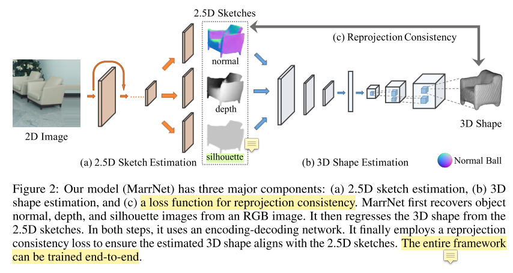

MarrNet 包含3个部分：
* 2.5D sketch estimator
* 3D shape estimator

* projection consistency function
    - 通过设计损失函数，使得估计的3D物体结构和推理的2.5D sketch保持一致

1. 2.5D Sketch Estimation
    - input: 2D rgb image
    - output: 2.5D sketch，由几个维度刻画
        * 物体表面法向量
        * （像素）深度值
        * 物体轮廓图 —— silhouette

    - 使用2.5D轮廓估计的目的是仅保留物体本身的特征（形状、深度、大小），去掉环境因素（光照、背景） —— **蒸馏**
    - 采用 encoder-decoder 架构进行 2.5D sketch 估计
        * 编码器是 ResNet-18，把256x256的图片，编码成512个8x8的特征图
        * 解码器包含4个这样的block：5x5 全卷积 + ReLU activation

2. 3D Shape Estimation
    - input: surface normal and depth image（这些东西从2.5D sketch得到）
    - output: 3D object

    - 因为有了2.5D sketch，所以这部分能在合成数据上训练，而且不用担心domain adaption问题，但不足之处是生成的3D object，真实感不足，一看就是生成出来的

    - 同样采用encoder-decoder结构
        - encoder: 5个block（conv + ReLU + pooling）$\rightarrow$ $2~fc~ layers$
            * 参考 Girdhar et al., 2016
            - 把输入数据编码成 200 维向量，给到decoder
        - decoder: 5个block（conv + ReLU）$\rightarrow$ $128 \times 128$ voxel-based reconstruction of the input
            * 参考 Wu et al., 2016b

3. Reprojection Consistency
    - 一些基于神经网络的方法，强制加入 估计的3D形状 和 2D表示 的一致性约束（一般是通过损失函数）
    - 本文也加入3D shape和2.5D sketch之间的一致性约束，共有两项
        * depth reprojection loss
        * surface normal reprojection loss
    - 一些形式化表示
        * $v_{x,y,z}$ 表示3D 体素网格中位置$(x,y,z)$对应的数值，且 $\forall~~ x,y,z~~ v_{x,y,z} \in [0,1]$ 成立
        * $d_{x,y}$ 表示位置$(x,y)$对应的深度值(？？？我理解这是说的像素值)
        * $n_{x,y} = (n_a, n_b, n_c)$ 表示估计的表面法向量

    - 本文有一个重要假设：认为从3D到2D的投影是正交的（我理解为主投影，原文是We assume orthographic projection in this work）

    - Depth reprojection loss
        - 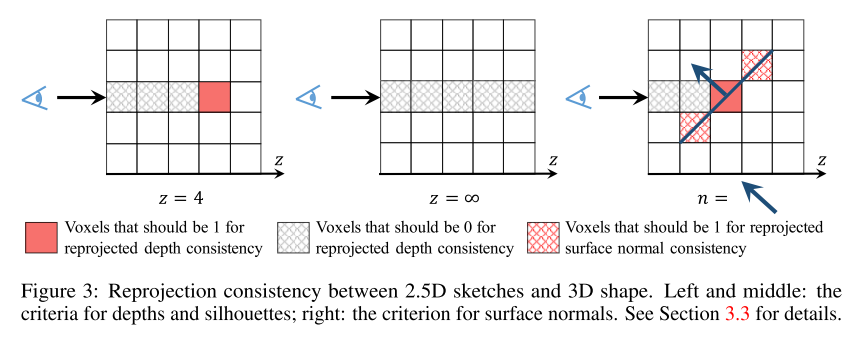
        * 这部分损失函数，设计目标是让体素值 $v_{x,y,d_{x,y}}$ 为1，因为此时深度值正好等于 $d_{x,y}$，深度小于 $d_{x,y}$ 时，体素值为0
        * 具体的损失函数如下
            - 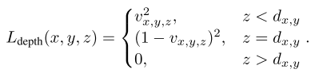
        * 损失函数对 $v_{x,y,z}$ 的导数
            - 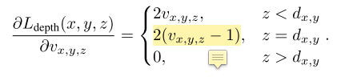
        - 当 $d_{x,y} = \infty$ 时，深度值进入一种特殊情况 —— 形状轮廓（？？？没理解这个因果关系）
            - 当线段与形状没有交集时，体素值应当全为0

    - Surface Normal reprojection loss
        - 向量 $n_x = (0, -n_c, n_b)$ 和 $n_y = (-n_c, 0， n_a)$与向量$n = (n_a, n_b, n_c)$正交，对前2个向量归一化得到
            - $n_x^' = (0, -1, n_b/n_c)$
            - $n_y^' = (-1, 0, n_a/n_c)$
            - 这两个向量位于点$(x,y,z)$对应的 surface plane（我理解为切面，因为前面说到了正交，而且是点$(x,y,z)$对应的平面，只能是切面）
        - 本损失函数试图保证 $(x,y,z) \pm n_x^'$ 和 $(x,y,z) \pm n_y^'$ 等于1，来匹配估计到的 surface normals
            - 上述约束仅在 目标体素 位于估计到的轮廓内部时适用（？？？不懂在说什么，道理是什么）
        - 令 $z = d_{x,y}$，Surface Normal reprojection loss 表示为
            - 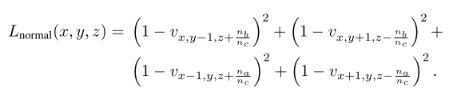
        - 损失函数的导数为
            - 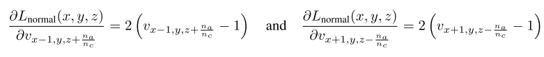

4. 训练模式
    - 两阶段训练模式
        - 第一阶段：训练2.5D sketch estimation module
        - 第二阶段：训练3D shape estimation module
        * 预训练的时候使用的都是 synthetic data，后来调优时候使用的是 real images
        - synthetic data 来自 ShapeNet objects 的合成图片，带有ground truth：surface normal, depth, silhouette annotations $\rightarrow$ L2 loss
        - 3D interpreter（我理解为3D shape estimation）在ground truth体素网格做监督 $\rightarrow$ cross entropy loss

    - 重投影一致性损失函数用来调优 3D shape estimation
        - 这部分输入是上一个模块的输出：normal, depth, and silhouette
        - 调优用的数据是 real images

    - 本文声称
        - 直接学习得到物体形状，能与2.5D sketch吻合较好，但是3D物体的外观真实性较差
        - 原因是跳过2.5D sketch，直接学习物体形状容易过拟合（并没有提供很多证据）

    - 在训练3D shape estimation module时，固定 decoder，仅调优encoder
    - 测试时，MarrNet能够自监督
        - e.g. 模型能在不带标注的单张图片 fine-tune（没明白这是在说什么，以及有什么作用）
        - 事实上，模型在每张图片迭代40次（为什么要用单张图片调优，我觉得这是一个平均数字吧 $\rightarrow$ 总共迭代次数 ÷ 图片数）
    
### 实验评估
1. 3D Reconstruction on ShapeNet
    - ShapeNet 的图片是合成的，做实验时只用了 chairs 这类物体
    - 从 Sun database [Xiao et al., 2010] 随机取了一些背景，把chairs放在物体之前；渲染对应的RGB、depth、surface normal、轮廓图片
    - 使用了 physics-based 渲染器 [Jakob, 2010]
    - 对于6778 个ShapeNet chairs，渲染了20张随机视角的图片（？？？实验数据量是不是不足）
    - 第4/5列是不经过2.5D sketch直接预测3D shape，相当于一个消融实验
    - 

2. 3D Reconstruction on Pascal 3D+
    - PASCAL 3D+ dataset 中的3D物体来自真实图片，本文测试用的数据集与[Tulsiani et al., 2017]保持一致
    - 在 ShapeNet 训练，在PASCAL 3D+调优，再在PASCAL 3D+的测试集评估
        - 调优时不像前人的工作 [Tulsiani et al., 2017]，本文的输入没有轮廓 silhouette，轮廓是要调优的对象，而不是输入
    - 对比方法：之前SOTA DRC [Tulsiani et al., 2017]
    - 
    - 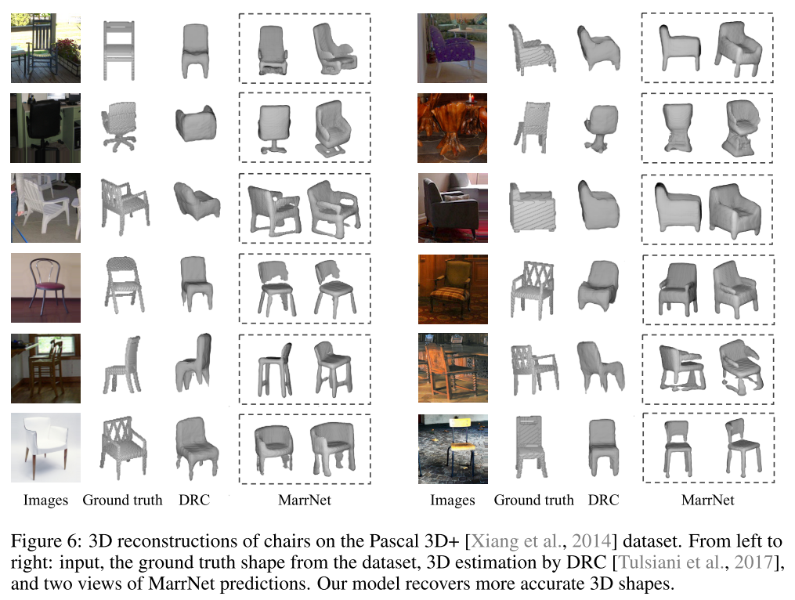

    - 为数不多的表格，定量分析结果
        - 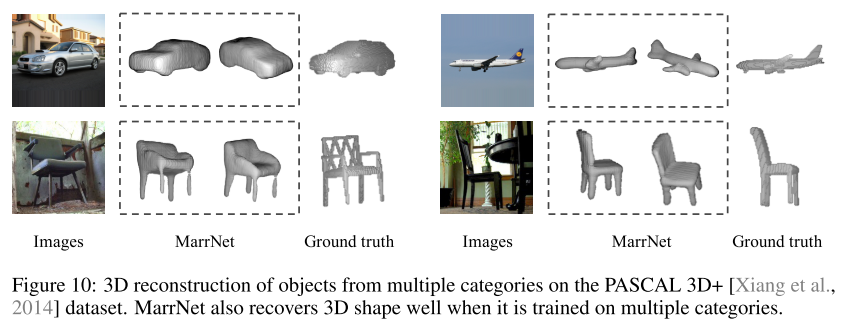

3. 3D Reconstruction on IKEA
    - 包含IKEA家具图片，带有准确的3D shape和姿态标签
    - 数据集很有挑战性，因为很多物体被遮挡、裁剪程度很高
    - 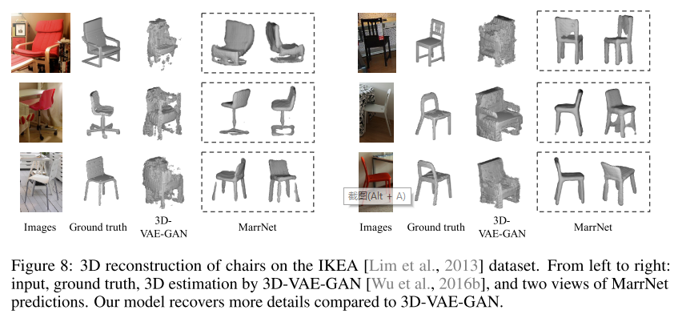

4. 失败案例
    - 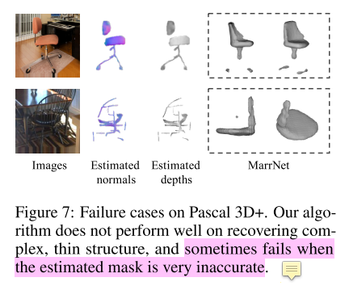
    - 因为这只是定性分析，所以结果很可能放了一部分，还有失败的cases没放

4. 扩展实验
    * 我的感受：只有椅子这类3D重建，能做的事情太少，而且方法也很复杂，说明这个问题还是很有挑战的
    * 除了椅子这类，还把MarrNet应用到了 car、airplane 3D模型建立
    - 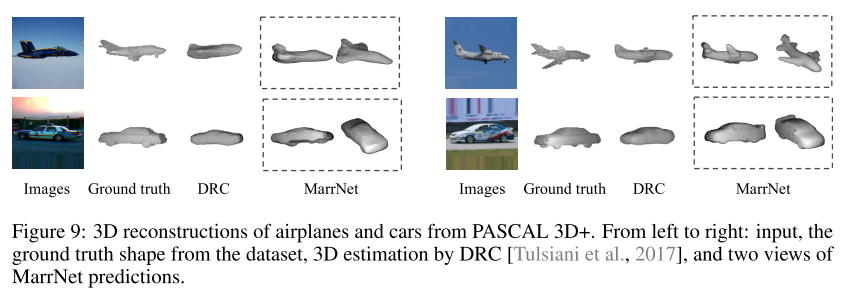
    - 