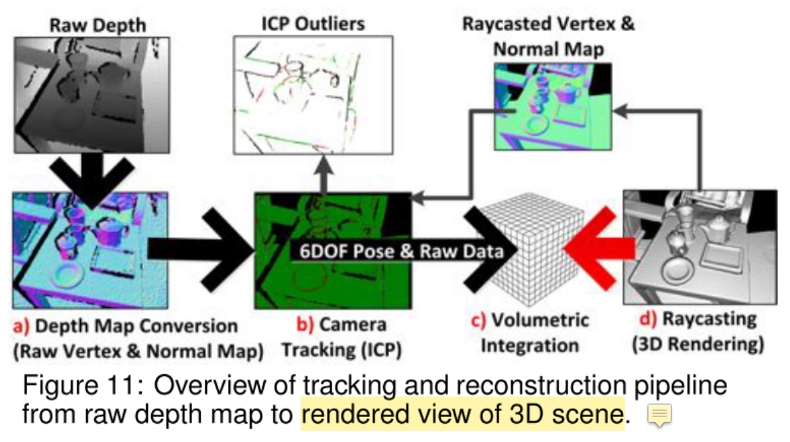

* 论文名称：[KinectFusion: Real-time 3D Reconstruction and Interaction Using a Moving Depth Camera](https://jiajunwu.com/papers/marrnet_nips.pdf)

* 论文作者：Shahram Izadi, David Kim, Otmar Hilliges, David Molyneaux, Richard Newcombe, Pushmeet Kohli, Steve Hodges1, Dustin Freeman（Microsoft Research Cambridge）

* 收录情况：ACM symposium on User interface software and technology 2011

这篇论文是微软2011年发表的，研究内容是通过RGBD相机，实时重建3D场景表面并能和用户交互，后来产生了很大的影响力。其中一个重要的原因是在GPU上实现了
完整的软件+硬件系统，非常具有说服力。

KinectFusion 不是一个简单的3D建模算法，也不是一个单纯的RGBD摄像机，而是集成了3D重建、交互和RGBD摄像机功能的系统

### 系统组成
1. KinectFusion 中相机跟踪和表面重建的方法是前人已经充分研究的（如下所列），专门为在GPU上并行执行设计。但本文的更关心的是实现并扩展其中的核心功能，让算法在GPU上高效运行起来，达到实时的交互
    * P. J. Besl and N. D. McKay. A method for registration of 3D shapes. IEEE Trans. Pattern Anal. Mach. Intell., 14:239–256, February 1992.
    * B. Curless and M. Levoy. A volumetric method for building complex models from range images. ACM Trans. Graph., 1996.
    * S. Rusinkiewicz and M. Levoy. Efficient variants of the ICP algorithm. 3D Digital Imaging and Modeling, Int. Conf. on, 0:145, 2001.

1. 系统pipeline由4个步骤组成，每步都在GPU上执行
    1. Depth Map Conversion. 要把RGBD相机拍摄深度图转换成相机坐标系下的3D点和法向量
    2. Camera Tracking. 在GPU上实现ICP算法，对齐当前帧和前一帧中的oriented points，其中的关键就是计算6个自由度的刚性变换（ICP对齐的目的就是求位姿变换）

    3. Volumetric Integration（体积整合）. KinectFusion 不使用融合点云或创建网格，而是使用基于[5]的体积曲面表示法。给定摄像机的全局姿态，定向点转换为全局坐标，并更新单个三维体素网格。每个体素存储其到物理曲面假定位置的平均距离。
        - 没完全理解 Volumetric Integration 在说什么，需要读参考文献[5]

    4. Raycasting(光线投射). 最后，对体积进行光线投射，以提取隐式曲面的视图，供用户渲染。当使用相机的全局姿势时，该体积的光线投射视图也相当于合成深度贴图，可作为下一次ICP迭代的噪声更小、更全局一致的参考帧。这允许通过将当前的实时深度贴图与我们的噪声较小的模型光线投射视图对齐进行跟踪，而不是只使用实时深度贴图帧到帧。