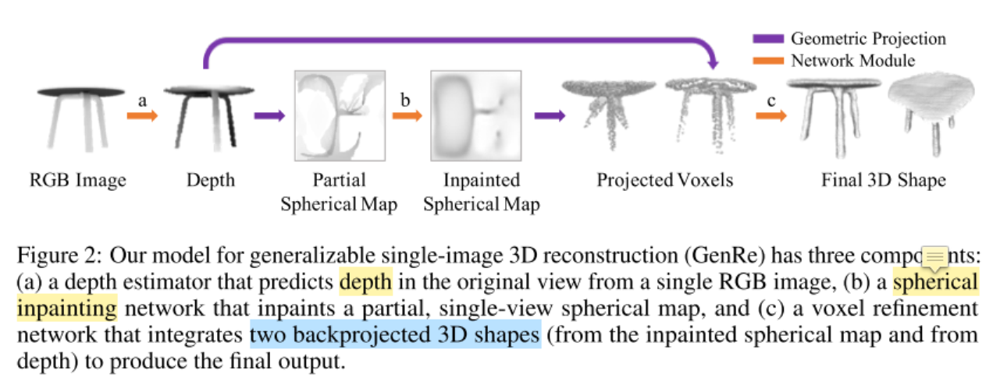
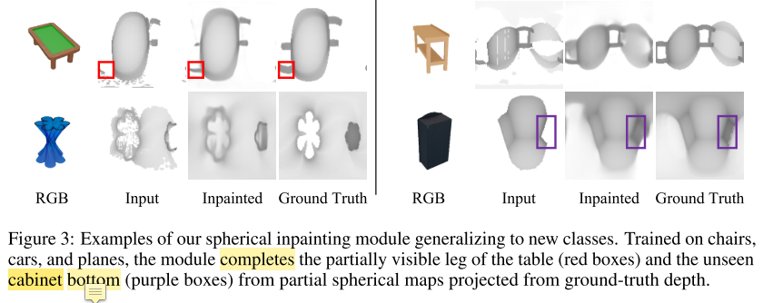
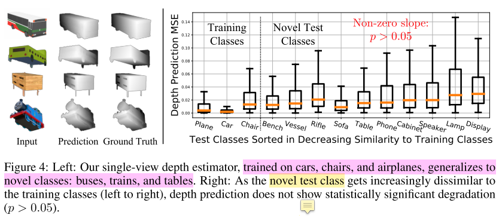
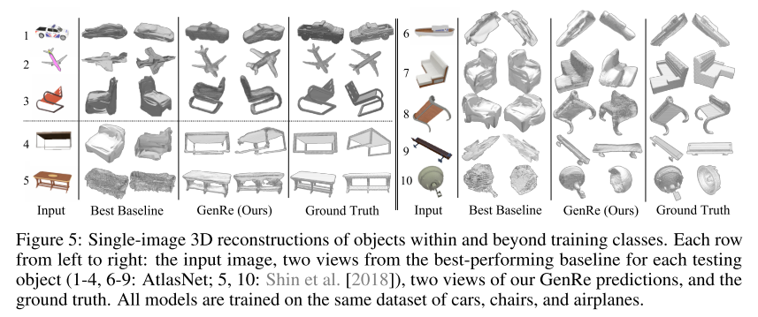
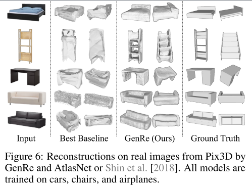
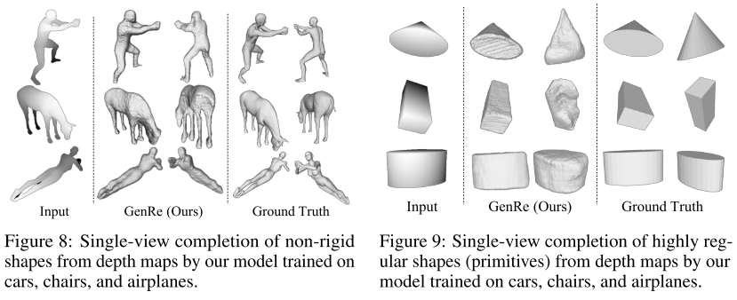

这篇论文是在[MarrNet](https://auniquesun.com/2020-12-08-MarrNet/)基础上的工作，研究内容是物体3D形状重建，重点放在了可扩展性上，即从已知物体学习，结合一些先验知识，重建出训练集没见过的物体的3D形状，创新性比较大。

* 论文名称：[Learning to Reconstruct Shapes from Unseen Classes](https://arxiv.org/abs/1812.11166)

* 论文作者：Xiuming Zhang, Zhoutong Zhang, Chengkai Zhang, Joshua B. Tenenbaum, William T. Freeman, Jiajun Wu（MIT CSAIL, Google Research）

* 收录情况：NeurIPS 2018

### 主要方法
利用单张图片的重建算法，学习一个函数 $f_{2D \rightarrow 3D}$，把图片中的2D物体映射成3D形状。本文通过正则化 $f_{2D \rightarrow 3D}$ 解决扩展性的问题。使用的正则化方法是把 $f_{2D \rightarrow 3D}$ 分解成 $geometric~projections$ 和 $learnable~reconstruction$ 模块。

本文的方法——$GenRe$，由3个可学习的模块组成，通过 $geometric~projections$ 模块连接。
* 第一个模块是单视图的 depth estimator $f_{2D \rightarrow 2.5D}$。输入是RGB图，输出是depth map，depth map可以理解成物体的可视化表面（因为获取深度的时候，计算的是相机到物体表面的深度）。因此，给定部分估计的深度图，重建问题变成了预测物体完整的表面。

* 因为物体3D表面很难形式化地表示出来（为什么这么说，因为物体表面不尽相同，不可能用一个方程完全表示，只能是选取一个函数作近似），这里使用球形图作近似（球形图，比较规则图形，方便用方程描述）。
    - $geometric~projections$ $p_{2.5D \rightarrow S}$ 把深度图转换成球形图，具体说是 $partial~ spherical~ map$
    - 然后把 $partial~ spherical~ map$ 输入到 $spherical~ map$修复网络，预测修复好的球形图（$inpainted~spherical ~map$）
    - 然后把 $inpainted~spherical ~map$ 投影到 voxel space

* 因为球形图仅有球形的外表面信息，不能处理沿球体半径的自遮挡，本文使用了 voxel refinement module解决这个问题。
    - 输入包含2部分
        * 一个是来自 $inpainted~spherical ~map$ 的体素图
        * 另一个是来自 $depth~map$ 的体素图
    - 输出最终的3D shape

1. Single-View Depth Estimator
    - 用带有干净背景的图片，预测物体深度。受MarrNet启发，把深度做为中间表示，能从图片蒸馏得到物体重要的几何信息
    - 深度估计是类别无关的，不同形状的物体可能有共同的几何结构，比如衣柜和床都有垂直于地面的表面（这都是自成一说，怎么都能找到支持自己观点的例子）

2. Spherical Map Inpainting Network
    * 利用球面图，本文把3D表面补全问题转化成2D球面图修复问题（**其实本文困扰我的点是，spherical map到底在说什么**）
    * 作者观察到：用来修复球面图训练好的网络，对未知形状类别具有好的扩展性，如下图所示(？？？从这幅图真的能看出什么吗)
    
    * 与voxel map相比（一般是3D图），因为3D表面的稀疏特性，spherical map处理更高效
    
    * 因为球面图反映了单位球体的信息，设计网络结构时容易想到球卷积。但是本文的 shape reconstruction 不适合球卷积，因为球卷积是在光谱域进行操作。每次往返于频谱域的转换都需要对最大频率进行封顶，从而导致额外的混叠和信息丢失（完全不清楚这段在说什么）。
    * 对于**识别任务**而言，与球卷积提供的卷转不变性的优势相比，信息损失可能能够忽略。但是对于**重建任务**，信息损失会导致带有低频组件模糊输出。
    * 从经验上来看，标准卷积比球卷积更适合重建任务。

3. Voxel Refinement Network
    * 虽然修复的球形图提供了物体表面在单位球体的投影，但是当自遮挡发生时，表面信息就丢掉了。本文使用精修网络恢复丢失的信息，精修网络在voxel space进行操作，它的输入是两个voxielized shapes:
        1. 从估计的depth map得到的shape
        2. 从inpainted spherical map得到的map
    * 输出最终重建的形状

    * 因为恢复的思路是从遮挡区域的周围得到信息，所以精修网络需要捕获 local shape priors，并且不关心形状类别（class-agnostic）
    * 这段是用来支撑上一段的表述：实验显示，当提供ground truth depth map和spherical map时，精修网络在重建训练数据和没有见过的类别形状时，表现都较好

### 实验
1. 3D形状表示方法
    * voxels：在深度学习时代，体素非常适合表示3D形状，因为它的结构很适合做卷积。本文的模型使用了 $128^3$ 个[0, 1]占用的体素网格（这里[0,1]是个区间，不是0、1两个值）
        - DRC、MarrNet 作为比较的方法
    * Mesh & point clouds：比体素表示简单一些（？？？作者的一家之言，其实未必）
        - AtlasNet 作为比较的方法（total3dunderstanding 这篇论文也见过这个方法）
    * Multi-view maps：多视角深度图
        - Daeyun Shin, Charless C Fowlkes, and Derek Hoiem. Pixels, voxels, and views: a study of shape representations for single view 3D object shape prediction. In CVPR, 2018 作为比较方法
    * spherical maps：3D 形状能表示成球形图（我理解就是一个球形表面）
        - GenRe-1step，从RGB图片直接预测球形图
        - GenRe-2step，首先从RGB图片直接预测球形图，再修复球形图

2. 数据
    - ShapeNet，前人制作的数据集
        - 合成的数据集
        - 对于每个物体，选取20个视角对应的图，进行渲染
        - 在cars/chairs/airplanes这几个类别进行训练，其他类别进行测试

    - Pix3D
        - 真实图像数据集，包含每个物体的真实形状信息
        - 在cars/chairs/airplanes这几个类别进行训练
        - 在beds, bookcases, desks, sofas, tables, and wardrobes进行测试

3. 评价指标：Chamfer distance(CD)
    - $$ CD(S_1, S_2) = \frac{1}{|S_1|} \sum_{x \in S_1} min_{y \in S2} \parallel x - y \parallel_2 + \\ \frac{1}{|S_2|} \sum_{y \in S_2} min_{x \in S1} \parallel x - y \parallel_2 $$
        - $S1$ 和 $S2$ 是一个点集对，取自3D shape surfaces；更准确的说，一个来自最终预测的3D shape，一个来自ground truth 3D shape

4. 一些实验结果
    * 由于本文重点是进行可扩展式的3D重建，所以我仅分析这部分结果，对于已知类别的形状，不进行赘述
    
    
    
    
    