* 论文名称：[Learning 3D Semantic Scene Graphs from 3D Indoor Reconstructions](https://arxiv.org/abs/2004.03967)

* 论文作者：Johanna Wald, Helisa Dhamo, Nassir Navab, Federico Tombari（TUM、Google）

* 收录情况：CVPR 2020

### 简介
3D场景理解就是感知和理解用3D数据表示的场景，不仅要求能识别和定位出3D空间的物体，而且能理解物体间的关系和所处的环境。这种彻底的3D场景理解对很多任务具有吸引力，比如自动导航，AR、VR。

当前的3D场景理解包含了实例分割、语义分割、3D物体检测等任务。这些工作把重点放在物体语义上，物体之间的关系和物体所处的环境主要用来提升物体分类的准确性。

最近，根据图像的场景理解开始探讨场景图的用途，比如用它来辅助理解物体之间的关系。在此之前，场景图已经被用在计算机图形学，排列图形场景的空间表示，其中节点表示物体实例，边表示连个节点的相对变换。这些概念被成功扩展到计算机视觉数据集，有 support structures/ semantic relationships and attributes / hierarchy mapping of scene entities。
**场景图在图片搜索、图像生成方面展现出用处**。

本文想要集中研究3D场景图的语义和潜在用处，目标是获得带标签的实例节点、带语义的关系边的场景图（如下所示），这种场景图具有以下功能：

* 对于场景和噪声的变化比较鲁棒  
* 填补文本、图像数据类型差异带来的鸿沟，在2D-3D场景检索、VQA方面很有应用前景
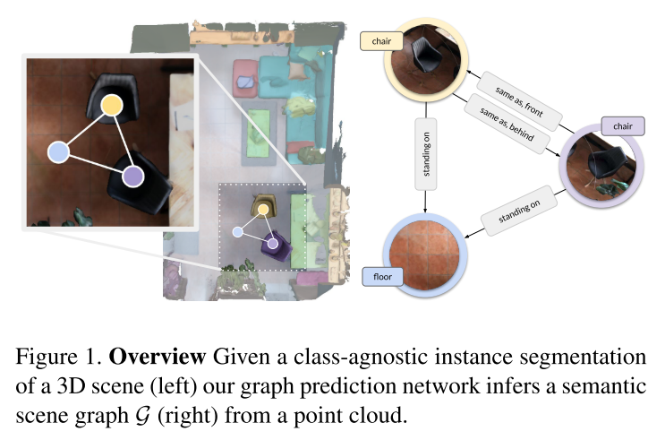

本文认为生成场景图是3D场景理解的基础，提出一种深度学习方法预测3D semantic graph，该方法基于PointNet和GCN实现，并展示了场景图在 3D场景-2D图片 中的能力。总结起来有以下几个贡献：

* 制作了3D场景数据集——3DSSG，该数据集扩展了3RScan，在上面加了场景语义标注、节点关系和属性、节点类别等信息  
* 提出一种从3D point cloud生成语义场景图的方法  
* 展示了3D 语义场景图在跨领域检索的能力——从2D图片检索3D场景

### 3D Semantic Scene Graphs
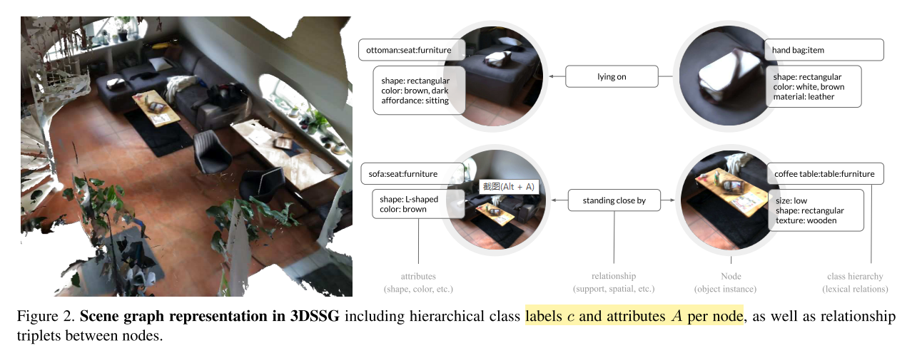

本文同时发布了3D语义场景图的数据集——3DSSG，包含478个室内环境，1482个3D重建场景，48K 物体。3DSSG中的语义图用 $(\mathcal{N}, \mathcal{R})$ 这样的元组集合表示，$\mathcal{N}$ 表示节点——3D物体实例，$\mathcal{R}$ 表示边。

比较特别的地方是，每个节点不只属于单个类别，而是属于分层次的类别 $c = (c_1, \dots, c_d)$；每个节点还有一个属性集合$A$，描述了物体实例的外观和物理性质；其中一个属性子集叫作 $affordances$，它描述了物体间的交互性质，比如 $bottles~stand~ on~ the~ chairs$

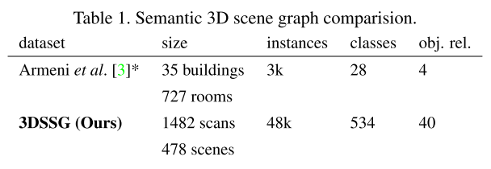

* Nodes
    - 图中的节点就是3D物体实例，每个实例属于一个3D场景，类别标签记为 $c_1$，后续的类标签是通过使用WordNet递归解析 $c_1$ 的超名词的词法定义获得的
        - 例如，通过定义"chair with a support on each side for arms"知：$c_{n+1} = chair$ 是 $c_n = armchair$ 的超名词
    - 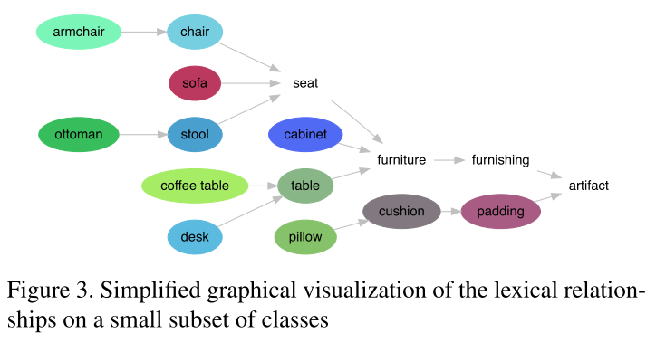
    - 1482个3D重建场，包含534个不同类别，对应534个文法描述

* Attributes
    - Static Properties. 
        * 视觉特征：物体颜色、大小、形状、纹理
        * 物理性状：是否刚性
        * 从文法描述抽取属性：a ball is spherical

    - Dynamic Properties
        * 随时间变化
        * 描述物体状态：定义了和物体类别相关的状态类别（这个是很自然的）
            - open/closed, empty/full, on/off

    - Affordances
        * 描述特定物体的功能或与环境的交互
            - $seat$ is for $sitting$
            - only a $closed~door$ can be $opened$

* Relationships
    - Support Relationships. 描述一个场景的支撑结构
        - walls are by default supported by the floor
        - floor does not have any support

        - 自动抽取support relationships是非常具有挑战性的，对于场景中的每个物体，仅考虑小半径范围内的相邻物体，之后抽取过程分为两步
            1. 消除错误的supports
            2. 补全丢失的candidates

    - Proximity Relationships. 这里指的是相对于参考场景的空间位置邻近关系，**我感觉和support relationships有重复的说辞**
        - next to/ in front of
        - 只计算有共同 support parent 的两个物体实例的 Proximity Relationships
        - 作者也说了，Proximity Relationships能从support parent导出

    - Comparative Relationships. 
        - bigger than/ same shape as/ darker than/ cleaner than

### Graph Prediction
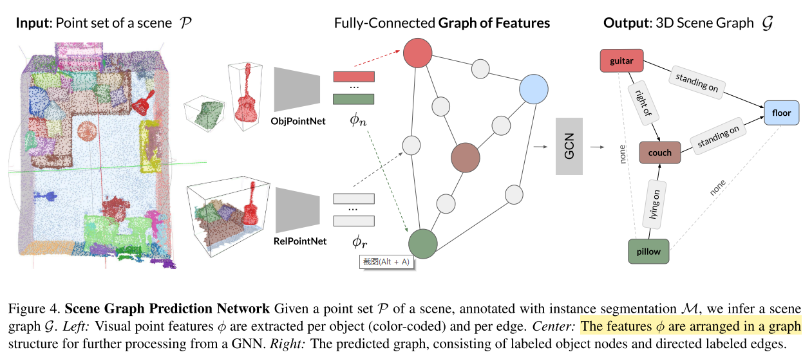
1. 给定场景$s$的点集 $\mathcal{P}$ 和类别无关的实例分割 $\mathcal{M}$（我理解就是带标签的点集），Scene Graph Prediction Network（SGPN）的目标是生成一幅图 $\mathcal{G} = (\mathcal{N}, \mathcal{R})$。

2. SGPN 包含
    - 为每个节点$\phi_n$和每条边$\phi_r$抽取视觉特征，用了两个PointNet，第一个称为ObjPointNet，第二个称为RelPointNet
    - 对于场景$s$，用实例分割图$\mathcal{M}$作mask，抽取每个物体实例$i$的点集
        - $$\mathcal{P}_i = \{\delta_{m_k i} \odot p_k\}_{k=1, |\mathcal{P}|}$$
        - $\delta$ 表示 Kronecker delta（$\delta_{ij} = 1 \Leftrightarrow i = j$）
        - $p, m$ 是$\mathcal{P}$，$\mathcal{M}$的实例
            - $m_k$ 是$\mathcal{M}$上**点的标号**，并不是真实的点

        - $\|\mathcal{P}\|$ 是$\mathcal{P}$包含的点数
        - 这个公式，前面的 $\delta_{m_k i}$ 和 运算$\odot$是用来作mask的，看取不取$p_k$。
            - 整体含义：遍历$\mathcal{P}$中的点$k$，如果$m_k$属于实例$i$，就取点 $p_k$
            - 相当于通过实例分割图$\mathcal{M}$ + $\mathcal{M}$和$\mathcal{P}$的对应关系，取$\mathcal{P}$中的点

        - 每个$\mathcal{P}_i$ 会输入到 ObjPointNet

        - 同时为每对物体实例 $i,j$ 抽取一个点集 $\mathcal{P}_{ij}$
            - $$ \mathcal{P}_{ij} = \{p_k | p_k \in (\mathcal{B}^i \cup \mathcal{B}^j)\}_{k=1, |\mathcal{P}|} $$
            - $\mathcal{B}$ 表示对应物体实例的3D bbox
            - $\mathcal{P}\_{ij}$ 输入到 RelPointNet，与$\mathcal{M}\_{ij}$拼接（当$\mathcal{P}\_{ij}$和物体$i$对应时，$\mathcal{M}\_{ij}$为1，当$\mathcal{P}\_{ij}$和物体$j$对应时，$\mathcal{M}\_{ij}$为0）。从上面的描述看出，$ \mathcal{P}_{ij} $ 包含了方向信息，这种方向信息（$left/right$）对于推断 proximity relationships 很重要。

        - 在物体中心点集和边点集输入OjbPointNet、RelPointNet前，进行归一化操作

        - 以三元组的形式，在图结构中排列抽取的特征
            - (subject, predicate, object)
            - $\phi_n$ 占据subject/object位置，$\phi_r$ 占据predicate位置

    - 使用一个GCN处理上面的3元组，分为两个步骤
        1. 信息传播
            - $$ (\psi_{s, ij}^{(l)}, \phi_{p, ij}^{(l+1)}, \psi_{o, ij}^{(l)}) = g_1(\phi_{s, ij}^{(l)}, \phi_{p, ij}^{(l)}, \phi_{o, ij}^{(l)}) $$
            - $g_1$ 是MLP
            - $\psi$ 表示处理后的特征，$s$ 表示subject，$o$ 表示object，$p$ 表示predicate
        2. 信息聚合
            - $$ \rho_i^{(l)} = \frac{1}{|\mathcal{R}_{i,s}| + |\mathcal{R}_{i,o}|} (\sum_{j \in \mathcal{R}_s} \psi_{s, ij}^{(l)} + \sum_{j \in \mathcal{R}_o} \psi_{o, ji}^{(l)}) $$
            - $\mathcal{R}\_{s}$ 是对应节点作为主体的连接集合、$\mathcal{R}\_{o}$ 作为客体的连接集合

        * 聚合后的物体节点特征输入另一个MLP，并且采用残差连接克服潜在的Laplacian smoothing（？？？这是在说啥），得到最终的节点特征
            - $$ \phi_i^{(l+1)} = \phi_i^{(l)} + g_2(\rho_i^{(l)}) $$
            - $\phi_i^{(l+1)}$ 再被传到下一层处理

        * GCN 的最后2层是MLP，预测node、predicate类别（其实都归结到了分类问题）

* Losses
    - object classification loss $\mathcal{L}\_{obj}$ as well as a predicate classification loss $\mathcal{L}_{pred}$
    - $$ \mathcal{L}_{total} = \lambda_{obj}\mathcal{L}_{obj} + \mathcal{L}_{pred} $$

    - 真实情况中，一对物体可能有多种关系，比如一个椅子在另一个之前(in front of)，并且与相同的外观(same as)，所以把 $\mathcal{L}_{pred}$ 定义成多个二分类交叉熵损失的组合，即对于每个类别，判断是不是这类关系
    - 为了处理类别不平衡问题，每个损失项用到了 focal loss
        - 我理解的是focal loss是对交叉熵损失的变形，处理类别不平衡问题
        - $$ \mathcal{L} = -\alpha_t (1-p_t)^{\gamma} \log p_t $$
            - $p_t$ 是预测的概率，$\gamma$ 是超参数
            - 对于$\mathcal{L}\_{obj}$，$\alpha\_t$是归一化的逆频率；对于$\mathcal{L}\_{pred}$，$\alpha_t$是固定的 edge/no-edge 因子
        - 说明，这里只考虑了正样本（？？？为什么）：
            - 当输入是容易正确分类的**正样本**，$\alpha_t (1-p_t)^{\gamma}$ **降低**了它对损失函数的贡献
            - 当输入是较难正确分类的**正样本**，$\alpha_t (1-p_t)^{\gamma}$ **增加**了它对损失函数的贡献
            - 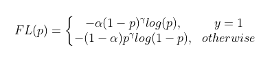

### Scene Retrieval
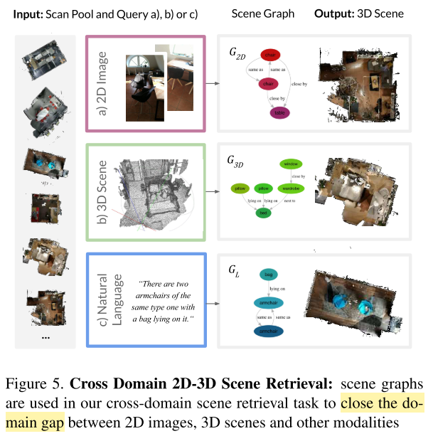

本文引入一项任务：给定一张2D图片（可以看作query），从一系列扫描图识别出对应的3D场景。这项任务的挑战性体现在：
* multiple domains(2D and 3D)
* scene changes(moving objects, changing illumination)

1. 不去用**图编辑距离**直接计算它们的相似度，而是先把场景图变换成 multisets，每个set包含节点类别和对应的边（后半句是我的理解）。
    - 定义一个相似度分数 $\tau$，对应multisets $s(\mathcal{G})$（？？？一个图$\mathcal{G}$，怎么来的相似度分数）
    - 采用两种相似度计算方法
        1. Jaccard similarity
            - $$\tau_{J}(A,B) = \frac{|A \cap B|} {|A \cup B|} $$

        2. Szymkiewicz-Simpson coefficient
            - $$\tau_{S}(A,B) = \frac{|A \cap B|} {min(|A|, |B|)} $$
            - A、B是不同的set
            - 当A、B大小差异较明显时，更能筛选出有意义的匹配（？？？是说min(\|A\|, \|B\|)小于\|A $\cup$ B\|}，然后算出来的分数更大吗）

2. 匹配 $\mathcal{G}$ 和 $\mathcal{G}{}^{\'}$时，组合 similarity metric of 
    - the object semantics
    - generic node edges $\mathcal{E}$
    - semantic relationships $\mathcal{R}$

    - 得到
        - $$ f(\hat{\mathcal{G}}, \hat{\mathcal{G}}{}^{\:'}) = \frac{1}{ |\hat{\mathcal{G}}| } \sum_{i=1}^{|\hat{\mathcal{G}}|} \tau(s(\hat{\mathcal{G}}^{(i)}), s(\hat{\mathcal{G}}{}^{\:'(i)})) $$
        - $\hat{\mathcal{G}} = (\mathcal{G}, \mathcal{E}, \mathcal{R})$ 称为增强的图
        - 我理解这里 $f(\cdot)$ 是算最终的相似度得分的吧，$s(\cdot)$ 是一个multiset

### 实验        
* Semantic Scene Graph Prediction
    - 评价指标是 Recall@top-n

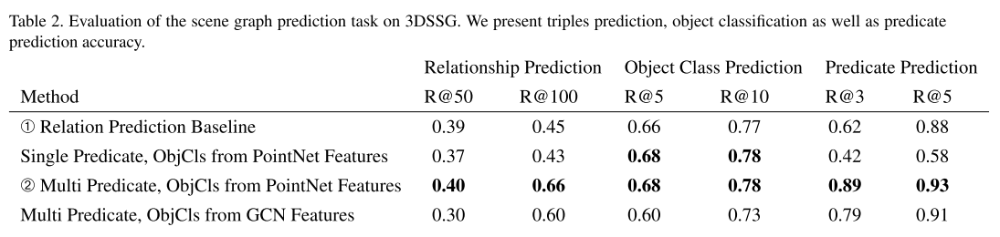

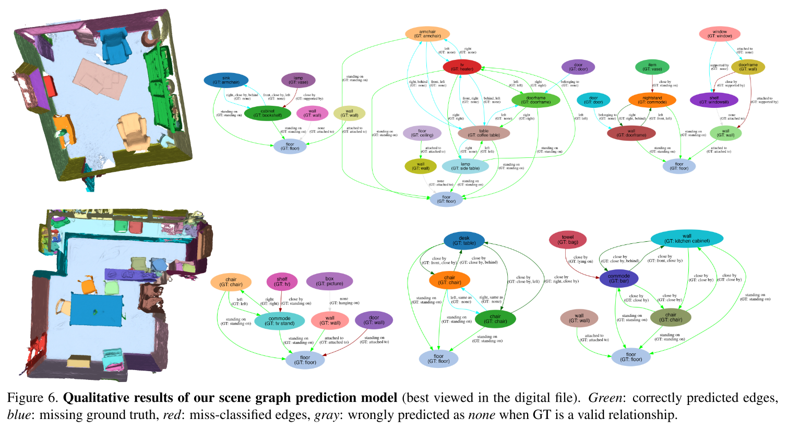

* Scene Retrieval

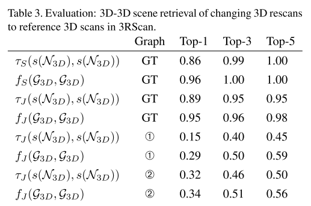

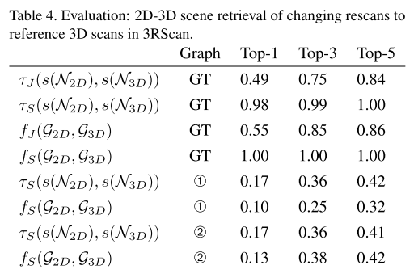