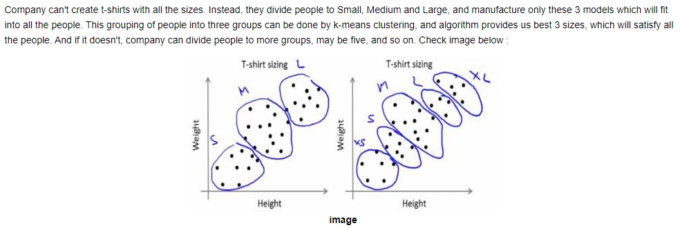

### 简介
* 最近几年，OpenCV 也引入了一些机器学习和深度学习算法，本文介绍具体包含哪些方法，及如何使用
* 本文内容参照版本 3.4.10，在4.x.y版本添加了更多SOTA深度学习方法，需要时查阅对应文档
* 算法的原理不作过多展开，主要看看OpenCV对应的实现

### K-Nearest Neighbors
一种分类方法，依据特征相似度，把测试数据分到在k个最近邻样本占据多数的类别，k一般选奇数；若假设每类样本权重不同，称为modified KNN。下面这段代码用KNN进行二分类，红色代表一类，蓝色一类，新来的绿色划分到其中之一
```python
import cv2 as cv
import numpy as np
import matplotlib.pyplot as plt
# Feature set containing (x,y) values of 25 known/training data
trainData = np.random.randint(0,100,(25,2)).astype(np.float32)
# Labels each one either Red or Blue with numbers 0 and 1
responses = np.random.randint(0,2,(25,1)).astype(np.float32)
# Take Red families and plot them
red = trainData[responses.ravel()==0]
plt.scatter(red[:,0],red[:,1],80,'r','^')
# Take Blue families and plot them
blue = trainData[responses.ravel()==1]
plt.scatter(blue[:,0],blue[:,1],80,'b','s')
plt.show()

newcomer = np.random.randint(0,100,(1,2)).astype(np.float32)
plt.scatter(newcomer[:,0],newcomer[:,1],80,'g','o')

knn = cv.ml.KNearest_create()
knn.train(trainData, cv.ml.ROW_SAMPLE, responses)
ret, results, neighbours ,dist = knn.findNearest(newcomer, 3)
```

### SVM
```python
svm = cv.ml.SVM_create()
svm.setKernel(cv.ml.SVM_LINEAR)
svm.setType(cv.ml.SVM_C_SVC)
svm.setC(2.67)
svm.setGamma(5.383)
svm.train(trainData, cv.ml.ROW_SAMPLE, responses)
svm.save('svm_data.dat')
```
### K-Means
对人的身高和体重，在做T-shirt时进行聚类，划分短袖尺码，是个很好的例子  

