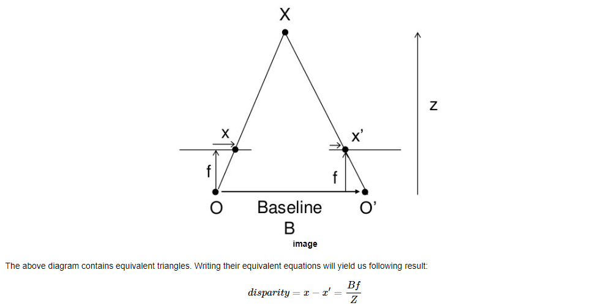

介绍几个问题，相机校准（标定）、姿态估计、对极几何、从双目图像计算深度，这部分和之前学过的《视觉SLAM十四讲》几章内容重叠

### 相机校准
* 畸变类型：径向、切向畸变
    - 有各自的畸变参数

* 标定相机内参、外参
    - 通常用棋盘，因为比较整齐，容易设定参照坐标
        - 对于棋盘中的交点，既知道世界坐标，又知道像素坐标，就能列方程求解
        - 为了达到好的效果，需要多找几组点 $\geq$ 10

* 去畸变

### 姿态估计
* 得到相机内参、畸变系数

* `cv.solvePnP()` 就能求解图像中特定物体的姿态
    - 从3D-2D点对求解旋转、平移矩阵

### 对极几何
- 从2D-2D点对求解旋转、平移矩阵
    - 飞鸟检测的定位应该关注这里

- 多视几何
    - 从不同视角，观察物体、场景，这不就是多机场摄像头拍摄同一块区域

- 对极点、对极线、对极约束、对极平面

### 双目相机深度图
- 双目相机，拍摄了对同一场景的两幅图，利用相机参数就能求其中物体深度

根据计算公式，视差的单位是m/cm等，不是pixel