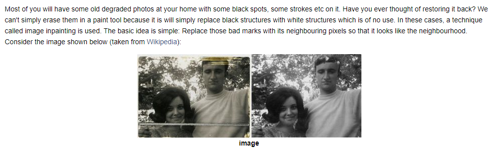
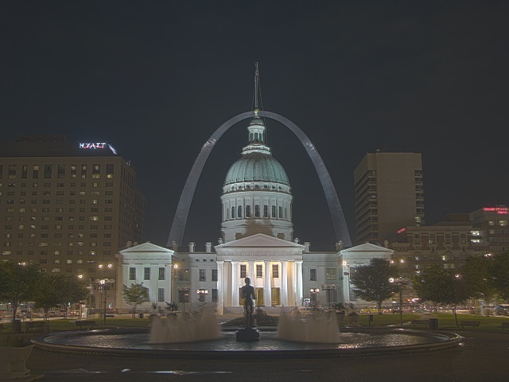
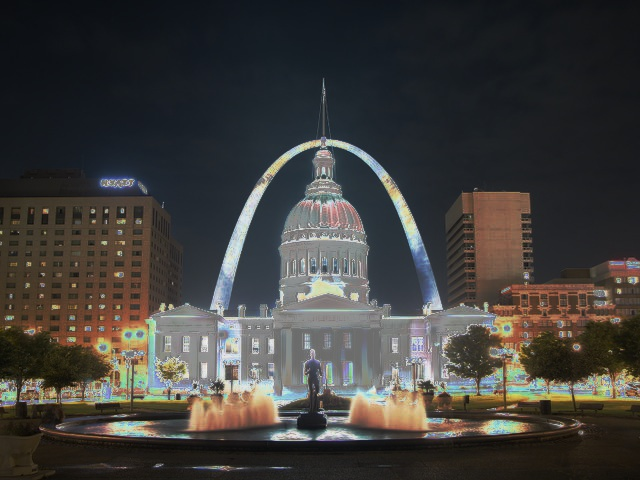

计算摄影平常接触的较少，这是一个专门的研究领域，本文介绍一下OpenCV实现了计算摄影中的哪些功能。手机相机集成了不少计算摄影算法。  
* Image Denoising
* Image Inpainting - 图像修补，不是填充
* High Dynamic Range (HDR)

### Image Denoising
 
- Gaussian Blurring, Median Blurring etc are good to some extent in removing small quantities of noise
- Non-local Means Denoising algorithm
    - 原理：在噪点附近取一个像素，再取一个窗口。在整幅图片滑动这个窗口，对所有搜索到的窗口包含像素取平均，代替噪点窗口。
    - OpenCV provides four variations of this technique.
        1. `cv.fastNlMeansDenoising()` - works with a single grayscale images
        2. `cv.fastNlMeansDenoisingColored()` - works with a color image.
        3. `cv.fastNlMeansDenoisingMulti()` - works with image sequence captured in short period of time (grayscale images)
        4. `cv.fastNlMeansDenoisingColoredMulti()` - same as above, but for color images.

### Image Inpainting
  
- OpenCV provides two of techniques
    * cv.inpaint(img,mask,3,cv.INPAINT_TELEA)
    * cv.inpaint(img,mask,3,cv.INPAINT_NS)
    ```python
    import numpy as np
    import cv2 as cv
    img = cv.imread('messi_2.jpg')
    mask = cv.imread('mask2.png',0)
    dst = cv.inpaint(img,mask,3,cv.INPAINT_TELEA)
    cv.imshow('dst',dst)
    cv.waitKey(0)
    cv.destroyAllWindows()
    ```

### High Dynamic Range
> High-dynamic-range imaging (HDRI or HDR) is a technique used in imaging and photography to reproduce a greater dynamic range of luminosity than is possible with standard digital imaging or photographic techniques. While the human eye can adjust to a wide range of light conditions, most imaging devices use 8-bits per channel, so we are limited to only 256 levels. When we take photographs of a real world scene, bright regions may be overexposed, while the dark ones may be underexposed, _so we can’t capture all details using a single exposure_. **HDR imaging works with images that use more than 8 bits per channel (usually 32-bit float values), allowing much wider dynamic range**.

> There are different ways to obtain HDR images, but the most common one is to use photographs of the scene taken with different exposure values. To combine these exposures it is useful to know your camera’s response function and there are algorithms to estimate it. After the HDR image has been merged, it has to be converted back to 8-bit to view it on usual displays. This process is called tonemapping. Additional complexities arise when objects of the scene or camera move between shots, since images with different exposures should be registered and aligned.

* the following scene where we have **4 exposure images**, with exposure times of: 15, 2.5, 1/4 and 1/30 seconds
  

* 2 algorithms to generate and display HDR image from an exposure sequence
    - Debevec
      
    - Robertson
    