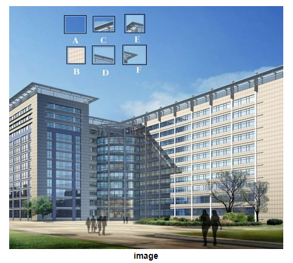

* 什么是图像特征？为什么重要？有什么作用？
* 为什么角是好的特征？
    

* 如何描述特征？
    - 描述可看作对特征的进一步抽象

* 如何检测到好的特征？

* 不同图像，如何匹配特征？基于此能做什么事情？

### 几种角检测方法
* Harris Corner Detection
* Shi-Tomasi Corner Detector & Good Features to Track
* FAST Algorithm for Corner Detection

### 经典特征提取法
* SIFT
    - Harris corner detector is not good enough when scale of image changes. Lowe developed a breakthrough method to find scale-invariant features and it is called SIFT

* SURF
    - SIFT is really good, but not fast enough, so people came up with a speeded-up version called SURF.

* BRIEF - Binary Robust Independent Elementary Features
    - SIFT uses a feature descriptor with 128 floating point numbers. Consider thousands of such features. It takes lots of memory and more time for matching. We can compress it to make it faster. But still we have to calculate it first. There comes BRIEF which gives the shortcut to find binary descriptors with less memory, faster matching, still higher recognition rate.

* ORB - Oriented FAST and Rotated BRIEF
    - 开源不收费
    - SIFT and SURF are good in what they do, but what if you have to pay a few dollars every year to use them in your applications? Yeah, they are patented!!! To solve that problem, OpenCV devs came up with a new "FREE" alternative to SIFT & SURF, and that is ORB.

### 特征匹配
- Brute-Force matcher

- FLANN based matcher

- Based on feature matching. Let's mix it up with calib3d module to **find objects in a complex image**.