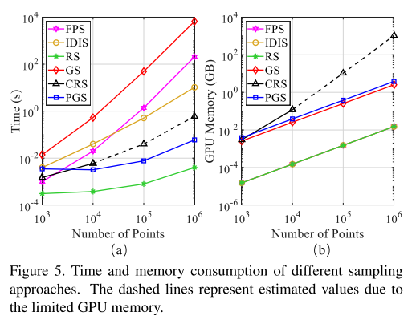

* 论文名称：[RandLA-Net: Efficient Semantic Segmentation of Large-Scale Point Clouds](https://arxiv.org/abs/1911.11236)

* 论文作者：Qingyong Hu, Bo Yang, Linhai Xie, Stefano Rosa, Yulan Guo, Zhihua Wang, Niki Trigoni, Andrew Markham (牛津大学、国防科大)

* 收录情况：CVPR 2020

### 简介
之前的语义分割方法受限于耗时的采样策略、计算沉重的预/后处理，只能处理小规模点云数据。本文重点研究点云
* 采样策略，认为随机采样能提高效率，适合处理大规模点云，但是随机采样容易丢弃重点的特征。
* 为了克服这一缺点，又提出了local feature aggregation module，逐渐增加3D点的感受野，保存细节信息。

提出的方法命名为**RandLA-NET**(random sampling, local spatial encoding, attentive pooling)，效率比之前方法高出200x，在Semantic3D和SemanticKitti效果
达到最优。
小规模：1x1 m$^2$，大规模：200x200 m$^2$

### 主要方法
大规模点云数据往往覆盖几百米的范围，要想高效处理，使用下采样减少数理是必要的。在多种采样方法中，本文认为随机采样最适合，但是要设计好的局部特征集成器来保存重要特征。

* 采样策略
    * 采样：从N个点采样K个点 $\{p_1,\cdots,p_k,\cdots,p_K\}$，

    1. 启发式的
        - Farthest Point Sampling
            * 每个点$p_k$距离前k-1个点最远
            * 对整个点集覆盖性较好
            * 时间复杂度 O($N^2$)
        - Inverse Density Importance Sampling
            * 根据每点密度排序N个点，去前K个
            * 对离群点敏感
            * 时间复杂度 O($N$)
        - Random Sampling
            * 时间复杂度 O($1$)，高效

    2. 学习式的
        - Generator-based Sampling
            * 生成一个点集，表示原来的点集
            * 推理阶段，常用Farthest Point Sampling匹配生成的子集和原点集，带来额外计算
        - Continuous Relaxation based Sampling
            * 为每个点学习一个采样权重，权重矩阵消耗大量内存
        - Policy Gradient based Sampling
            * 把采样建模成Markov决策过程，学习一个概率分布进行采样
            * 搜索空间很大，采样策略学不好；比如从$10^6$个点采$10^5$个，搜索空间是 $C^{10^5}_{10^6}$

* 局部特征集成
    * local spatial encoding
        - 以欧式距离为指标，找到$p_i$的K个最邻近点$\{p_1,\cdots,p_k,\cdots,p_K\}$
        - 这里的 relative position encoding，对于$p_i$，编码它的相对点位置特征
            * $$ \textbf{r}_i^k = MLP\left( p_i \oplus p_i^k \oplus (p_i -p_i^k) \oplus \parallel p_i - p_i^k \parallel \right) $$
            * $\oplus$ 是连接操作，$\parallel \cdot \parallel$计算对应坐标绝对值差

    * attentive pooling
        - 为LocSE局部特征模块学习权重，输入$\hat{\textbf{F}}_i = \{ \hat{\textbf{f}}_i^1, \cdots, \hat{\textbf{f}}_i^k, \hat{\textbf{f}}_i^K\}$
        - $$ \textbf{s}_i^k = g(\hat{\textbf{f}}_i^k, \textbf{W}) $$
            - $g(\cdot)$ 是多层感知机
            - $\textbf{W}$是权重
        - $\hat{\textbf{f}}_i^k$ 与 $\hat{\textbf{s}}_i^k$ 做点积，求和，特征进一步集成
            - $$\tilde{\textbf{f}}_i = \sum_{k=1}^{K} (\hat{\textbf{f}}_i^k, \textbf{s}_i^k)$$

    * dilated residual block
        - 堆叠 LocSE+Attentive Pooling，增加跳跃连接，形成膨胀残差块
        - 原理是每堆叠一次，就能从更多跳邻点接收信息，相当于扩大了感受野（？？？没完全理解跳的过程）
        - 但是堆叠次数越多，网络规模越大，本文选2次，平衡效率和准确率
        - 

### 实验
1. 

1. 

1. 

1. 

1. 