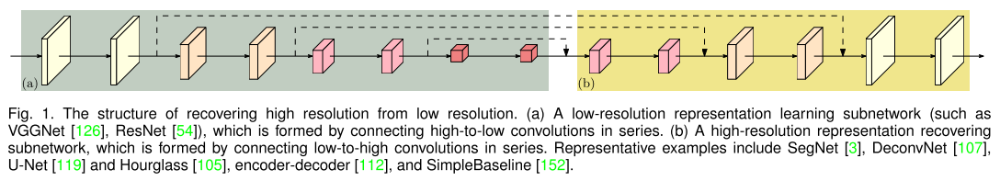
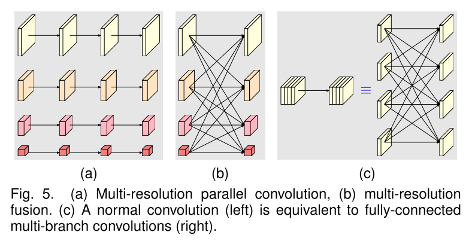
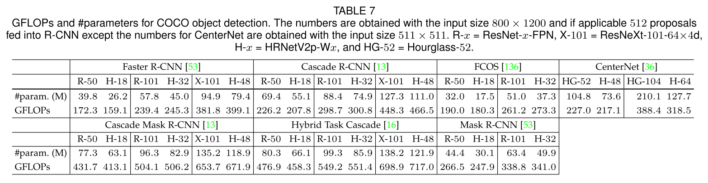
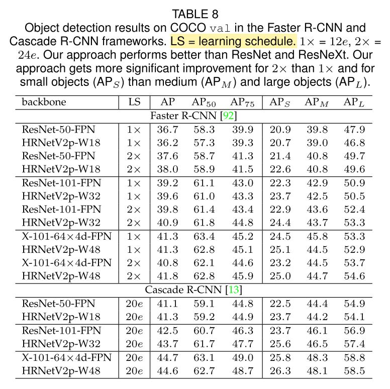
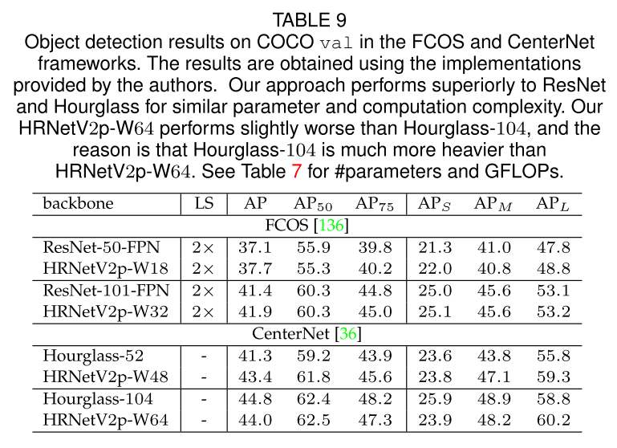
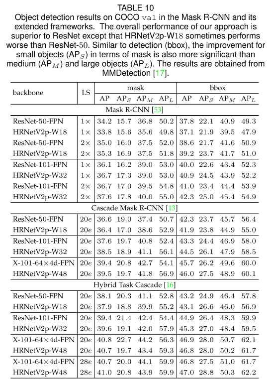
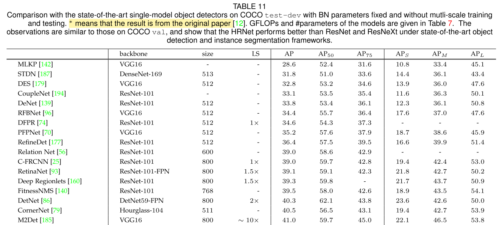
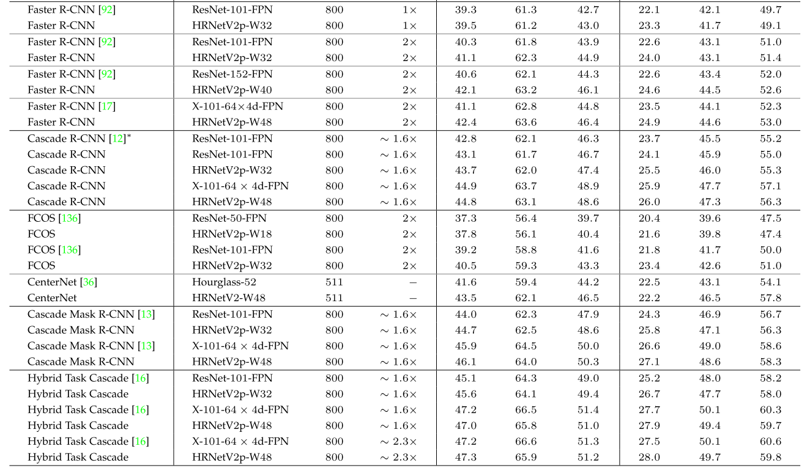

* 论文名称：[Deep High-Resolution Representation Learning for Visual Recognition](https://ieeexplore.ieee.org/document/9052469)

- 论文作者：Jingdong Wang, Ke Sun, Tianheng Cheng, Borui Jiang, Chaorui Deng, Yang Zhao, Dong Liu, Yadong Mu, Mingkui Tan, Xinggang Wang, Wenyu Liu, and Bin Xiao (Microsoft Research Asia)

- 收录情况：TPAMI 2020

### 简介
这篇论文其实是总结了HRNet在人体关键点估计、物体识别、语义分割视觉任务的表现，它的工作基础：
* [Deep High-Resolution Representation Learning for Human Pose Estimation](https://arxiv.org/abs/1902.09212)
    - CVPR 2019
* [HRNet-FCOS](https://github.com/HRNet/HRNet-FCOS)
* [HRNet-Object-Detection](https://github.com/HRNet/HRNet-Object-Detection)
* [HRNet-MaskRCNN-Benchmark](https://github.com/HRNet/HRNet-MaskRCNN-Benchmark)
* [HRNet-Semantic-Segmentation](https://github.com/HRNet/HRNet-Semantic-Segmentation)

* VGG 
* U-Net 

计算机视觉任务中，人们设计的骨干网络常常**遵循“高分辨率”降采样到“低分辨率”，再由“低分辨率”升采样到“高分辨率”的模式**，很少有人探索过更新颖的网络结构。但显而易见的是，高的图像分辨率有助于提升检测、分割、关键点提取的准确性，本文提出的网络结构不同于上述模式，具体表现为

* 并行地连接高分辨率、低分辨率卷积流
* 不同分辨率卷积流之间频繁地交换信息

实验表明`HRNet`对提升物体检测、分割、姿态估计准确性方面具有显著优势，更广阔的意义是能作为一个通用的$\color{red}{骨干网}$，应用在各项视觉任务上。

### High-Resolution Networks

图片输入进来，首先经过2个 stride=2 的3x3卷积（**上图只显示了主体部分，不包括2个 stride=2 的3x3卷积**），分辨率降维1/4，最终输出的也是 1/4 分辨率，主体部分由几个模块构成：
* parallel multi-resolution convolutions
* repeated multi-resolution fusions
* representation head

根据不同任务设计的变种  

* HRNetV1 for pose estimation
* HRNetV2 for semantic segmentation
* HRNetV2p for object detection
    - 作为骨干网，应用到目标检测器，提升小目标检测能力

1. parallel multi-resolution convolutions
    - 不采用传统 high-low-high 的模式，另辟蹊径
    - 从一个高分辨率卷积流开始，并行地增加低分辨率卷积流，下图概括了并行多分辨率卷积流的结构  
    

    - $\mathbb{N}_{sr}$ 代表第 $s$ 个阶段、第 $r$ 个分辨率一个子模块，
        - $$ resolution = \frac{1}{2^{r-1}} $$

2. repeated multi-resolution fusions
    - 想法是让不同分辨率的特征图交换信息
    - 下图示例，让3个不同分辨率的特征图交换信息
    

    - 输入有三种分辨率：$\{ \textbf{R}_r^i, r=1,2,3 \}$，对应的输出分辨率：$\{ \textbf{R}_r^o, r=1,2,3 \}$
        - $$ \textbf{R}_r^o = f_{1r}(\textbf{R}_1^i) + f_{2r}(\textbf{R}_2^i) + f_{3r}(\textbf{R}_3^i) $$

        - 跨分辨率的融合有一个额外的输出，参见整体架构图中**第3阶段第4级分辨率**的输入
            - $$ \textbf{R}_4^o = f_{14}(\textbf{R}_1^i) + f_{24}(\textbf{R}_2^i) + f_{34}(\textbf{R}_3^i) $$

        - 这里的变换函数 $f_{xr}(\cdot)$ 依赖于输入分辨率索引$x$和输出分辨率索引$r$
            - $x = r$时，$f_{xr}(\textbf{R}) = \textbf{R}$
            - $x \lt r$时，$f_{xr}(\textbf{R})$ 对输入$\textbf{R}$进行下采样，使用$r-s$个步长为2的3x3卷积，
            - $x \gt r$时，$f_{xr}(\textbf{R})$ 对输入$\textbf{R}$进行上采样，使用1x1的卷积对通道数进行对齐

3. representation head
    
    - 网络结构的头部表示，本文提出了3种类型，见下图
        - HRNetV1，应用到人体姿态估计；输出表示仅来自高分辨率卷积流
        - HRNetV2，应用到语义分割；用双线性插值上采样低分辨率卷积流，再把四种分辨率的表示连接起来，
        - HRNetV2p，应用到目标检测；通过下采样高分辨率的表示，得到多种低分辨的表示，利用不同分辨率的表示构建多级表示

4. instantiation
    - 网络主体由4个并行的卷积流组成，1/4, 1/8, 1/16, 1/32 四种分辨率
    - 第一个卷积流包含4个残差单元，每个残差单元
        - 宽度64的bottleneck
        - 接一个 3x3 的卷积，把特征图的宽度改到$C$

    - 第二个、三个、四个并行卷积流分别包含 1,4,3 个模块化的block
        - 这个模块化的block包含4个残差单元，每个残差单元包含2个3x3的卷积，每次卷积后经过 batch normalization 和Non-Linear ReLU处理
        - 四种分辨率对应的卷积的通道数分别是 $C, 2C, 4C, 8C$，如第一幅图所示

5. analysis
    - 
        - 子图c是作者的观点
        - 每个输出通道的子集是之前各个卷积流输出的加和

    - 首先分析一下模块化的block，它有2个关键组件
        - multi-resolution parallel convolutions，对应子图a 
        - multi-resolution fusion，对应子图b

    - 多分辨率融合单元集成了多个卷积流的输出
    
### COCO Object Detection
1. 数据集：MS COCO 2017 detection dataset
    - 118k images for training
    - 5k for validation and 20k for test
    - 水平翻转，图片短边缩放到800 pixels

2. 评价指标：$average precision$ (AP) $\rightarrow$ AP[0.5,0.05,0.95]
    - 参考指标：$AP_S$、$AP_M$、$AP_L$、$AP_{50}$、$AP_{75}$

2. COCO Object Detection
    - 比较运算速度和参数量：GFLOPs and #parameters
    * 

3. Object Detection results on COCO val
    - 使用不同的骨干网，HRNet是其中一种
    - 两阶段检测器：Faster R-CNN、Cascade R-CNN
    * 

4. Object Detection results on COCO val
    * 使用不同的骨干网，HRNet是其中一种
    * 一阶段检测器：FCOS、CenterNet
    * 

5. Object Detection results on COCO val
    - 使用不同的骨干网，HRNet是其中一种
    - 兼具检测和分割的方法：Mask R-CNN、Cascade Mask R-CNN、Hybrid Task R-CNN
    * 

6. Object Detection results on COCO test-dev（表中LS：learning schedule）
    - 使用不同的骨干网，HRNet是其中一种
    - 目标检测器：BN parameters fixed & without mutli-scale training and testing
    * 
    * 

### 一些思考
0. 批判性思考
1. 扬长避短，重点谈准确率，谈效率时只和参数量大的比
2. 不管论文中不中，选定方向，坚持做，坚持写