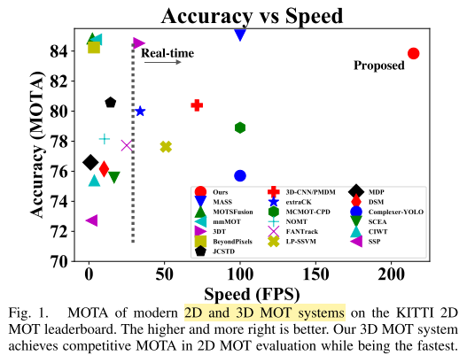
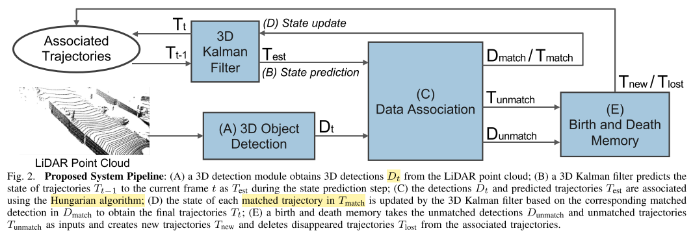
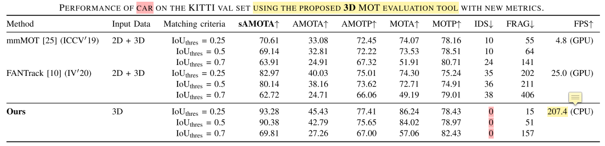
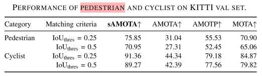
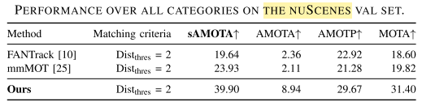
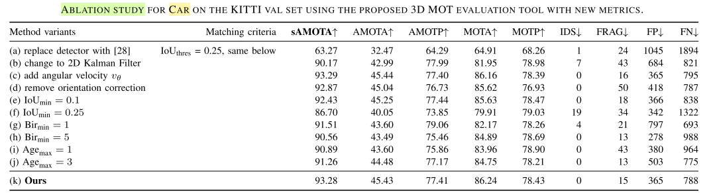

* 论文名称：[3D Multi-Object Tracking: A Baseline and New Evaluation Metrics](https://ieeexplore.ieee.org/document/9341164)

- 论文作者：Xinshuo Weng, Jianren Wang, David Held and Kris Kitani (CMU)

- 收录情况：IROS 2020

### 简介

3D多目标跟踪系统，更多时候关注系统的准确性，对系统复杂度和计算开销考虑较少，而这些方面对于3D跟踪系统的可用性非常重要。本文与其他工作形成鲜明对比，仅用简单的方法，使跟踪系统达到实时的运行效率。

AB3DMOT利用PointRCNN，从3D点云获得物体检测结果，然后组合 3D Kalman Filter 和 Hungarian algorithm进行**状态估计**和**数据关联**，没有像主流方法那样用深度神经网络做，所以系统非常高效（不计3D检测，207.4 FPS）。

另外一个重要的创新点：已有的KITTI数据集，其实是在2D 图像平面评价3D MOT系统，有些错位的感觉，目前仍然缺乏3D MOT evaluation metrics，本文提出了3D MOT evaluation tools，评价3D MOT系统在3D空间的表现。基于新的评价指标，AB3DMOT达到了最好的效果(:。

### 相关工作
* 2D MOT & 3D MOT
    - 关键模块是**数据匹配**，建立匹配损失函数
        - 离线方法：考虑全局最优，构建网络流图，成本最小的**流优化算法**
        - 在线方法：考虑前后两帧，deep association network

    - 匹配使用的特征：人工设计，神经网络学习物体外观和运动信息

    - 追踪物体在三维空间运动

    - Kalman Filter、Hungarian algorithm，无论在2D还是3D都会用到，基础知识需要掌握

### 主要方法

AB3DMOT 由以下几个步骤组成
* 3D Object Detection
* 3D Kalman Filter: State Prediction
* Data Association
* 3D Kalman Filter: State Update
* Birth and Death Memory

1. 3D Object Detection
    - 使用PointRCNN
    - $t$时刻的检测结果 $D_t = \{D_t^1, D_t^1, \cdots, D_t^{n_t}\}$
    - 对于 $D_t^j, j\in\{1,2,\cdots,n_t\}$，表示为以下元组
        - $(x,y,z,\theta,l,w,h,s)$
        - 物体中心位置$(x,y,z)$
        - 物体尺寸$(l,w,h)$
        - 朝向角$\theta$
        - 置信度分数$s$

    - 3D object检测器的好坏，必然对3D MOT的表现有影响

2. 3D Kalman Filter: State Prediction
    - 这一步要根据前一帧信息，预测物体下一帧**物体轨迹的状态**
    - 本文假设运动模型中速度是恒定不变的，独立于相机自身运动，即仅用运动模型估计相机自身和其他物体的运动
    - **物体轨迹的状态**用向量$T$描述
        - $(x,y,z,\theta,l,w,h,s,v_x,v_y,v_z)$
        - 物体在3D空间的速度：$v_x,v_y,v_z$
        - $T$中不包含角速$v_\{theta}$，是为了简化问题，作者说加上$v_\{theta}$对跟踪表现提升不明显

    - 前一帧物体轨迹的状态 $T_{t-1} = \{ T_{t-1}^1, T_{t-1}^2, \cdots, T_{t-1}^{m_{t-1}} \}$
        - $m_{t-1}$ 是第$t-1$帧中物体轨迹数
        - 经过3D Kalman Filter**预测**，得到第$t$帧的轨迹$T_{est}$
        - 运动模型
            - $x_{est} = x + v_x, y_{est} = y + v_y, z_{est} = z + v_z$
    
    - 因此，对于 $T_{t-1}^i \in T_{t-1}, i\in{1,2,\cdots,m_{t-1}}$，它在第t帧预测的状态是$T_{est} = (x_{est},y_{est},z_{est},\theta,l,w,h,s,v_x,v_y,v_z)$
    
3. Data Association
    - 目标跟踪，数据匹配是关键的一步
    - 匹配：预测的物体轨迹$T_{est}$和当前的检测$D_t$
        - 构建一个关联矩阵$A$，矩阵尺寸为 $m_{t-1} \times n_t$，$A_{ij}$等于$T_{est}^i$与$D_t^j$的
            - 3D Box IoU
            - 物体中心距离的相反数（距离越远，值越小）
            - 小于阈值时，拒绝匹配

        - 这时数据关联问题，就成了经典的二部图匹配问题
        - Hugarian algorithm在多项式时间内给出最佳匹配
        - 匹配的输出结果形如，$w_t$是最终匹配的对数
            - $T_{match} = \{ T_{match}^1, T_{match}^2, \cdots, T_{match}^{w_t}\}$
            - $D_{match} = \{ D_{match}^1, D_{match}^2, \cdots, D_{match}^{w_t}\}$
            - $T_{unmatch} = \{ T_{unmatch}^1, T_{unmatch}^2, \cdots, T_{unmatch}^{m_{t-1}-w_t}\}$
            - $D_{unmatch} = \{ D_{unmatch}^1, D_{unmatch}^2, \cdots, D_{unmatch}^{n_t-w_t}\}$

4. 3D Kalman Filter: State Update
    - 承接第3步数据关联：
        - 第2步状态预测具有不确定性，这一步基于第$t$帧已匹配的检测$D_{match}$，对$T_{match}$中轨迹状态进行更新
        - 更新后的轨迹状态记为 $T_{match} = \{ T_{match}^1, T_{match}^2, \cdots, T_{match}^{w_t}\}$
    - 根据贝叶斯法则，一个更新后的轨迹状态 $T_t^k = (x^{`},y^{`},z^{`},\theta^{`},l^{`},w^{`},h^{`},s^{`},v_x^{`},v_y^{`},v_z^{`})$
        - 权重取决于 匹配的轨迹状态$T_{match}$、已匹配检测的状态$D_{match}$的不确定性
        - $k \in \{1,2,\cdots,w_t\}$

        - 对于物体朝向$\theta$，直接应用贝叶斯法则更新会产生问题，预测的朝向很可能与实际朝向完全相反，对同一个物体这就是矛盾的
            - 一般的做法是取$T_{match}^k$和$D_{match}^k$的均值，但是这样会使得**关联的轨迹和真实估计的3D IoU变小**
            - 本文的做法是当$T_{match}^k$和$D_{match}^k$的差异大于$\frac{\pi}{2}$时，给这个差异再加$\pi$，这样物体朝向的差异总会小于等于$\frac{\pi}{2}$

5. Birth and Death Memory
    - 不断地有物体退出视野、进入视野，有必要单独设置一个模块，管理每个物体的生命周期，这就是本模块的作用
    - 管理方法
        - $D_{unmatch}$ 包含可能新出现的物体
            - 为避免出现伪正例，直到$D_{unmatch}^p$在连续Bir$_{min}^p$帧得到匹配，才创建新物体的轨迹状态$T_{new}^p$
            - 一旦$T_{new}^p$创建，它的状态初始化为距离最近的检测到的物体$D_{unmatch}^p$的状态，速度$(v_x,v_y,v_z)$为0
            - $p \in \{n_t - w_t\}$
        - $T_{unmatch}$ 没有匹配到的预测轨迹，可能离开了当前场景
            - 为了避免删掉真实存在的物体轨迹，只有当连续Age$\_{min}^p$帧未能成功匹配，才把$T_{unmatch}$删掉
            - $q \in \{m_{t-1} - w_t\}$

### 3D MOT 新的评价指标
1. 如上文所述，很多评价3D MOT方法的公开数据，虽然提供了物体的3D位置，但是评价指标用图像平面的跟踪就能计算得到，或者把3D位置投影到图像平面进行计算，这显然是有问题的
    - 2D IoU分数高，不代表3D IoU也高

    - 新的指标直接计算3D IoU，不在图像平面计算
        - 这种想法看似人人都能想到，但之前就没每人尝试去做

    - 之前的指标，如 CLEAR metrics 没有考虑检测物体置信度对3D MOT的影响

3. Integral Metrics: AMOTA and AMOTP
    - compute $\textcolor{red}{AMOTA}$ and $\textcolor{red}{AMOTP}$ by integrating MOTA and MOTP over all recalls
    - 平均划分40个recall，每段2.5%
    - AMOTA: average MOTA
        - $$ MOTA = 1 - \frac{FP+FN+IDs}{num_{gt}} $$
        - $$ AMOTA = \frac{1}{L} \sum_{r \in \{\frac{1}{L},\frac{2}{L},\cdots\,1\}} (1 - \frac{FP_r+FN_r+IDs_r}{num_{gt}})$$
    - AMOTP: average MOTP

4. sAMOTA: scaled Accuracy Metric
    - 缩放到区间[0,1]，为什么要做缩放呢？那必然是目前的区间不是[0,1]，原因如下
    - $$ MOTA_r = 1 - \frac{FP_r+FN_r+IDs_r}{num_{gt}} \le 1 - \frac{FN_r}{num_{gt}} $$
    - $$ \le 1 - \frac{num_{gt}\times(1-r)}{num_{gt}} = r $$
    - 因此 $MOTA_r \le r$，在此基础上得到的 AMOTA 不能达到区间[0,1]右端点，所以要缩放
    - 缩放方法
        1. 提出 $$sMOTA_r = max(0, 1-\frac{FP_r+FN_r+IDs_r-nums_{gt}\times(1-r)}{r \times num_{gt}})$$
            - 取 $max(0, \cdot)$ 是为了保证下界为0，后一项可能为负
        2. $$ sAMOTA = \frac{1}{L} \sum_{r \in \{\frac{1}{L},\frac{2}{L},\cdots\,1\}} sMOTA_r$$

### 实验
1. 数据集和评价指标
    用KITTI、nuScenes数据集做实验
    - 3D MOT: AMOTA, AMOTP, sMOTA
    - 2D MOT: MOTA, MOTP, IDs, Frag(number of trajectory fragmentation)

2. 对比方法
    - FANTrack, IV 2020
    - mmMOT, ICCV 2019
    - 感觉只对比两种方法太少

3. KITTI验证集，汽车三维跟踪效果
    

4. KITTI验证集，行人三维跟踪效果
    

5. nuScenes验证集，所有类别跟踪效果
    - 不明白所有类别怎么做成一个表的？  
    

6. AB3DMOT各组件消融分析
    

7. 在作者提出的新评价指标：AMOTA, AMOTP, sMOTA上，相比于其他方法的提升还是比较明显的

### 总结
直观感觉本篇论文简单有效，这正是做系统需要的，视觉研究做个系统事半功倍。与我们之前的想法不谋而合，就是用算出来的3D位置辅助数据关联模块，也想到了目前评价3D MOT还是用一些二维计算方法，但是动手太慢，别人早已经做完了，我们还停留在想法阶段。剩下可能改进的点一是提高3D检测的效率，真正让模型在线跑，而不是只用数据关联部分的实验效率唬人；二是目前数据关联方法可能有些粗糙，可以改进。