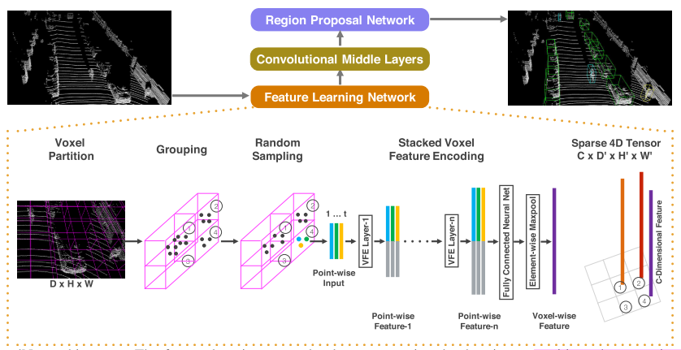
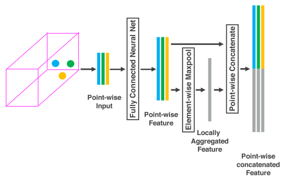
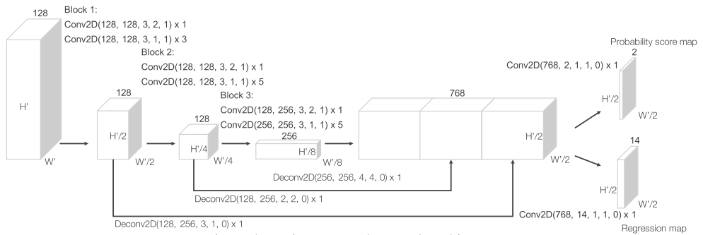
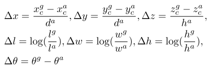
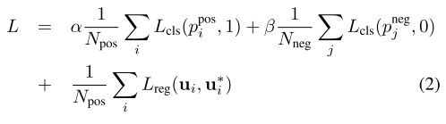
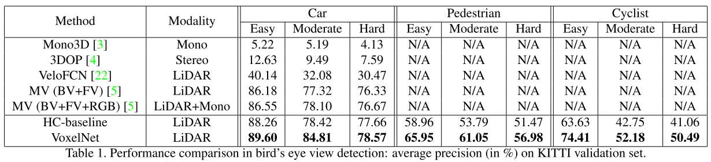
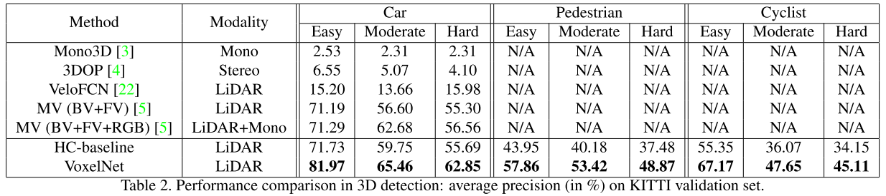

* 论文名称：VoxelNet: End-to-End Learning for Point Cloud Based 3D Object Detection

* 论文作者：Yin Zhou, Oncel Tuzel (Appple Inc)

* 收录情况：CVPR 2018

### 简介
VoxelNet，是较早探索体素化处理点云的方法，初衷是设计端到端神经网络，减少使用手工设计的点云特征；作者受2D目标检测中成熟的$region~proposal~network~(RPN)$启发，将它推广到3D检测框预测，问题是RPN需要张量形式的稠密数据输入，这与点云稀疏、不规则的特点不符，为此作者引入了Voxel Feature Encoding Layer，
将原始点云逐步处理，提取特征，形成高维张量数据。
实验部分作者设计了baseline检测方法，使用人工定义的特征，和VoxelNet对比，在KITTI数据集汽车类物体上优于其他方法。现在来看思路比较清楚，结果相对可靠，
在雷达点云—3D目标检测领域产生了较大影响力。

### 主要方法

- VoxelNet 架构如上图所示，由三个模块组成：
    1. Feature learning network
    2. Convolutional middle layers
    3. Region proposal network

1. Feature learning network
    1. 体素划分。点云大小为$D, H, W$，每个体素的尺寸 $v_D, v_H, v_W$，所以体素网格的个数 $D' = D/v_D, H' = H/v_H, W' = W/v_W$
    2. 点分组。每个体素内部的点是一组，每组包含的点数不一定相同
    3. 随机采样。在每组内部随机采样，采样点数固定为$T$，目的是减少运算量
    4. 提取体素内点云特征。这篇文章提出了 Voxel Feature Encoding Layer (VFE Layer)，如下图，堆叠多个VFE Layer输出提取的特征
        - 
        - 用$\textbf{V}$表示一个体素，$\textbf{V} = \{\textbf{p}_i = [x_i,y_i,z_i,r_i]^T \in \mathbb{R}^4\}_{i=1 \dots t}$
            - $r_i$ 是反射率
            - $(v_x, v_y, v_z)$ 是 $\textbf{V}$的中心，就是所有点坐标的平均值
        
        - 对 $\textbf{p}_i$ 进行变换，得到 $\hat{\textbf{p}}_i$
            - $$\textbf{V}_{in} = \{ \hat{\textbf{p}}_i = [x_i,y_i,z_i,r_i,x_i-v_x,y_i-v_y,z_i-v_z]^T \in \mathbb{R}^7\}_{i=1 \dots t}$$
            - 和中心点做差，相当于编码了点云表面形状信息

        - 再用全连接网络对 $\hat{\textbf{p}}_i$ 作变换，得到新的特征 $\textbf{f}_i \in \mathbb{R}^m$
            - 全连接网络很常见：线性层、BN层、ReLU层

        - 再对所有的 $\textbf{f}_i$ 做对应维度的最大池化操作，得到体素$\textbf{V}$整体的特征 $\tilde{\textbf{f}} \in \mathbb{R}^m$

        - 然后连接 $\textbf{f}_i$ 和 $\tilde{\textbf{f}}_i$，得到 $\textbf{f}_i^{out} = [\textbf{f}_i^T, \tilde{\textbf{f}}] \in \mathbb{R}^{2m}$

        - 所以体素$\textbf{V}$提取特征后的输出为 $\textbf{V}_out = \{\textbf{f}_i^{out}\}_{i \dots t}$

        - 堆叠 $n$ 次，，最后一个VFE Layer输出 $C$ 维的体素级的特征表示

    5. 稀疏的张量表示。整个点云表示成了 $C \times D'\times H' \times W'$ 维度的张量
        - 超过 90% 的体素是空的，这是加速的关键
        - 剩余非空体素表示成了这样的张量

2. Convolutional middle layers
    - Conv$M$D($c_{in}, c_{out}, \textbf{k},\textbf{s},\textbf{p}$) 表示$M$维的卷积操作，前2个参数是输入输出维度，后3个是kernel、stride、padding维度
        - 如果$\textbf{k}$中3个数值一样，如 $k=(k,k,k)$，就用一个标量$k$表示$\textbf{k}$

    - 每个卷积中间层，操作都是3D卷积，BN，ReLU序列化的操作
    - 因此，卷积中间层把 voxel-wise features 作了一系列非线性变换，形成更抽象和高层特征

3. Region proposal network
    - 
    - 这部分是参考Faster RCNN中的RPN，从行文思路来看，借鉴RPN在2D目标检测的成功经验，应用到3D目标检测中
    - 输入：卷积中间层的输出
    - 输出的probability score map、regression map维度没搞清楚什么含义？

4. 损失函数设计
    - positive anchor 集合$N_{pos} = \{a_i^{pos}\}_{i= 1\dots N_{pos}}$，和ground truth关系是？我觉得是IoU大于阈值的anchor，是positive anchor，也就是预测产生的
        - positive anchor 表示为 $(x_c^a, y_c^a, z_c^a, l^a, w^a, h^a, r^a)$
        - ground truth 3D box表示为 $\textbf{u}^* = (x_c^g, y_c^g, z_c^g, l^g, w^g, h^g, r^g)$，分别表示中心点、长宽高、偏航角(物体朝向)

    - negative anchor 集合$N_{neg} = \{a_i^{neg}\}_{i=1 \dots N\_{neg}}$

    - 

    - 
        - 二值交叉熵分类、SmoothL1回归
        - 上下文有矛盾？
        - 这里没搞明白，回归的到底是数值本身，还是数值的偏移量？

    - 注意：算回归损失时，**只算 positive anchor 的损失**

### 实验
1. 数据集：KITTI。测试集结果要提交服务器才能得到，作者主要在验证集实验，测试集展示了自身结果，没有对比
    - 训练集/验证集，划分方法值得借鉴

2. 验证集，鸟瞰图结果

2. 验证集，3D检测结果

3. 测试集，检测结果
