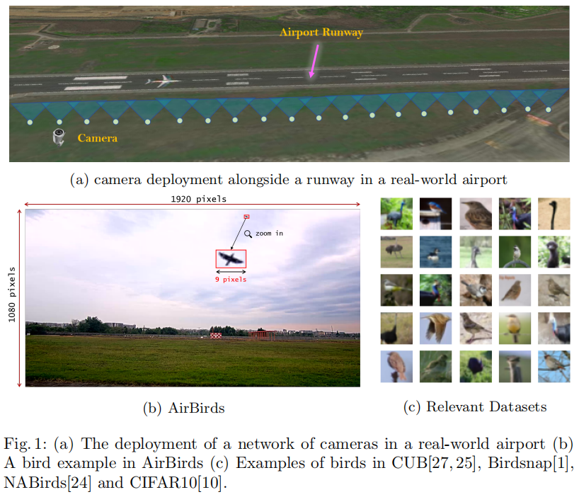
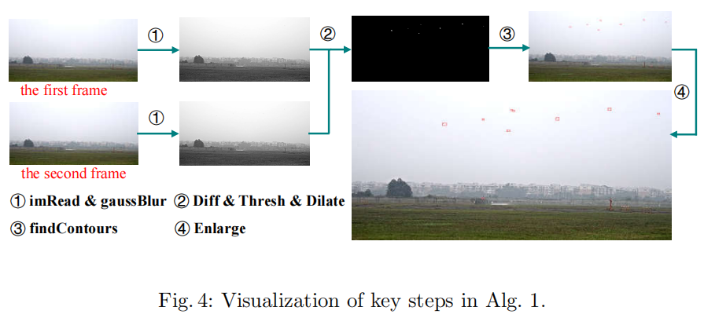
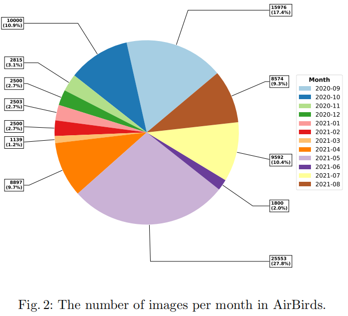
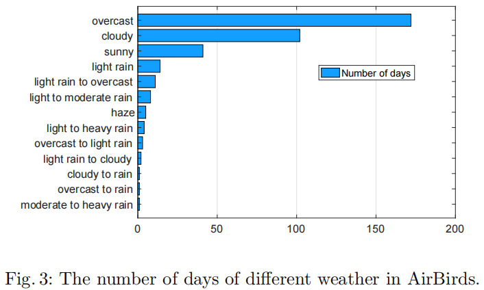
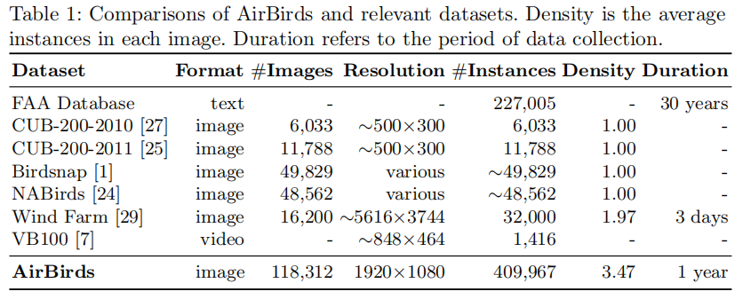
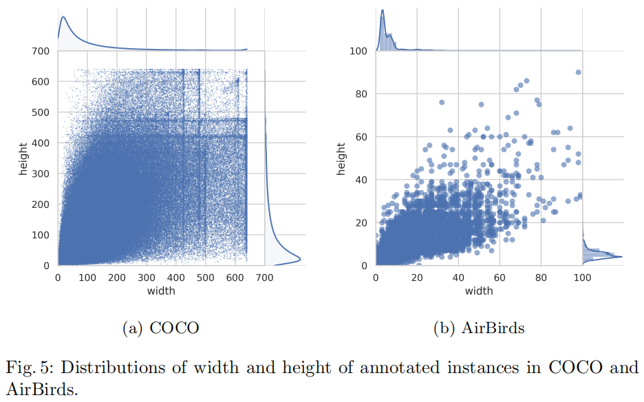
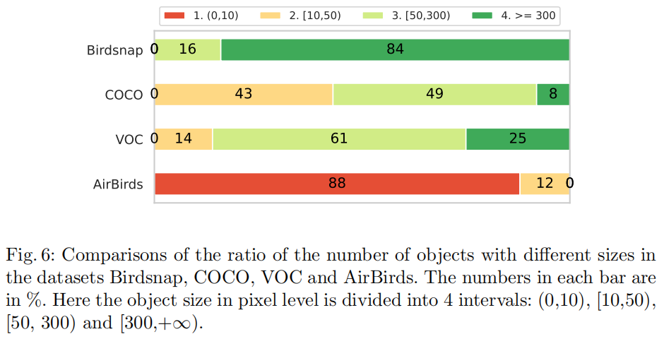
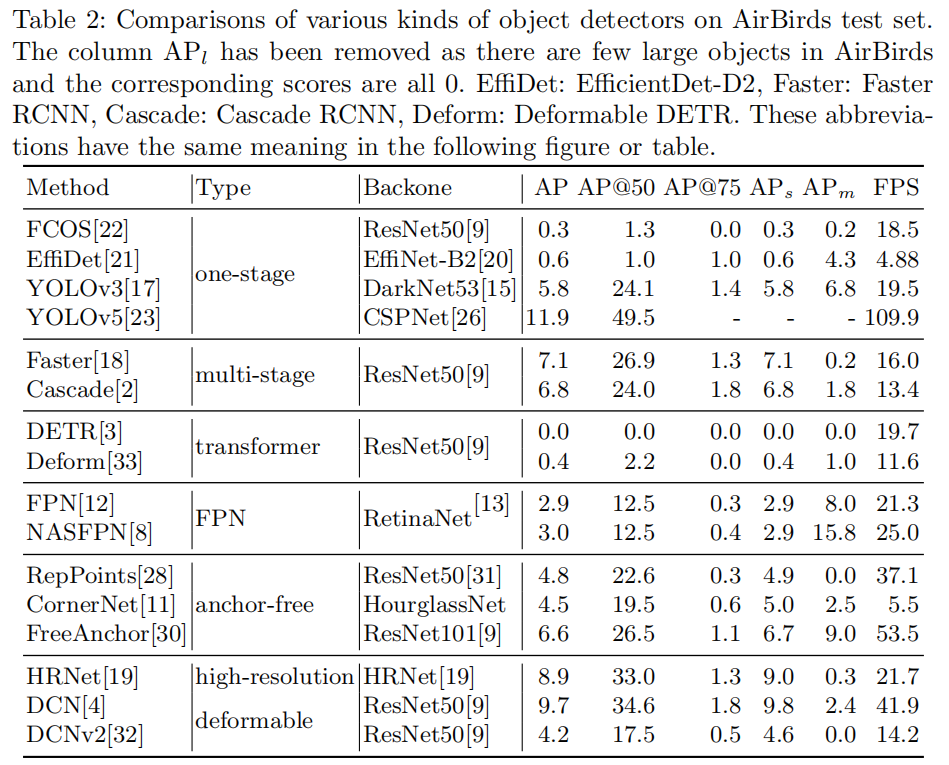
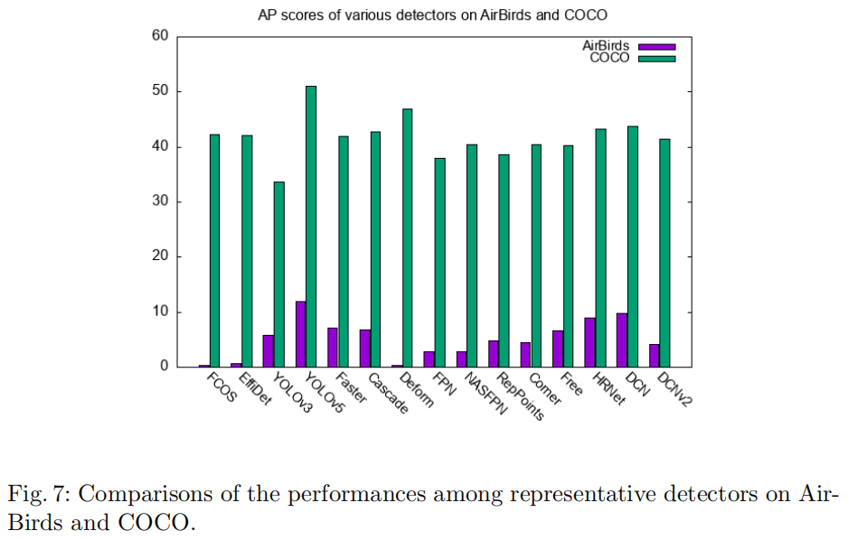
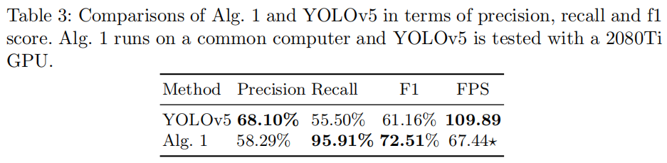

<h2 align = "center">
AirBirds: A Large-scale Challenging Dataset for Bird Strike Prevention in Real-world Airports
</h2>
<h4 align = "center" >
<a href="https://dl.acm.org/doi/10.1007/978-3-031-26348-4_24"> 16th Asian Conference on Computer Vision (ACCV) </a>
</h4>

Hongyu Sun, Yongcai Wang*, Xudong Cai, Peng Wang, Zhe Huang, Deying Li, Yu Shao, Shuo Wang

School of Information, Renmin University of China, Beijing, 100872 

<center>
  <a href="airbirds.pdf"> 
  </a>
  <a href="#">
  
  </a>  
  <a href="#">
  
  </a> 
</center>

<h2 align = "center">
Overview 
</h2>
One fundamental limitation to the research of bird strike prevention is the lack of a large-scale dataset taken directly from real-world
airports. Existing relevant datasets are either small in size or not dedicated for this purpose. To advance the research and practical solutions
for bird strike prevention, in this paper, we present a large-scale challenging dataset AirBirds that consists of 118,312 time-series images, where
a total of 409,967 bounding boxes of flying birds are manually, carefully
annotated. The average size of all annotated instances is smaller than
10 pixels in 1920×1080 images. Images in the dataset are captured over
4 seasons of a whole year by a network of cameras deployed at a realworld airport, covering diverse bird species, lighting conditions and 13
meteorological scenarios. To the best of our knowledge, it is the first
large-scale image dataset that directly collects flying birds in real-world
airports for bird strike prevention. This dataset is publicly available at
https://airbirdsdata.github.io/.



<h2 align = "center">
Contributions
</h2>

- A large-scale dataset, namely AirBirds, that consists of 118,312 time-series
images with 1920×1080 resolution containing flying birds in real-world airports is publicly presented, where there exist 409,967 instances with carefully
manual bounding box annotations. The dataset covers various kinds of birds
in 4 different seasons and diverse scenarios that include day and night, 13
meteorological and lighting conditions, e.g., overcast, sunny, cloudy, rainy,
windy, haze, etc.

- To reflect significant differences with other relevant datasets, we make comprehensive statistics on AirBirds and compare it with relevant datasets.
There are three appealing features. (i) The images in AirBirds are dedicatedly taken from a real-world airport, which provide rare first-hand sources
for the research of bird strike prevention. (ii) Abundant bird instances in
different seasons and changing scenarios are also covered by AirBirds as the
data collection spans a full year. (iii) The distribution of AirBirds is distinctive with existing datasets since 88% of instances are smaller than 10
pixels, and the remaining 12% are more than 10 and less than 50 pixels in
1920×1080 images.

- To understand the difficulty of AirBirds, a wide range of strong baselines
are evaluated on this dataset for bird discovering. Specifically, 16 detectors 
are trained from scratch based on AirBirds with careful configurations and
parameter optimization. The consistently unsatisfactory results reveal the
non-trivial challenges of bird discovering and bird strike prevention in real-world airports, which deserve further investigation.

<h2 align = "center">
AirBirds Construction
</h2>
This section describes the process of constructing the AirBirds dataset, including raw data collection, subsequent cleaning, annotation, splits and sorting to
complete it.



<h2 align = "center">
Statistics
</h2>





<h2 align = "center">
Comparison to Related Datasets
</h2>







<h2 align = "center">
Evaluations
</h2>







<h2 align = "center">
BibTex
</h2>
```tex
@inproceedings{sun22airbirds,
  author = {Sun, Hongyu and Wang, Yongcai and Cai, Xudong and Wang, Peng and Huang, Zhe and Li, Deying and Shao, Yu and Wang, Shuo},
  title = {AirBirds: A Large-scale Challenging Dataset for&nbsp;Bird Strike Prevention in&nbsp;Real-world Airports},
  year = {2023},
  isbn = {978-3-031-26347-7},
  publisher = {Springer-Verlag},
  address = {Berlin, Heidelberg},
  url = {https://doi.org/10.1007/978-3-031-26348-4_24},
  doi = {10.1007/978-3-031-26348-4_24},
  booktitle = {Computer Vision – ACCV 2022: 16th Asian Conference on Computer Vision, Macao, China, December 4–8, 2022, Proceedings, Part V},
  pages = {409–424},
  numpages = {16},
  keywords = {Bird strike prevention, Bird detection in airport, Large-scale dataset},
  location = {Macao, China}
}
```

<h2 align = "center">
Acknowledgment 
</h2>
We thank all members who involved in the system deploying, data collecting, 
processing and labeling. This work was supported in part
by the National Natural Science Foundation of China (Grant No. 61972404,
12071478).
