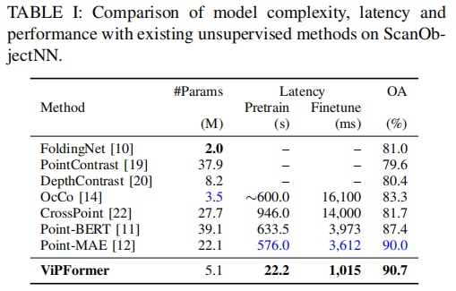
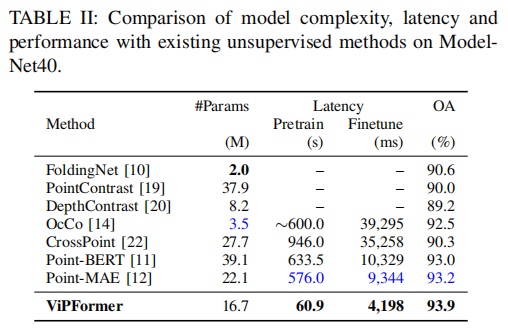
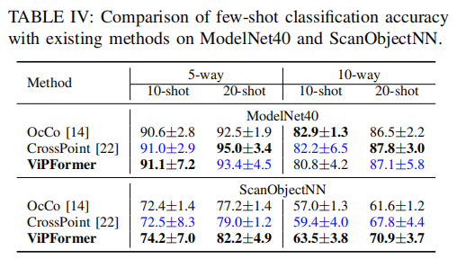
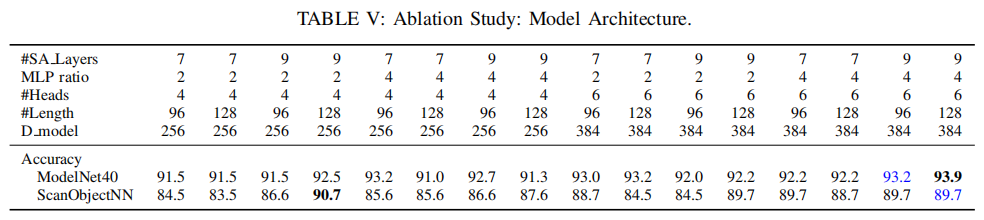
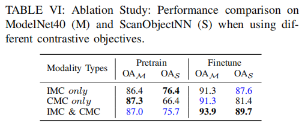
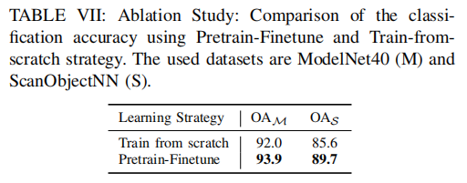
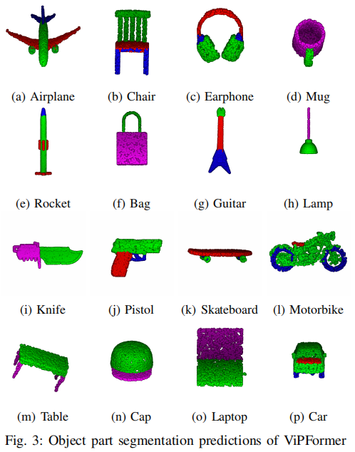
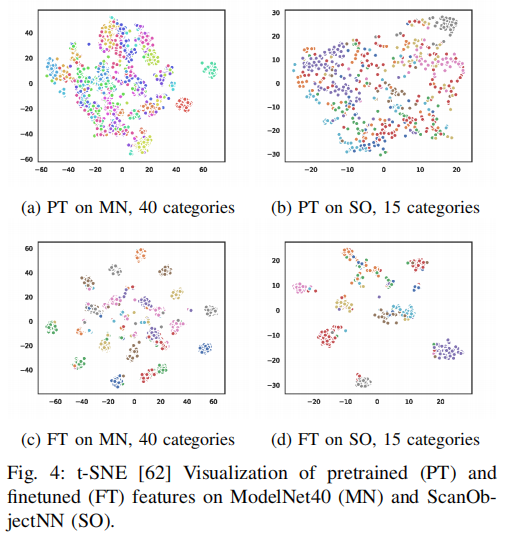

<h2 align = "center">
ViPFormer: Efficient Vision-and-Pointcloud Transformer for Unsupervised Pointcloud Understanding
</h2>
<h4 align = "center" >
<a href="https://ieeexplore.ieee.org/document/10160658"> 2023 IEEE International Conference on Robotics and Automation (ICRA) </a>
</h4>

Hongyu Sun, Yongcai Wang*, Xudong Cai, Xuewei Bai, Deying Li

School of Information, Renmin University of China, Beijing, 100872 

<center>
  <a href="vipformer.pdf"> 
  </a>
  <a href="#">
  
  </a>  
  <a href="#">
  
  </a> 
</center>

<h2 align = "center">
Overview 
</h2>
digms for point cloud processing to alleviate the
limitation of expensive manual annotation and poor transferability of supervised methods. Among them, CrossPoint follows
the contrastive learning framework and exploits image and
point cloud data for unsupervised point cloud understanding. Although the promising performance is presented, the
unbalanced architecture makes it unnecessarily complex and
inefficient. For example, the image branch in CrossPoint is
∼8.3x heavier than the point cloud branch leading to higher
complexity and latency. To address this problem, in this paper,
we propose a lightweight Vision-and-Pointcloud Transformer
(ViPFormer) to unify image and point cloud processing in
a single architecture. ViPFormer learns in an unsupervised
manner by optimizing intra-modal and cross-modal contrastive
objectives. Then the pretrained model is transferred to various
downstream tasks, including 3D shape classification and semantic segmentation. Experiments on different datasets show
ViPFormer surpasses previous state-of-the-art unsupervised
methods with higher accuracy, lower model complexity and
runtime latency. Finally, the effectiveness of each component
in ViPFormer is validated by extensive ablation studies. The
implementation of the proposed method is available at https:
//github.com/auniquesun/ViPFormer.


<h2 align = "center">
Contributions
</h2>

- We propose ViPFormer, handling image and point cloud
data in a unified architecture, simplifies the model
complexity, reduces running latency and boosts overall
performances for unsupervised point cloud understanding.

- We show that ViPFormer can be generalized better
to different tasks by simultaneously optimizing intra-modal and cross-modal contrastive objectives.

- The proposed method is validated on various downstream tasks, e.g., it achieves 90.7% classification accuracy on ScanObjectNN, leading CrossPoint by 9%, and
surpassing the previous best performing unsupervised
method by 0.7% with ∼77% fewer parameters. Similarly, ViPFormer reaches a 93.9% score on ModelNet40,
outperforming the previous state-of-the-art method and
reducing the number of parameters by 24%.

- We conduct extensive ablation studies to clarify the
advantages of the architecture design, contrastive optimization objectives, and unsupervised learning strategy

<h2 align = "center">
Evaluations
</h2>







<h2 align = "center">
Ablation Studies
</h2>

- **Architecture.** The controlled variables of ViPFormer
architecture are the number of self-attention layers
(#SA Layers), the widening ratio of the MLP hidden layer
(MLP ratio), the number of attention heads (#Heads),
the sequence length (#Length) and the model dimension
(D model). For different architectures, the accuracy of the
pretrain-finetune scheme is reported on ModelNet40 and
ScanObjectNN, respectively, shown in Tab. V. The overall
trend is the larger the model, the better the performance.
We choose the best-performing architecture to compare with
other methods.



- **Contrastive Optimization Objectives.** The effectiveness
of proposed IMC and CMC contrastive objectives are evaluated by training ViPFormer in three modes: i) only use
IMC, ii) only use CMC, and iii) use IMC and CMC together.
The experiments are conducted on different learning stages
(Pretrain vs. Finetune) and different datasets (ModelNet40
vs. ScanObjectNN). The results are shown in Tab. VI.
Apparently, the combination of IMC and CMC optimization
objectives significantly improves the model performance for
target tasks across different datasets.



- **Learning Strategies.** The differences between two
kinds of learning strategies, Train from scratch and Pretrain-Finetune, are also investigated. As Tab. VII shows, The
Pretrain-Finetune strategy outperforms Train from scratch
by 1.9% and 4.1% on ModelNet40 and ScanObjectNN,
respectively. The results indicate the initialization provided
by the pretrained ViPFormer really helps the model find
better directions and solutions in downstream tasks.



<h2 align="center">
Visualization
</h2>

- **3D object segmentation**



- **Feature Distribution**



<h2 align = "center">
BibTex
</h2>
```tex
@INPROCEEDINGS{10160658,
  author={Sun, Hongyu and Wang, Yongcai and Cai, Xudong and Bai, Xuewei and Li, Deying},
  booktitle={2023 IEEE International Conference on Robotics and Automation (ICRA)}, 
  title={ViPFormer: Efficient Vision-and-Pointcloud Transformer for Unsupervised Pointcloud Understanding}, 
  year={2023},
  volume={},
  number={},
  pages={7234-7242},
  keywords={Point cloud compression;Solid modeling;Runtime;Three-dimensional displays;Shape;Semantic segmentation;Manuals},
  doi={10.1109/ICRA48891.2023.10160658}
}
```

<h2 align = "center">
Acknowledgment 
</h2>
This work was supported in part by the National Natural Science
Foundation of China under Grants No. 61972404 and No. 12071478, and
Public Computing Cloud, Renmin University of China.
