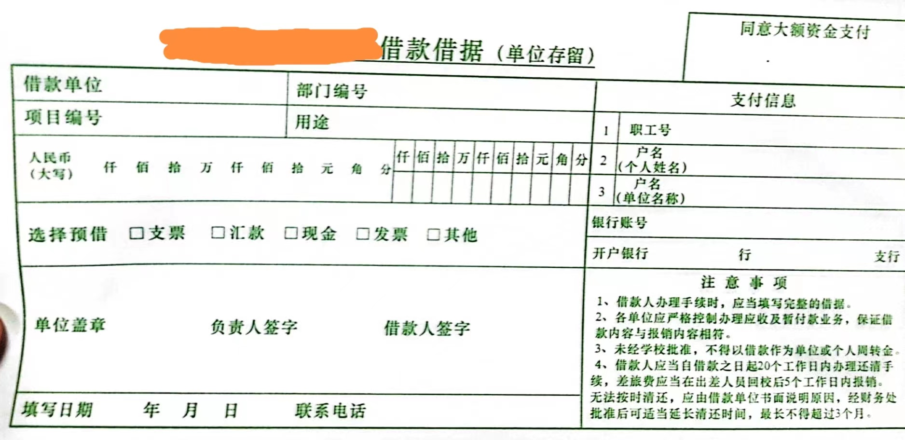

### 本文适用范围
1. 高校做科研的本硕博 
2. 在国外举办的国际会议
    - **不包括**港澳台

论文投到国际会议被录用是件值得欣喜的好事，但同时提醒你该准备出去开会了，一般录用通知发布后3-4个月会议正式召开，这段时间正是准备出国材料和申请签证的时间，而且要尽早准备。
出国有很多流程需要了解，有很多材料需要准备，对于小白们来讲，弄清楚这个流程并不轻松，要跑很多地方问来问去，要和导师讨论行程，要和学院打交道，要和研究生院打交道，要和国交处打交道，等等。

我以自己去伦敦参加 ICRA 2023 经历为案例，全面梳理办理出国参会手续的各个环节，
讲解不同环节的注意事项，为师弟师妹们出国参会办手续指明方向和道路。
出国参会主要涉及到下面几件事情，办理起来断断续续需要两到三周，
这仅指的是**准备材料到提交签证申请的时间**，$\color{red}{不包括}$递签后等待的时间，
所以应当靠前计划和行动，避免错过关键事项。

### 办理事项
1. 出国批件（和学校/学院备案）
1. 订机票 
2. 订酒店 
3. 办签证 
4. 取外汇
5. 报销
5. 其他注意事项

* 整体流程概括为下图

#### 出国批件（和学校/学院备案）
> 对于在校生，无论本硕博，出国一般都要经过学院、学校两级备案，备案的目的首先是让学院、学校知道你出国这回事，毕竟你是学校的人，出国要打招呼；更重要的是为了回来后找学院/学校报销，不备案就出国参会肯定是不能报销的

1. 学校备案。登录学校指定的系统，登记出国信息。以人大为例，登录微人大 -> 应用导航 -> 校务 -> 外事工作系统，根据指南如实填写出国信息。
    - 填完之后要告诉学员负责外事工作的老师（我那时是杜老师），让他们及时审批，审批通过后会流转到学校的部门，有问题他们会联系你，在这期间你要每天上去查下进度，看看是否有异常
2. 学院备案。信息学院有一个在线共享文档，由负责外事工作的老师负责维护（我那时是杜老师），是一个表格，在其中如实登记出国信息
    - CCF A 类论文可申请学院资助，每个导师一年一次

#### 订机票
1. 订机票前要先和导师确定好出发和返回日期，这个一般是根据会议时间确定，出发最早比会议开始早一天，返回最晚比会议结束晚一天。
    - 一般是开会前一天到，会议结束当天或第二天返回

2. 订机票的渠道很多，各大航司官网或者第三方平台，像携程、飞猪、去哪儿。我是从携程买的，也没和其他平台对比，价钱应该差不多
    - 查询机票最好选择往返机票而不是单选，往返更方便一点，单选除了价钱贵一些，还比较浪费时间

3. 出发和返回日期确定后
    * 一是选择出发登机时间，建议选在**白天**，晚上/凌晨登机有很多不方便，比如早起或者熬夜，还有些_安全因素_，要综合考虑
    * 二是选择是否中转，建议选择直达，这样花在路上的时间会少些，中转一下就多好几个小时，飞行时间太长会很累；另外带东西多的话得托运，中转对托运者可能不太方便
    * 三是返程登机时间，建议选在白天，理由同上

4. 订机票根据以上几点三思后行，国际航班一般不能退票，退票也是象征性地退你几十块钱，相比于上万块的机票就是小巫见大巫，无论对于导师还是个人，这个损失还是比较大的，所以谨慎选择，一旦定下来就不要改了

#### 订酒店
1. 先要查看学校具体的住酒店标准，在标准之内的才能报销，当时杜老师告我去国交处网站找通知和公告，我没找到，就订了个稍微便宜一点的，肯定不会超过报销标准
    - 是从[Booking这个网站](https://www.booking.com/)找的，直接搜**会议地点附近**

1. 会议一般会指定几个酒店，距离会议地点也很近，如果价格合适，马上出手，否则就被人抢光了。如果超标，建议不要订这些指定的，从 [Booking](https://www.booking.com/) 找合适的酒店/宾馆，主要考虑距离会议地点远近和价格，一般都能找到合适的

3. 我1月下旬得知论文被接收，3月下旬才开始订酒店，属于出手比较晚的了，依然从 [Booking](https://www.booking.com/) 找到了符合报销标准且距离会议地点近的地方
    - 从网站看找的地方环境还可以，但是没去住过，不知道实际住宿情况如何，开完会再更新一下体验

4. [Booking](https://www.booking.com/) 还有一个优点是不用提前付款（但要绑定信用卡且余额大于1美元），同时支持取消订单和退款
    - 我自己办了信用卡，充进去2美元；没有信用卡可以去人大支行办理一下，很方便
    - 在入住前要把房费充好，[Booking](https://www.booking.com/) 到期会自动扣

#### 办签证
> 各个国家的申请攻略可以从小红书、谷歌、百度找到，大家去对应国家的签证网站在线申请，根据指南如实填写各项内容即可，我不详细讲解网申过程，而是介绍一些关键点

1. 网申过程会有这样的问题，你出国的经费来源是什么？有没有人资助你出国？你有没有工作和固定收入？你有没有存款，具体额度是多少？
    - 这些问题是对方国家签证审查官比较关心的，就怕你经费不够，有去无回，赖在那不走了给他们国家造成拖累
    
2. 流程上来讲，出国的花费导师/学校是会给报销的，但这是在开会回来以后，前期需要自己垫付
    - 也就是说，出国 机票+酒店+签证费 先要自己出
    - 如果填 导师/学校 资助，这时要出具**非常具体的书面材料**给签证官，证明 导师/学校 会资助你，但在你$\color{red}{出国参会前这些资料并不容易开具}$

3. 针对上述问题，我们要提供证据，证明有足够的经费覆盖你的出国费用，以我为例，
    - 申签证的时候，经费来源填**个人储蓄/收入**，总体上是这个意思，不同国家可能略有不同
    - 我去人大支行打印了**过去一年的银行流水**，证明我账上有稳定资金收入
    - 我往银行卡里存入一定量资金（**大于** 机票+酒店+签证 总花费），这在**网申签证**填表的时候会填，证明我有储蓄足以支付出国往返费用
    - 如果你没这么多储蓄覆盖 机票+酒店+签证 总花费，可以找父母或者好朋友借一些，等学校报销下来还给他们，或者找其他合理合法途径获取

4. 下图展示一下我准备的材料清单
    * 
    * 前2个 checklist 分别是签证申请checklist、预约确认信，前者是从签证申请官网下载，后者是从驻华使馆合作的第三方机构网站下载
    1. 储蓄（存款）证明
    2. 成绩单
    3. 英国酒店订单
    4. 航班行程单——去程
    5. 航班行程单——返程
    6. 签证邀请信，由国际会议主办方开具，一般有两种途径
        1. 在会议官网搜索 `visa` 关键词，找到对应说明，按照说明获取即可
        2. 中稿之后，开会之前，会议主办方会给你发相关邮件，说明如何办理 `visa`
    7. 护照人像页扫描
    8. 银行流水文件1和2，这两文件其实应该放在一起，但因为文件大小限制（5MB）只能拆成2个文件
    9. 在读证明，由学校开具，我们学校微人大就能开 （校务 -> 综合服务大厅）
    10. 身份证正反面复印件，放在同一张A4纸上
    11. 身份证复印件英译版，因为要求所有材料都是英文版，不是英文版的要翻译成英文
    * $\color{red}{注意}$：有些材料**不是必须**的，比如酒店订单、航班行程单、成绩单等，个人感觉银行流水和储蓄证明提供一个就好，只要能证明你有**足够的资金**支持你访问英国及返程即可；我是首次申签证，不想出意外，准备比较全面

5. 准备好申请材料后，要把材料上传到指定的网站，这个网站一般是外国驻华使馆合作的第三方机构运营，负责申请材料收集和传输，最后交由驻外使馆签证处审核
    - 也可以**不提前上**传，准备好纸质版后到现场交由工作人员扫描，这样做一是浪费时间，本可以提前做好，二是需要交费，费用要上百RMB，为什么不自己做呢？
    - 预约到现场的时间，一般每隔15分钟一个时间段，但是可以提前15-30分钟到达，前面人少的话工作人员会为你提早办理，不必等到固定时间
        - 我预约的时间是上午 10:15 办理，但我达到的时间是 9:40，不到 10:00 就照完相录完指纹了
    - 我提前在指定网站上传了申请材料，也带了对应的纸质版到现场，但实际上工作人员用到的只有 **护照** + **预约确认信**
        - 一大堆纸质版材料又原封不动带了回来，所以后面申英国的小伙伴可以省去打印+带大量纸质材料的步骤
    - 梳理一下到签证现场的办事步骤
        1. 提前 15-30 分钟到达
        2. 排队等候，轮到时在进门处登记，工作人员会扫描你预约确认信上的二维码
        3. 登记后会为你排号，等待办事窗口叫号，大屏幕会滚动显示当前号码，注意关注
        4. 拍到你的号时到指定窗口，拿出护照和预约确认信，工作人员在系统做些记录后，打印多张条形码，贴到你的护照和信封，再将护照和信封返回给你
            - 期间工作人员会问你当签证官审核结束后，是否需要邮寄护照给本人（费用92人民币），我回答不需要，因为我的学校离签证中心比较近，自己去现场取即可
        5. 带着护照和信封到指定房间拍照+录指纹，这个步骤结束后，需要你做的事情也就结束了
        6. 等待申请结果，工作人员告诉我需要 3-4 周
            - 实际上不到3周就出结果了，顺利下签！
            - 等待时间受淡旺季、政治因素、材料齐全程度等影响

#### 取外汇
1. 外汇就是外币，你到目的国所用的现金，多少也要带点现金，不可能只拿着一张visa信用卡出国吧，国外网上支付系统没国内这么方便

2. 只有当**出国批件**、**会议邀请信**、**机票和酒店**、**护照**、**签证**都办理完成后，才能去取外汇，上述材料是办理外汇的必要手续

2. 先介绍下取外汇整体流程：
    1. 出示证明材料。拿着**会议邀请信**、**机票和酒店订单**、**护照**、**签证**复印件，到明德主楼 311b 国交处出国交流中心出示给负责的老师

    2. 领取新材料。上述材料没问题后，国交出老师会给你 **批件原件**、**出访人员名单**、**出国用汇预算表**、**校章使用申请表**
        1. 这里 **出国用汇预算表** 就是使用外汇的依据，列出了住宿、伙食、公杂、交通等项目费用，单位是国外货币，如美元、英镑等
        2. 意味着你在国外的开销不能超过对应项预算，$\color{red}{超出的部分不能报销，未列的项目也不能报销}$
        3. **如果已经在 Booking.com 订好了酒店，并且使用人民币支付，可以告诉国交处的老师去掉这一项**
            - 酒店如果用人民币支付，且有订单和收据等凭证，报销直接去财务处，不用走国交处借外汇的渠道
            - 以我为例：我在 Booking.com 订好了酒店，用人民币支付，但是国交处不知道此情况，给我开了住宿的外汇预算，我当时没有向国交处老师提出来去掉此项，拿着单子回去了，结果导师让我重新跑一趟，把这项预算去掉

    3. 出国用汇预算表盖章。拿着国交处老师给你的4份文件，去明德主楼 1115b 找国交处另外一位老师，在**出国用汇预算表**盖上国际交流处的章

    4. 批件原件、出访人员名单盖章。
        - 到综合服务大厅，找到学校党政办窗口（我办理时为31号窗口），凭借国交处领取的 **校章使用申请表**，让工作人员在批件原件、出访人员名单2分文件上盖章
        - 同时，**校章使用申请表** 会上交到党政办，作为他们盖章的依据留存；在上交之前，建议你拍照保存

    5. 复印材料。后面需要去财务处领借款借据，这些材料是财务处需要的
        - 以下文件，一式三份
            - 出国批件
            - 出访人员名单
            - 出国用汇预算表
            - 会议邀请信
            - 机票订单
            - 护照本人页
            - 签证页
            - 身份证正反面
        - 注意事项
            1. 上述**每份文件**都需要盖好对应的章，这是最后去银行领外汇现金需要的
            2. 出国批件、出访人员名单、出国用汇预算表已经在前述流程盖过章
            2. 会议邀请信、机票订单、护照本人页、签证页、身份证正反面去学院 233 盖院章
    
    6. 去财务处领取外汇借款借据。
        - 把上述复印材料给到财务处办理外汇业务的老师，审查合格后，会给你一个蓝色借据条，一式三联
        - 借据长这样
        
        
    7. 外汇借款借据填写和盖章。
        - **借款单位**，**项目编号**，**部门编号**和导师确认好再填（如果由导师项目经费资助），其他内容按实际情况填写
        - 单位盖章是学院的章，**一式三联都要盖章**，负责人签字由导师完成（如果由导师项目经费），借款人就是你

    8. 领取外汇交易申请书。
        - 拿着刚才填写并盖好章的外汇借款借据，连同第5项一式三份的复印材料，到财务处负责外汇的老师那审批
        - 审批通过后，老师会给你一份完整的材料，包括 **外汇交易申请书**，这份申请书和材料是你去银行换外汇的凭据

    9. 和银行打电话预约取外汇时间。
        - 我当时是去工商银行取，财务处老师告诉一个预约电话 010-68940874
        - 当天打电话预约，最早第二天排到，也可能是第三天，提前安排好时间

    10. 去银行取外汇。
        - 按照约定的时间去取外汇现金，一定要保管好，别丢了，也别炫耀，你懂得
        - 至此，漫长的借汇之路就结束了

#### 报销
1. 开完会返回学校后，2个月之内要办理报销手续，主要是自己前期垫付的费用，包括机票、住宿、签证费等

2. 根据本博客第一幅整体流程图，报销需要以下材料的复印件
    * 批件
    * 预算表
    * 护照
    * 签证
    * 登机牌原件、行程单复印件
    * 住宿收据/发票复印件
    * 签证费收据/发票
        - 英国签证是从 www.gov.uk 缴费，没有收据/发票，但是打印的 checklist、application form 都会显示交费金额信息，用这个

3. 准备好以上材料，去明德主楼 311b，开具《支付报销单》，确认好报销单所列项目是想要报销的，没有漏项多项

4. 拿着《支付报销单》到明德主楼 1115b 盖国交处章和负责人签名章

5. 拿着盖好章的《支付报销单》到学院领取 《报销封面》
    - 在报销封面**报销经手人**、**联系电话**处填写 本人信息
    - 在报销封面**业务经办人**处填写本人姓名
    - 其他信息，如报销单位、部门号、项目号、报销金额等信息由导师填写

6. 准备好《支付报销单》要求材料，交到崇德一楼财务处外汇业务窗口
    - 主要是住宿收据，这是国外酒店开具的，一般显示外汇支付，如 £200 GBP，需要国交处列在预算里
    - 机票一般走人民币报销流程，不涉及国交处
    - 如果签证费用人民币支付，也走人民币报销流程，不涉及国交处

7. 财务处认为没问题，需要你走的报销流程就结束了，坐等回款吧！

#### 其他注意事项
1. 出国千万条，安全第一条，贯穿全过程全链条
    - $\color{red}{提前了解出行路线}$
        - 下飞机、赶飞机、会议到住宿地（尤其是在国外）
    - 白天出门，晚上不出门
    - **找参会华人小伙伴结伴**，从知乎或者会议日程找相关小伙伴
    - 乘坐公共交通，不坐私家车
    - 电话畅通、短信畅通、邮件畅通
    - 手机、电脑电量充足
    - 预先记录我国大使馆求助号码

2. 去国外考虑开通国际漫游，或者从京东/淘宝/天猫/飞猪买对应国家临时电话卡（14天的套餐足够），用于在当地通话和手机上网
    - 例如，移动手机营业厅可开通移动号码国际漫游

3. 去国外考虑带好充电器转换头
    - 国外手机、电脑充电器和中国型号、外观不一样
    - 没有转换器你去国外很可能手机电脑充不了电，或者到时候以高价买，总之很不方便

4. 签证（包括申请支撑材料）、酒店、机票部分有对应材料，建议单独建立文件夹，统一放在类似 “出国开会” 这样的文件夹管理
    - 及时更新材料，把最新版本放到指定文件夹，并确保准确、完整
    - 上传材料前逐一确认
        - 上传的文件没有对应错
        - 上传的文件内容完整、准确

5. 在国交处领取**出国用汇预算表**时，如果你已经订好了酒店且已用人民币付款，告诉他们把住宿这项预算去掉
    - 人民币报销不经手国交处，直接到财务处即可
    - 我当时没有去掉这项预算，又跑一趟重新办理

6. 祝你一切顺利！