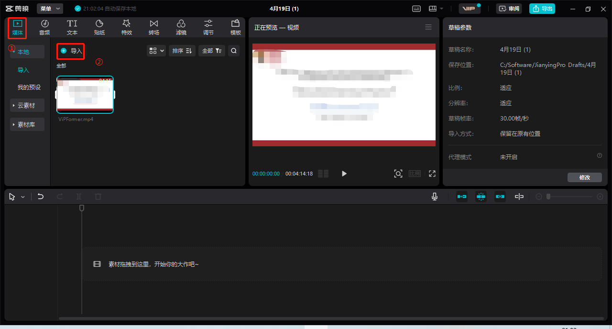
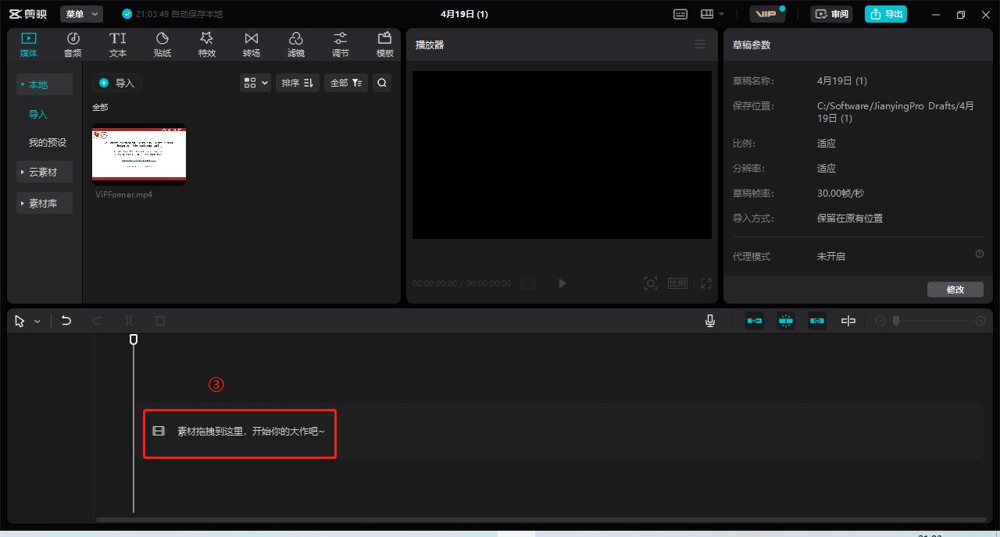
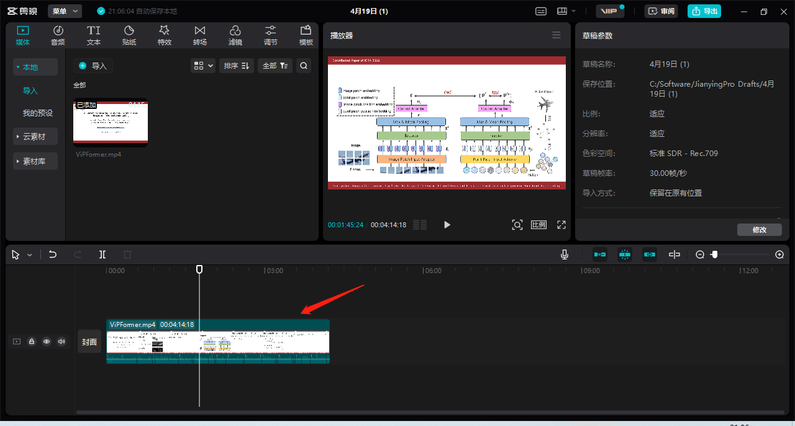
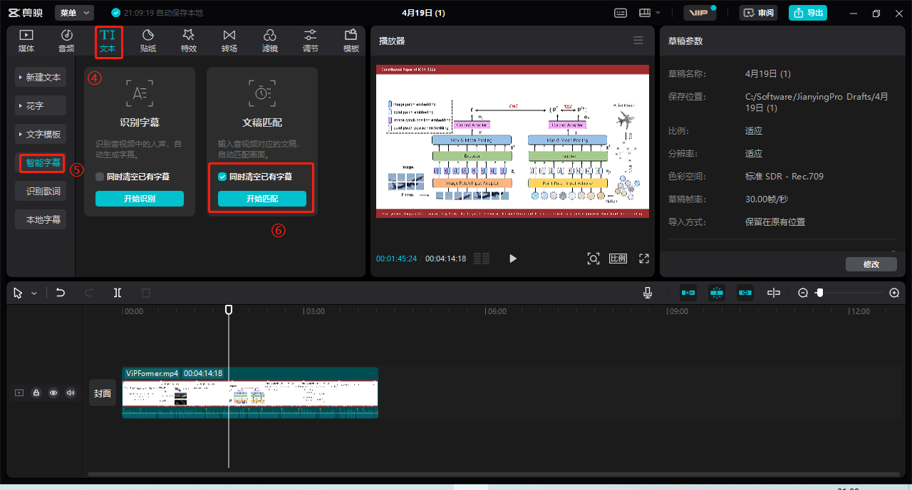
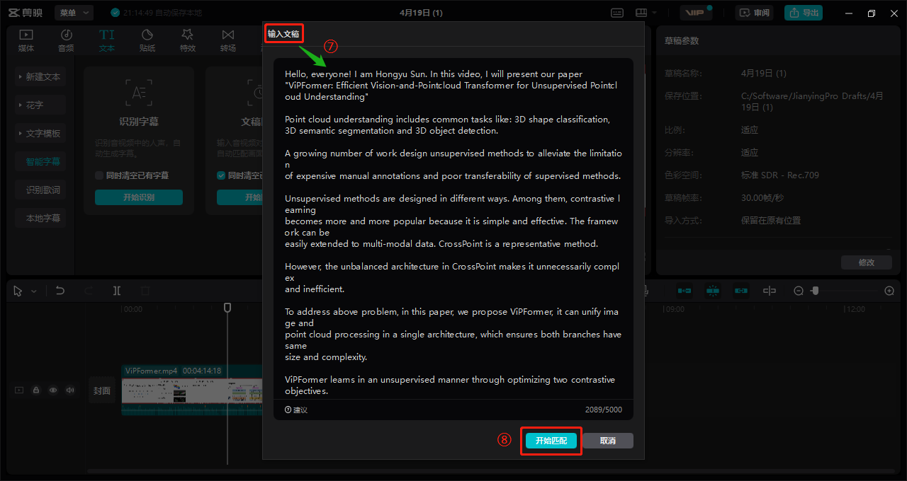
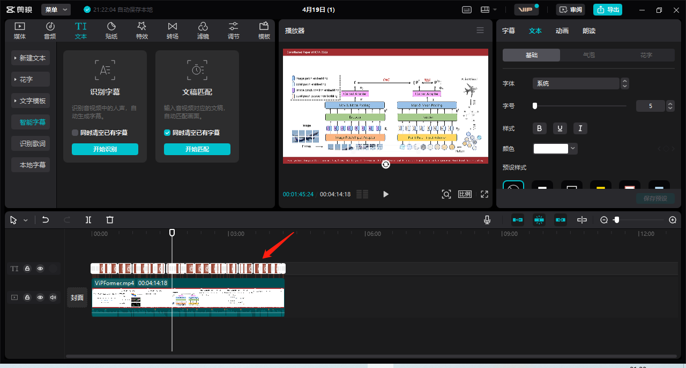
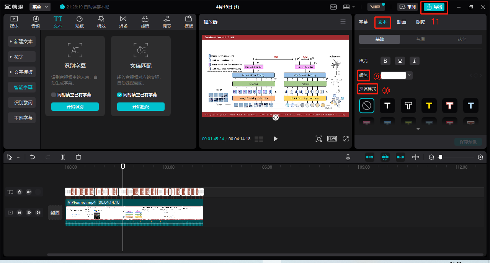

论文被接收只有，会议主办方还会让作者上传额外的材料用于宣传论文，其中一项便是
presentation video。对于初次中稿的我来说，这个活不太轻松，因为之前没有相关
事件经验，网上的知识又比较碎片，需要花费一阵时间。
经过几天摸索，终于把这个制作过程搞清楚了，并且成功做完一个成品。
本文总结如何制作一个带有字幕的视频，用于国际会议论文讲解展示，当然也可迁移到其他
视频制作场景。

本文介绍的流程简单易学，需要以下几方面准备工作

* 论文内容呈现工具
* 视频讲稿
    - 也就是字幕呈现的内容
    - 这部分可选做，但我建议做，因为有了它你能比较流利得把要讲的内容说出来，避免卡顿/忘词/讲错
* 录制视频/音频的软件
* 视频添加字幕工具

我们对上述工具一一展开

1. 论文内容呈现工具
    - 我用的 PowerPoint，我想绝大部分会把内容做成PPT讲解
    - 根据自身情况，把研究背景，创新性，相关工作，技术方案，实验效果等方面总结清楚，制作成PPT

2. 视频讲稿
    - 我**录视频前**就把讲稿写好了，因为国际会议讲论文用英语，而且不能有明显卡顿/忘词等情况，没有讲稿我很难做到这点，毕竟不是 native speaker
        - 准备好讲稿在后续视频处理软件添加字幕的时候也会很方便，直接粘贴即可

3. 录制视频/音频的软件
    - 这部分我仍然用的 PowerPoint，它内部有录制音视频功能
        - 好处是不用去切换和学习另外的软件，也能制作音视频
        - 讲者讲的时候，会同时把音频记录到PPT的每页，讲者返回去能看到，也能点击播放

    - 具体操作
        - 菜单栏，“录制” $\rightarrow$ “录制幻灯片演示”
        - 准备好后，点击 “录制”
        - 录制完后，点击 “停止”
        - 在 “录制” 选项卡下，点击 “导出到视频”，保存到想要的位置
            - e.g., 视频命名为 video.mp4

4. 添加字幕
    - 我推荐用 [剪映](https://www.capcut.cn/)，和它无利益相关，单纯因为免费且容易操作
    - 安装好这个软件后，点击 “+ 开始创作”，按如下步骤添加字幕
        1. 菜单栏，点击 “媒体”，将刚才保存的 video.mp4 导入到媒体工作区，如下图所示
            
        
        2. 将媒体工作区的 video.mp4 拖拽到下方工作区，出现该视频的音频轨道，如下图所示
            
            

        3. 返回上部菜单栏，点击 “文本”，左侧会出现几个选项，选择 “智能字幕”，右侧紧接着会出现 “识别字幕”，“文稿匹配”，选择“文稿匹配”，如下图所示
            

        4. 选择“文稿匹配”后，会弹出一个文本窗口，让你输入视频文稿（就是之前准备的讲稿），粘贴进去并点击“开始匹配”，如下图所示
            - 输入文稿要与视频中的讲解尽可能一致，这个软件匹配的时候也是一套语音识别算法
            - 如果输入文稿与音频讲解一致，基本上匹配的结果非常准确，包括音频时间上的切分也很准确，也就是说讲者的文稿与音频同步
            - 为了添加的字幕美观，作者可以讲文稿长句子人为换行一下，让它们显示在视频字幕的一行
            
            
        5. 几分钟之后剪映提示“字幕识别成功”，会在下方工作区出行识别的字幕，如下图所示
            

        6. 这时工作还没完成，还要做些后续处理
            - 有人可能好奇，按照上述步骤操作了一遍，字幕没有出现，这和可能是字幕颜色是白色，和PPT背景一致，导致无法辨认，所以还要对字幕颜色、字体、对齐方式（居中/居左/居右）等单独设置
            - 上述设置比较细致，在剪映软件右侧工作区
            - 导出视频查看整体效果
            - 如果你对某个地方不满意，可以返回步骤 1-6 中的任一步重新操作直至满意
            

        7. 最终将满意的视频导出，导出的视频就是带字幕的