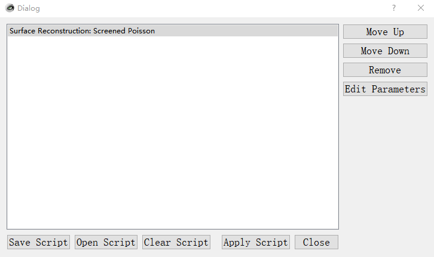

多视图 (multi-view images)，是三维物体一种表现形式，多视3D形状识别 (multi-view 3D shape recognition) 这一问题在学术界
备受关注。当前评测多视3D形状识别，经常用到的数据集有 ModelNet40, RGBD, ScanObjectNN 等。其中 ModelNet40 最常见形式是点云，
渲染好的[多视图版本](https://data.airc.aist.go.jp/kanezaki.asako/data/modelnet40v2png_ori4.tar)在网络上能比较容易找到。
[RGBD](https://rgbd-dataset.cs.washington.edu/dataset/) 在发布时就提供了多视图版本，所以也很方便使用。

问题在于 ScanObjectNN，它是香港科技大学研究团队在 ICCV 2019 发布的一个**点云数据集**，但目前很难找到**渲染好的多视数据版本**。
由于该数据集在3D领域比较知名，也具有一定挑战性，对于 multi-view 3D shape analysis 方向的文章，
领域顶会/顶刊审稿人希望看到作者在这样的数据集进行评测。现实问题是很难获取 ScanObjectNN 多视图数据集，
至今也没有公开的数据可供下载，想做这部分实验只能自己从头渲染，要了解点云到多视的生成原理，
要学习3D软件的使用，要写批量处理的脚本，要调很多bug，难度和门槛是不小的。

为了解决这一痛点，笔者花了一段时间将**渲染点云生成多视图**的原理和过程搞清楚了，并成功生成了 [ScanObjectNN多视数据集]，
这篇博客将其中关键点和操作步骤记录下来，供大家学习使用。若要得到其他点云的多视图，按照这个流程操作即可。

### 环境配置
1. Windows 10
2. Git Bash
3. MeshLab 2020.07
    - 版本要小于 2020.12，因为该版本及其以后不支持 `meshlabserver`，这在渲染中是要用到的
    - 将安装目录添加到环境变量，如 `C:\Software\MeshLab`
        - 渲染脚本用到 `meshlabserver.exe`
4. Miniconda3
    - 将安装、脚本目录添加到环境变量，如 `C:\Software\miniconda3` `C:\Software\miniconda3\Scripts`
        - Git Bash 使用 miniconda3
    - 建立虚拟环境并安装必要软件
        ```shell
        conda init bash
        conda create -n mv_render python=3.7
        pip install meshlabxml
        ``` 

### 原理和操作：点云 -> 多视图
1. 点云是稀疏的点集，无法直接生成对应图像，需要先转换成 mesh 再渲染得到图像
    - mesh 就是多边形网格体，形成三维物体表面，用相机从不同角度投影，就能得到三维物体多视图

2. 转换成mesh步骤：
    1. 若点云只包含点的坐标，不包含法向量，需要用 MeshLab 计算每点法向量
        - 点击菜单栏**Filters -> Normals, Curvatures and Orientation -> Compute Normals for Point Sets**
        - 若点云数据包含每点法向量，跳过第一步，直接进入下一步

    2. 用 MeshLab 重建点云表面
        - 点击菜单栏**Filters -> Remeshing, Simplification and Reconstruction**，有3种方法
            - Screened Poisson Reconstruction
            - Ball Pivoting Reconstruction
            - VCG Reconstruction

    3. 在 MeshLab 导入一个想渲染的点云，把上一步中重建表面的Filter应用一下，生成它的表面
        - 这一步操作有2个目的
            1. 确认点云放到 MeshLab 显示正常，格式没有问题，能够重建出表面
            2. 无误后，将重建表面的Filter **转换成script**，这是$\color{red}{更重要的目标}$
                - 通常来说渲染的点云不可能是一个，会是很多个，用手工处理不是解决方案，正确的做法是用脚本批量处理
                - 操作如下
                    - 点击菜单栏**Filters -> Show current filter script**，会出现一个对话框
                    - 仅保留刚才选择的重建方法，将其他script删去，如下图所示
                        - 
                    - 保存重建脚本，例如 `poisson_surface_reconstruct.mlx`，注意文件后缀为 `.mlx`

    4. 准备数据和保存结果的文件夹
        - 准备所有点云文件，放到统一目录下，如 `ScanObjectNN_plyn_files` （`plyn` 命名代表带有法向量的点云）
        - 准备存放点云表面重建结果的文件夹，如 `ScanObjectNN_plyn_files_recon`
        - 准备存放最终mesh的文件夹，如 `ScanObjectNN_obj_files`

    5. 准备批量处理点云的脚本，命名为 `convert_ply_to_obj.sh`，参考 [批量处理脚本](#脚本)章节

    6. 运行上述脚本
        ```bash
        conda activate mv_render
        chmod +x convert_ply_to_obj.sh
        ./convert_ply_to_obj.sh
        ```

### 批量处理脚本

    #!/bin/bash

    # Input directory containing PLY files
    ply_directory="ScanObjectNN_plyn_files"

    # Output directory for reconstructed PLY files
    reconstructed_directory="ScanObjectNN_plyn_files_recon"

    # Output directory for OBJ files
    obj_directory="ScanObjectNN_obj_files"

    # Iterate over the PLY files
    for ply_file in "$ply_directory"/*.ply; do
        # Set up output file paths
        filename=$(basename "$ply_file")
        base_name="${filename%.*}"
        reconstructed_ply_file="$reconstructed_directory/$base_name.ply"
        obj_file="$obj_directory/$base_name.obj"

        # Reconstruct surface using meshlabserver
        meshlabserver -i "$ply_file" -o "$reconstructed_ply_file" -s poisson_surface_reconstruct.mlx

        # Convert reconstructed PLY to OBJ using meshlabserver
        meshlabserver -i "$reconstructed_ply_file" -o "$obj_file"

        echo "Converted: $ply_file -> $obj_file"
    done

