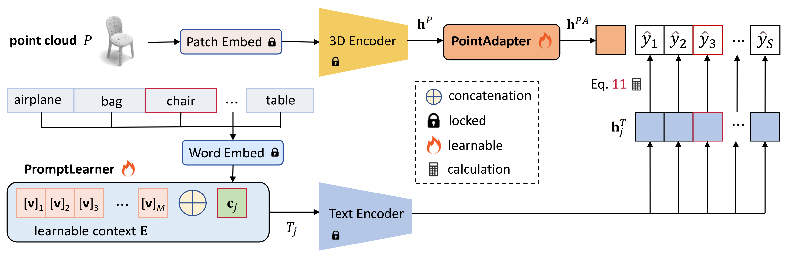
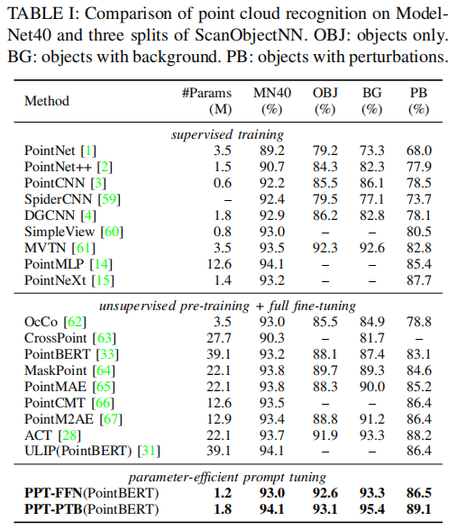
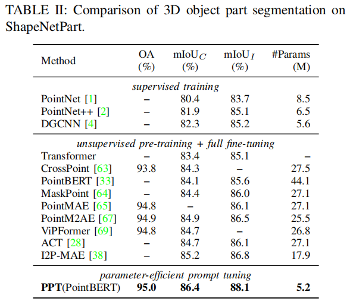
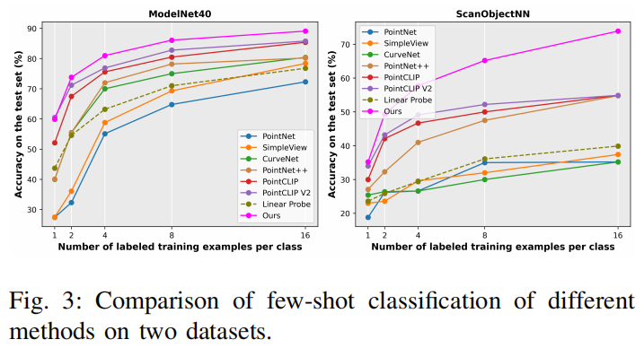
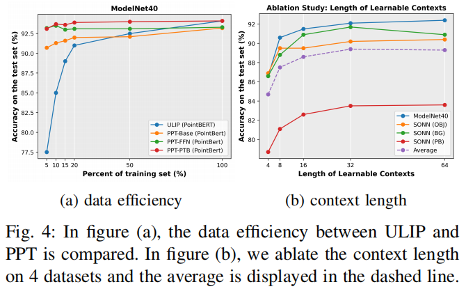

<h2 align = "center">
Parameter-efficient Prompt Learning for 3D Point Cloud Understanding
</h2>
<h4 align = "center" >
<a href="https://arxiv.org/abs/2402.15823"> 2024 IEEE International Conference on Robotics and Automation (ICRA) </a>
</h4>

Hongyu Sun, Yongcai Wang*, Wang Chen, Haoran Deng, Deying Li

School of Information, Renmin University of China, Beijing, 100872 

<center>
  <a href="ppt.pdf"> 
  </a>
  <a href="#">
  
  </a>  
  <a href="#">
  
  </a> 
</center>

<h2 align = "center">
Overview 
</h2>
 This paper presents a parameter-efficient prompt
tuning method, named PPT, to adapt a large multi-modal model
for 3D point cloud understanding. Existing strategies are quite
expensive in computation and storage, and depend on time-consuming prompt engineering. We address the problems from
three aspects. Firstly, a PromptLearner module is devised to
replace hand-crafted prompts with learnable contexts to automate the prompt tuning process. Then, we lock the pre-trained
backbone instead of adopting the full fine-tuning paradigm
to substantially improve the parameter efficiency. Finally, a
lightweight PointAdapter module is arranged near target tasks
to enhance prompt tuning for 3D point cloud understanding.
Comprehensive experiments are conducted to demonstrate the
superior parameter and data efficiency of the proposed method.
Meanwhile, we obtain new records on 4 public datasets and
multiple 3D tasks, i.e., point cloud recognition, few-shot learning, and part segmentation. The implementation is available at
https://github.com/auniquesun/PPT.



<h2 align = "center">
Contributions
</h2>

- We identify two critical problems in ULIP: (1) performance fluctuation caused by prompt engineering. (2)
expensive storage and poor parameter efficiency caused
by fully fine-tuning the pre-trained 3D encoder.

- We devise PromptLearner and PointAdapter to liberateprompt engineering, promote parameter and data effi-
ciency, and enhance the effectiveness of point cloudunderstanding.

- The proposed method shows stunning performancesacross different tasks and datasets for 3D point cloud
understanding, supported by systematic experiments and ablation studies.

<h2 align = "center">
Evaluations
</h2>







<h2 align = "center">
Ablation Studies
</h2>

- **Data Efficiency.** Adapting a large model to downstream tasks could potentially decrease the demand for labeled data. We investigate
the data efficiency of the devised prompt tuning strategy
and compare it with the full fine-tuning paradigm adopted
by ULIP. The experiment is conducted on ModelNet40, 
using different portions (5%, 10%, 15%, 20%, etc.) of data
for training and evaluating on the whole test set. Fig. 4a
exhibits the results. Here PPT-Base indicates our model only
introduces the PromptLearner module, without PointAdapter.
We observe under low-data regime, especially when using
less than 20% of training data, our three PPT variants lead
ULIP (PointBERT) by significant margins. Even training
with 5% data and less than 1.8M learnable parameters,
PPT-Base, PPT-FFN, and PPT-PTB reach 90.7%, 93.2% and
93.1% test accuracy, respectively, versus 39.1M parameters
and 77.5% accuracy of ULIP. The results indicate the developed parameter-efficient prompt tuning strategy is also
data-efficient.

- **Context Length.** One variable that
should be decided is the length M of the learnable contexts.
Intuitively, longer contexts contain more parameters thus may
provide the model with more informative descriptions for
downstream tasks. We explore this problem by varying the
length and comparing the recognition accuracy. The results
are averaged over 4 datasets, referring to the dashed line in
Fig. 4b. The overall trend is the longer the context, the better
the performance. But it is not always positive to increase
length, i.e., PPT-Base of M = 64 lags behind that of M = 32
in average. Thus we adopt M = 32 by default.



<h2 align = "center">
BibTex
</h2>
```tex
@inproceedings{sun24ppt,
  title={Parameter-efficient Prompt Learning for 3D Point Cloud Understanding},
  author={Hongyu Sun, Yongcai Wang, Wang Chen, Haoran Deng and Deying Li},
  booktitle={IEEE International Conference on Robotics and Automation (ICRA)},
  year={2024}
}
```

<h2 align = "center">
Acknowledgment 
</h2>
This work was supported in part by the National Natural Science
Foundation of China under Grants No. 61972404 and No. 12071478, and
Public Computing Cloud, Renmin University of China, and the Blockchain
Lab, School of Information, Renmin University of China.
