<h2 align = "center">
VSFormer: Mining Correlations in Flexible View Set for Multi-view 3D Shape Understanding
</h2>
<h4 align = "center" >
 <a href="https://ieeexplore.ieee.org/document/10478769">2024 IEEE Transactions on Visualization and Computer Graphics (TVCG)</a>
</h4>

Hongyu Sun, Yongcai Wang*, Peng Wang, Haoran Deng, Xudong Cai, Deying Li

School of Information, Renmin University of China, Beijing, 100872 

<center>
  <a href="VSFormer.pdf"> 
  </a>
  <a href="#">
  
  </a>  
  <a href="#">
  
  </a> 
</center>

<h2 align = "center">
Overview 
</h2>
View-based methods have demonstrated promising
performances in 3D shape understanding. However, they tend
to make strong assumptions about the relations between views
or learn the multi-view correlations indirectly, which limits the
flexibility of exploring inter-view correlations and the effectiveness 
of target tasks. To overcome the above problems, this paper
investigates flexible organization and explicit correlation learning
for multiple views. In particular, we propose to incorporate
different views of a 3D shape into a permutation-invariant set,
referred to as View Set, which removes rigid relation assumptions 
and facilitates adequate information exchange and fusion
among views. Based on that, we devise a nimble Transformer
model, named VSFormer, to explicitly capture pairwise and
higher-order correlations of all elements in the set. Meanwhile,
we theoretically reveal a natural correspondence between the
Cartesian product of a view set and the correlation matrix
in the attention mechanism, which supports our model design.
Comprehensive experiments suggest that VSFormer has better
flexibility, efficient inference efficiency and superior performance.
Notably, VSFormer reaches state-of-the-art results on various
3d recognition datasets, including ModelNet40, ScanObjectNN
and RGBD. It also establishes new records on the SHREC’17
retrieval benchmark. The code and datasets are available at
https://github.com/auniquesun/VSFormer

<h2 align = "center">
System Architecture 
</h2>
Several critical designs are presented in VSFormer. (1) The
position encodings of input views are removed since views are 
permutation invariant. (2) The class token is removed because
it is irrelevant to capturing the correlations of view pairs in the
set. (3) The number of attention blocks is greatly reduced as
the size of a view set is relatively small (≤ 20 in most cases).

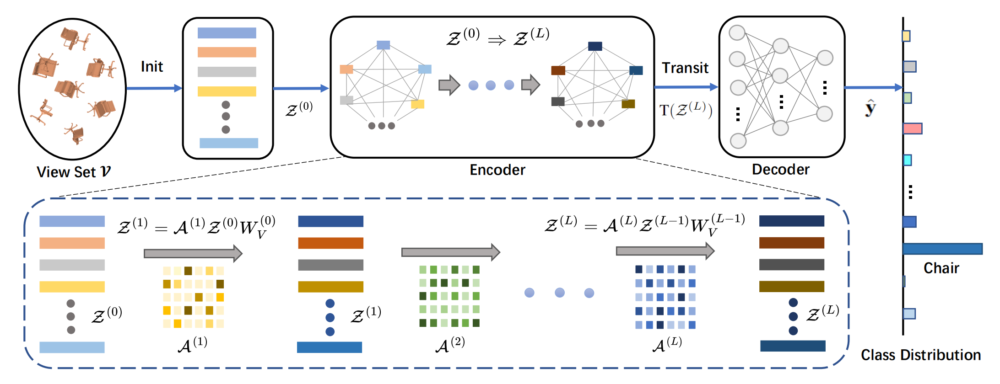

<h2 align = "center">
Contributions
</h2>

- We identify two key aspects of multi-view 3D shape understanding, organizing views reasonably and modeling
their relations explicitly, albeit they are critical for performance improvement but absent in previous literature.

- We propose a Transformer-based model, named VSFormer, to capture the correlations of all view pairs
directly for better multi-view information exchange and
fusion. At the same time, a theoretical analysis is accompanied to support such a design.

- Extensive experiments demonstrate the superb performances of the proposed approach and the ablation
studies shed light on the various sources of performance gains. For the recognition task, VSFormer reaches
98.4%(+4.1%), 95.9%(+1.9%), 98.8%(+1.1%) overall accuracy on RGBD, ScanObjectNN, ModelNet40, respectively. 
The results surpass all existing methods and achieve new state of the arts. For 3D shape retrieval,
VSFormer also sets new records in multiple dimensions
on the SHREC’17 benchmark.

<h2 align = "center">
Evaluations
</h2>

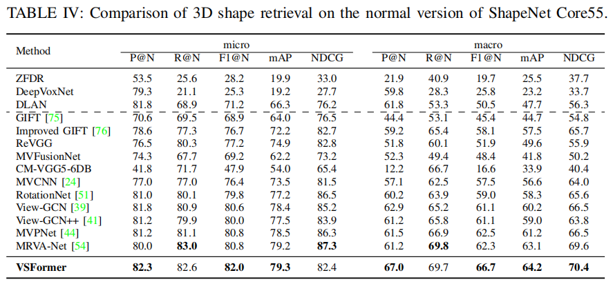

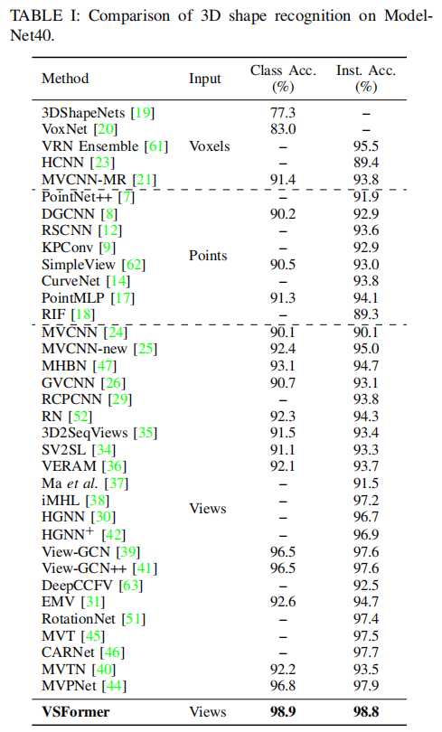

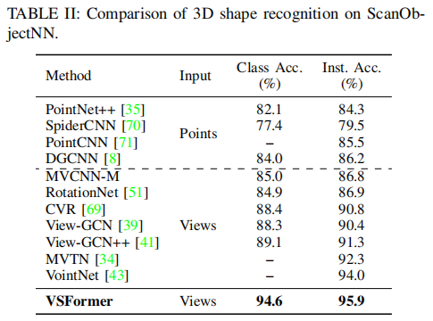

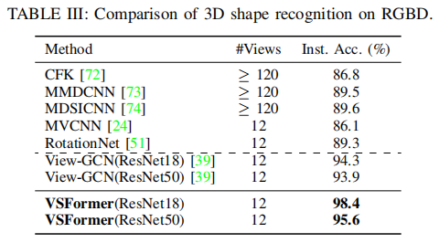

<h2 align = "center">
Ablation Studies
</h2>

- **Initializer.** 

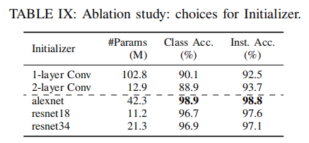

- **The Architecture of Encoder.**

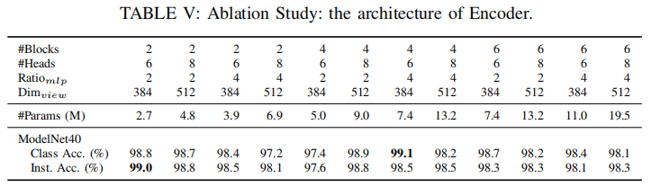

- **Performance Gains Delivered by Our Encoder.**

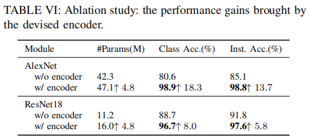

- **Number of Attention Blocks.** 

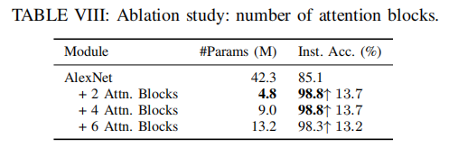

- **Number of Views.** 

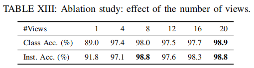

<h2 align = "center">
Bad Case Analysis
</h2>

- Here we carry out a bad case analysis of the proposed
model. The study covers recognition and retrieval tasks on
different datasets, including ModelNet40 and SHREC’17. The
input views come from the corresponding test set and the
incorrect predictions of our model are visualized in Figure 8.
For the recognition task, the model is confused by shapes with
highly similar appearances, resulting in incorrect outputs on
occasion. As the subfigure 8a displays, our model predicts the
bathtub views as the bowl category, the bookshelf views as
table category, and the bottle views as flower pot category.
The bottle and flower pot have close appearances and share
the function of holding water. Note that the views in the right
part (Prediction) are found in the training set and they are
hard to distinguish from corresponding input views, even for
human beings.

- For 3D shape retrieval, its performance is affected by
classification accuracy since the misclassified result of a query
shape will propagate in the retrieval process, where the model
tries to find shapes that have the same category as the query.
Here we visualize the misclassification of several query shapes
on the SHREC’17 benchmark, exhibited in the subfigure 8b.
For instance, the query in the first row is a faucet but our model
recognizes it as a lamp. The misclassification is somewhat
understandable as there are views of lamp in the training
set with extremely close appearances with faucet, seeing the
corresponding prediction part. Interestingly, in the third row,
our model regards two chairs side by side as sofa, probably
because it learns the common sense that sofa is more likely
to have consecutive seats than chair.

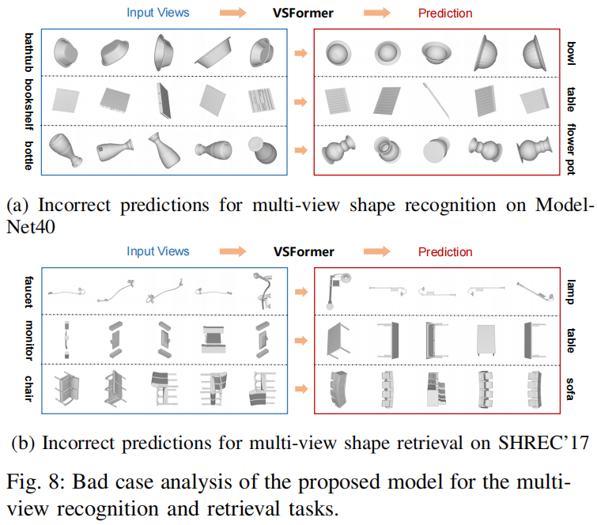


<h2 align = "center">
BibTex
</h2>
```tex
@ARTICLE{sun24vsformer,
  author={Sun, Hongyu and Wang, Yongcai and Wang, Peng and Deng, Haoran and Cai, Xudong and Li, Deying},
  journal={IEEE Transactions on Visualization and Computer Graphics}, 
  title={VSFormer: Mining Correlations in Flexible View Set for Multi-view 3D Shape Understanding}, 
  year={2024},
  volume={},
  number={},
  pages={1-15},
  keywords={Three-dimensional displays;Shape;Correlation;Feature extraction;Solid modeling;Transformers;Aggregates;Multi-view 3D Shape Recognition and Retrieval;Multi-view 3D Shape Analysis;View Set;Attention Mechanism},
  doi={10.1109/TVCG.2024.3381152}
}
```


<h2 align = "center">
Acknowledgment 
</h2>
This work was supported in part by the National Natural
Science Foundation of China under Grants No. 61972404
and No. 12071478, and Public Computing Cloud, Renmin
University of China, and the Blockchain Lab, School of
Information, Renmin University of China.
