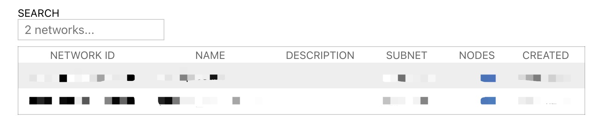
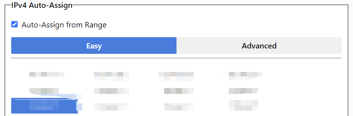
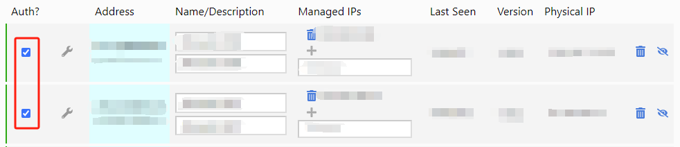

作为一名计算机科学领域科研工作者，随着研究经历和成果的积淀，会到国际会议或国外的高校、科研机构进行交流访问。当你在国外学习交流时，如果仍想要访问国内服务器资源开展实验，特别是审稿意见返回要补充实验等关键时刻。

此时我们往往首先想到国内学校/公司提供的VPN软件，通过登录这样的VPN软件连接到国内的服务器，但想法很好很直观，现实是这种方法大概率**不能work**。原因是这些软件在技术和系统优化方面做得不够好，当面临相隔万里的物理距离时，数据传输速度非常慢（几十 Kb/s），而且会经常掉线，根本无法正常使用。

* 这篇博客介绍一种软件，叫作 [ZeroTier](https://www.zerotier.com/)，能很好地帮你解决这个痛点。ZeroTier 工作的原理是建立一个专属于自己的虚拟私人网络(VPN)，不同国家的主机加入同一个虚拟私人网络，就能实现互联互通，访问速度虽然没有同属一个物理局域网这么快，相比**学校/公司的VPN蜗牛般的网速**已经足够快，完全能够满足工作需求。另外一大优点是对于普通个人用户，ZeroTier 虚拟私人网络允许最多接入 25 个主机，完全免费。

### 系统和环境
1. ZeroTier 在各大操作系统平台，Windows, Linux, Mac OS 都有对应软件，作为计算机科学工作者，跑实验常用 Linux，所以我下面的软件安装和设置以 Linux-Ubuntu 系统为例，其他平台参考[官方文档](https://www.zerotier.com/download/)即可。

2. 安装软件下载工具，`curl`，需要用户在 Ubuntu 系统有管理员权限，没有权限找管理员代为操作，在 **terminal** 运行以下命令
    ```
    sudo apt-get install
    ```

### 软件安装
1. 进入 Ubuntu 系统，在 **terminal** 运行以下命令
    ```shell
    curl -s https://install.zerotier.com | sudo bash
    ```
    - 该命令运行结束后，如果没有报错或异常提示，就代表安装成功

### 软件配置
1. 创建 ZeroTier 虚拟私人网络，在 web browser 端进行，打开浏览器进入[官方网站](https://www.zerotier.com/)，点击 **Login** 登录网址，可以选择用 Google 账号登录，如果没有提前创建

2. 登录后浏览器上方会出现 **Create A Network** 的橘黄色按钮，点击创建属于自己的虚拟私人网络，创建成功后会出现如下界面，本人创建过两个，所以有两条记录
    - 
    - 
    - 其中 `NETWORK ID` 是虚拟私有网络唯一标识符，在添加主机设备时会用到

3. 点击刚才创建的网络，进入详情设置页面，选择私有虚拟网络地址段，如下图所示，从列表中选择一个，一般情况保持默认即可
    - 
    - 网络名称等信息可以修改，根据自身习惯决定

4. 在想要访问的服务器上，打开 **terminal** 输入如下命令，将该设备加入刚才 web browser 端创建的虚拟私人网络
    ```
    sudo zerotier-cli join <network-id>
    ```
    - 将上条命令中 <network-id> 替换为自己创建网络的 `NETWORK ID`
    - 命令执行成功后，ZeroTier 显示诸如 "200 OK" 的信息表示添加主机成功

5. 用这样的方式添加多台设备到同一个ZeroTier网络，翻到同一页面的 **Members** 选项卡，勾选第一列 `Auth?` 不同主机对应的蓝色方框，它们就会处于同一个ZeroTier 提供的VPN下，如下图所示
    - 
    - 这样配置好后，登录这些设备就能用第四列 `Managed IPs` 显示的主机IP
        - 即使几台设备处于不同国家/物理距离相隔万里，互联互通将非常方便免，受常规VPN访问断网的困扰
        - **亲测好用**