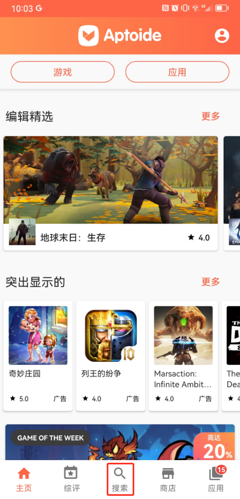
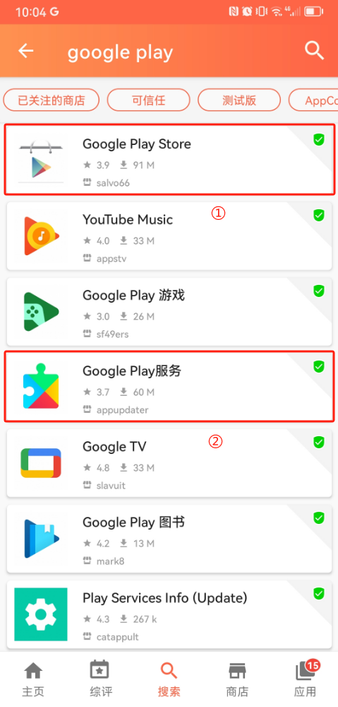
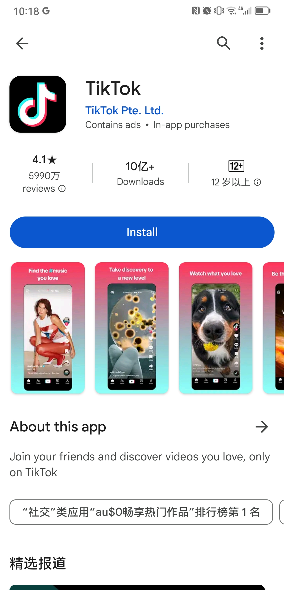

* 本文适用范围：在 中国大陆+港澳台 **以外国家和地区**使用 **Huawei** 手机/平板电脑用户，

### 背景
1. 中国大陆有很多 Huawei 手机/平板电脑用户，在国内生活时完全感觉不到，日常需要/不需要的 App 都能方便地下载安装，但当他们去其他国家（尤其是西方国家）旅行、留学、工作时，会发现原生的 Huawei 手机系统用起来非常受限，原因如下：
    
    - Huawei 受到美国禁令影响，无法安装 Google Play 应用商店，进而无法安装在国外出行、支付、社交等等日常必备 App，日常生活会很不方便
    
    - 中国国内的很多应用都是面向中国大陆用户的，在国外无法正常使用，西方国家在这方面和国内不是一套生态，以下常用应用在 Huawei 应用商店无法搜索到
        
        - 出行，Google Maps
        - 支付，PayPal, Google Pay
        - 社交，Whatsapp, Instagram
        - 邮箱，Gmail
        - 视频，Tiktok, Youtube
        - 搜索，Google
        - 日程，Google Calendar
        - 应用商店，Google Play Store

2. 一种解决办法是换个手机，换成苹果手机，在苹果系统切换成国外地区就能正常使用了，但这种方式适用于预算和资金充足的人群，毕竟一个苹果手机七八百上前美元，开销还是不小的，否则能继续用原系统就接着用

3. 本人就遇到了这样的问题，带着 Huawei 手机来到了西方某发达国家，因不能下载当地日常生活必备应用而饱受困扰，经过一段时间摸索找到了一条可行路径，并成功解决了遇到的问题，遂记录成文，以备后用

### 解决方案
0. 需要提前注册 Google 账户，后续登录 Google Play Store 要用

1. 在 Huawei 手机安装备选应用商店，名叫 **Aptoide**，这是[下载链接](https://aptoide.en.aptoide.com/app)
    - 这里备选应用商店 Aptoide 也是一个 App，它是国外开发者开发的
    - 从这个 App 能搜索到国外常用的日常应用

2. 打开 Huawei 手机安装的 Aptoide，安装 Google Play Store
    1. 点击搜索，如下图
        - 

    2. 输入 google play，从出现的结果列表安装如下两个 App，它们就是 Google Play Store 的前后端应用
        - 

3. 第二步成功后，Play Store 就会出现在 Huawei 手机桌面，打开 Play Store 就能正常下载在国外所需要的任何应用了!
    - Play Store 图表如下
        
    
    - 下图是我从 Play Store 搜索出来的 TikTok
        

4. Bingo!