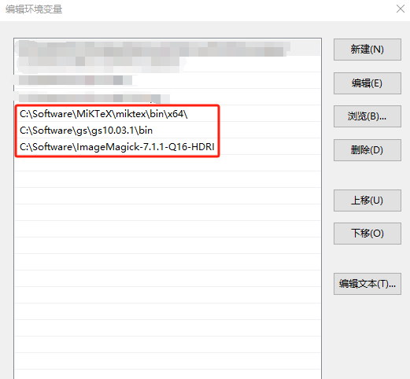
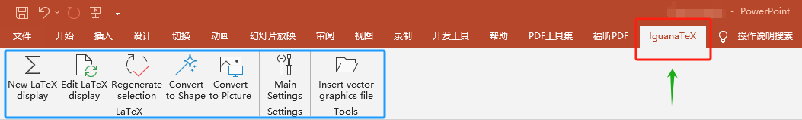
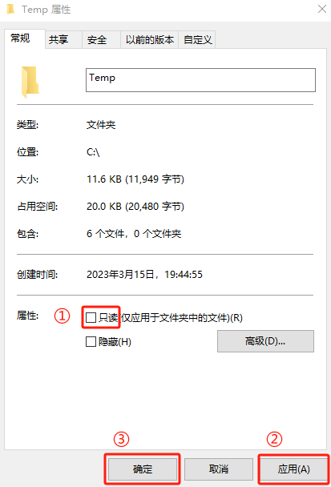
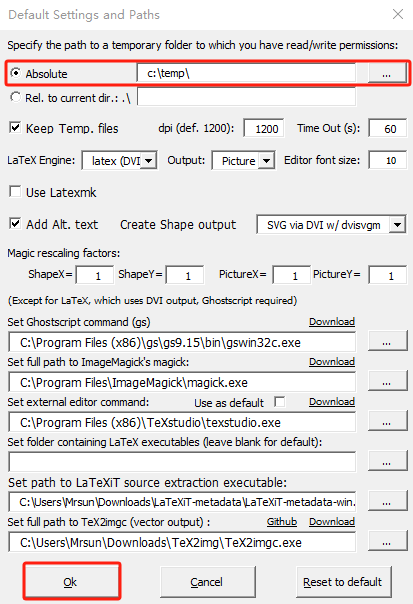
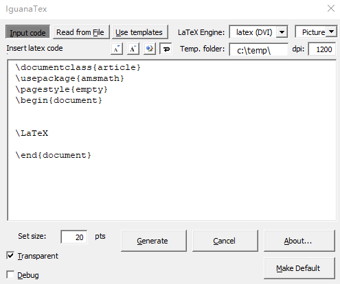
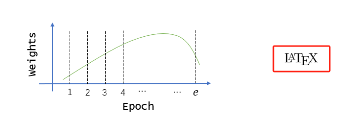

PowerPoint (PPT) 是科研从业者画图的常用工具，比如要画复杂的架构图/流程图，PPT 提供了线条、形状、颜色、大小等模板，用户根据自己需求定制图表即可。

但是 PPT 在**数学符号和公式**方面 $\color{red}{支持不是很好}$，自带的插入符号、公式功能不够完善，很多符号和公式不能实现，
大部分用户会**退而求其次**，用不那么准确的符号代替本该用 $\LaTeX$ 展示的内容，极大限制了学术图表的专业性和表达能力。

本文介绍一种简单有效的解决方案，**已经过本人验证**，能够在 PPT 中插入 $\LaTeX$ 能够实现的任意符号和公式。

### 系统和软件要求
1. 本人长期使用 Windows 10 系统，因此主要介绍针对 Windows 的操作步骤，Mac OS 也有对应教程，[参见这里](https://github.com/Jonathan-LeRoux/IguanaTex)。

2. PowerPoint。安装在对应操作系统，PowerPoint 版本 2010, 2013, 2016, 2019 (32 and 64 bit), Office 365, and PowerPoint 2003 都支持。
    - PowerPoint 2000 and 2007 可能支持，未经过测试

3. LaTeX，常用发行版有 [TeXLive](https://www.tug.org/texlive/) 和 [MikTeX](http://miktex.org/)，我选择较轻量的 MiKTeX，而 TeXLive 包含全部的package，根据自身情况选择。

4. [GhostScript](http://www.ghostscript.com/download/gsdnld.html)。如果安装最新版过程中报错，或者在 PPT 插入符号和公式报错（要确认输入的公式和其他配置没问题），尝试该软件 `gs2.16` 版本
    - 一般情况下安装最新版没问题，本人安装了 Ghostscript `10.03.1` for Windows (64 bit)，一切正常

5. [ImageMagick](https://www.imagemagick.org/script/download.php#windows)，根据官方网站导引下载安装包：安装 Windows 对应的最新版即可。
    - 本人当时安装的是 `ImageMagick-7.1.1-33-Q16-HDRI-x64-dll.exe`

### 配置环境变量
1. 为安装的 `LaTeX`，`GhostScript`，`ImageMagick` 配置环境变量，以便其他程序调用 
    - 实际上这些软件是 实现插入 $\LaTeX$ 符号和公式的核心，PowerPoint 中的插件只是在调研这些软件实现功能

2. 在 Windows 设置中搜索 **环境变量**，点击打开 **编辑账户的环境变量**
    - 
    - 编辑 Path 变量，进行 _类似_ 如下设置，具体路径要替换成自己的
        - 

### 安装 IguanaTeX 插件
1. 这个插件是实现在 PPT 插入 $\LaTeX$ 符号和公式的 $\color{red}{**直接载体**}$，安装完成后会出现在 PPT 的菜单栏，如下图所示
    - 

2. [下载插件](https://github.com/Jonathan-LeRoux/IguanaTex/releases)，该插件后缀为 `.ppam`，看起来就是和 PPT 适配的插件格式
    - 本人下载的是 **v1.61**，后续可能会有更新，下载最新版即可
    - 官方说明文档在[这里](https://github.com/Jonathan-LeRoux/IguanaTex)

    - 将插件放在如下位置：`C:\Users\<username>\Appdata\Roaming\Microsoft\Addins`
        - `<username>` 替换成自己的用户名

3. 加载插件，打开 PowerPoint，执行以下操作
    1. 点击“文件” > “选项” > “加载项”

    2. 在窗口的下方部分，选择框中选择“PowerPoint 加载项”

    3. 接着点击“添加新项目”，选择你下载的文件夹中的 `.ppam` 文件，然后点击“关闭”

    - 操作完成后如下图所示
        - 

4. 设置临时目录，该目录用于存放 IguanaTeX 插件编译好的 $\LaTex$ 中间文件
    1. 该目录默认为 `C:\Temp`，如果没有，用户需要自行创建，并确保有 $\color{red}{读写权限}$
        - 右键该文件夹，选择 “属性”，在出现的对话框将 **只读** 选项去掉，“应用” -> “确定”
            - 

    2. 如果用户对 `C:\Temp` 目录没有写权限，需在其他地方建立一个有写权的文件夹，并在 PowerPoint 的IguanaTeX插件中设置，如下图
        - 

### 插入 LaTeX 符号和公式
1. 在 PowerPoint 菜单栏，点击 `IguanaTeX` 选项卡，会出现对应的很多功能，如下图所示
    - 点击 `New LaTeX display` 开始编辑
        - 
        - 生成符号/公式前，用户可在窗口选项**定制**编译引擎、字体大小等**参数**

    - 公式确认无误 + 添加必要 latex package 后，点击 **Generate** 就能插入到 PPT 了
        - 